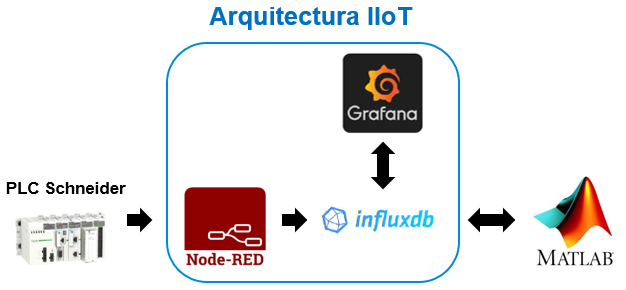
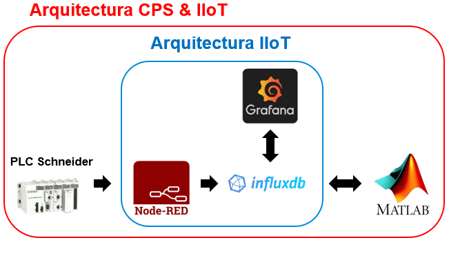
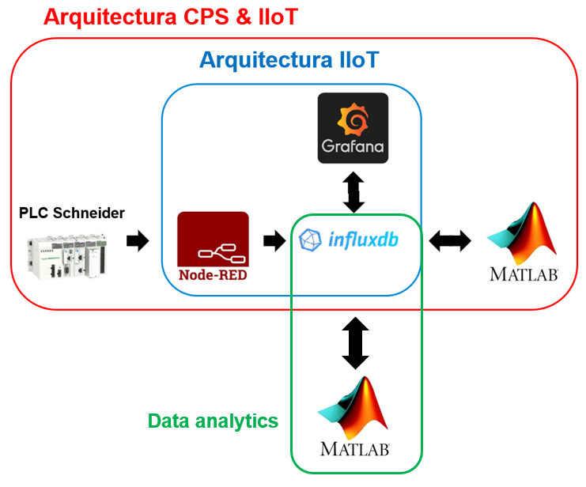

<!-- multilingual suffix: en, es -->

<!-- [en] -->

# Project description

**Development of an IIoT architecture in the cloud (cloud computing)**

This guidance document only covers the first part of the project, which aims to build the IIoT architecture and verify that it has the ability to manage data flows. Communications with the industrial environment and data processing will be carried out in the second part of the project.

**In section 1. the structure of the IIoT architecture is presented and the objectives of this first part of the project are defined, as well as the results that you must obtain and contribute.**
## Introduction to the first part of the project
In the IIoT architecture, you will generate artificial data within the communication flow management software itself (Node-RED) that will allow you to verify that the database and the visualization panels work as expected. You are expected to follow the sections in order as they cover the steps necessary to implement the proposed IIoT architecture.

{: .center}

When you have achieved it, you will be able to advance to the second part of the project, which also has its respective guide, which consists of the integration of the IIoT architecture that you have generated in a cyber-physical system (CPS architecture).
### Motivation
Validation of the correct operation of an IIoT architecture in isolation is essential to ensure that, in the future, when it is integrated into the design of the technological solution of which it is a part, it complies with the desired specifications.

In an industrial environment, where it may be necessary to scale a solution like the one you are going to generate due to the need to connect several PLCs and databases, it is especially important to make sure that the solution has been correctly designed. In this way it will be possible to deal more effectively with the problems inherent to the integration of this solution in an industrial environment, starting from the assumption that the designed solution can be treated as a product in the form of a closed package, which admits certain types of data as inputs and manage them in a specific way.

### Objectives of the first part of the project
1. In this first part of the project you must achieve three objectives:
1. Set up a virtual environment (cloud computing) using a Microsoft Azure platform virtual machine and the Docker software packaging system.
1. Generate a base IIoT architecture on which you will be able to develop aspects related to industrial communications in the second part of the practice.
1. Launch applications that will perform specific functions through the following software: NodeRED, InfluxDB and Grafana.
### Results of the first part of the project
- Taking into account the objectives that have been mentioned in the previous section, the results that you must obtain and contribute at the end of this first part of the practice are:
- Ensure that the virtual machine is operational and that the necessary software is correctly installed.
- Demonstrate through screenshots that you are able to generate synthetic data in Node-RED and can visualize it in an InfluxDB database.

- Demonstrate through screenshots that you generate a Grafana dashboard that allows you to view the data stored in an InfluxDB database.

> **Throughout this document it will be clearly indicated at which points of the process (specifically there are 3) you are expected to take screenshots to demonstrate that your implementation works correctly. A green box will be used like the one that frames this text to make it as easy as possible to identify it.**

## Introduction to the second part of the project

The second part of the project aims to integrate the IIoT architecture already generated on a cyber-physical system or *CPS*. A cyber-cyber-physical system is any device that integrates computing, storage and communication capabilities to control and interact with a physical process. Cyber-physical systems can be connected to each other and also to remote storage and data management services, like the ones you work with in the course project.

Once the IIoT architecture has been implemented, it is proposed that you integrate a communications system with a simulated industrial environment and include data processing prior to displaying the data in Grafana.

{: .center}

### Communications with industrial environment

Through a communication protocol, such as TCP/IP in this case, it is possible to introduce a flow of data coming from a plant (e.g. through its PLCs) in an IIoT architecture such as the one developed up to now.

In practice, the use of TCP/IP will allow you to receive and store the data sent by a vibration sensor located in a machine, which is made up of four statistical parameters calculated on the vibration signal of the machine: *RMS, Skewness, Kurtosis and Mean*. These parameters are captured and recorded in memory locations of a PLC compatible with the Modbus TCP/IP communications protocol, which has an Ethernet communications port.

### Data processing

The data processing has to analyze the stored data to obtain useful information (e.g. alarms, costs, logistics management). In your case, you will implement a code in the MATLAB environment that allows you to extract value-added information from the data received. This code must calculate the average value of each of the five parameters taking the data that has been sent in the last minute of recorded information.

### Motivation
In this part of the project you will simulate the process of setting up a communication flow with an industrial environment (which can be located anywhere in the world) with a certain data processing capacity, which will be carried out in the application in which MATLAB cloud. Apart from MATLAB, the rest of the technologies that will be used have already been presented and configured in the first part of the project (Docker, Node-RED, Influx, Grafana).
### Objectives of the second part of the project
In this second part of the project you must meet 2 objectives:

1. Implement scripts on MATLAB Online to carry out the processing of the data received from the vibration sensor.
1. Modify the IIoT architecture generated in the first part of the project so that it receives the data from the vibration sensor.

### Results of the second part of the project
Taking into account the objectives that have been mentioned in the previous section, the results that you must obtain and contribute at the end of this second part of the practice are:

- In Node-RED, receive and preprocess the data emitted by the sensor and write it to an InfluxDB database.
- Using MATLAB Online, read the data from the database, process it, and write it back to the database.

- Visualize in Grafana both the original data and the processed data.

> **To demonstrate that you have achieved these results, you will be asked, over a period of time of approximately 1-2 weeks, to configure the virtual machine with the cheapest option and leave it powered on with the Docker containers running and share the IP with the teaching team. This will imply that during all this time the IP will be the same and we will be able to access it to validate your architecture.** 

## Introduction to the third part of the project

The third part of the project aims to integrate a data analysis application in the cloud.

After completing the implementation of the CPS & IIoT architecture, it is proposed that you implement a data analysis application on MATLAB Online, using the four statistical indicators of the vibration data that have been measured and stored in the database.

{: .center}

### Motivation

In this part of the project you will use mathematical models generated in MATLAB to determine if the vibration data indicates that the industrial equipment is healthy or if a specific fault is occurring, which responds to a specific distribution of the parameters.

The mathematical models, which are provided to you in the form of a MATLAB *workspace* (.mat file extension), have been generated *offline* using data from the same simulated PLC with which you have been working so far. Thus, these models are trained to identify certain patterns in the data, as long as they come from the same team. These models will interpret the data that you will read from MATLAB Online and will classify them, first as known or unknown, and then if they are known, it will be decided if they are believed to correspond to the operating condition of a healthy system or a system with a specific fault, which in this case is defined as excessive wear of one of the bearings of the electric motor in which the vibration sensors that send information to the PLC are mounted.

In addition, a membership value will be determined for each data entry considered to be known. The mathematical model expresses as a membership value the probability that the data belongs to one class or another. Therefore, in this case there will be two probabilities, which in total must add up to 1 (or 100%) because only two operating conditions are considered, "Healthy" and "Bearing failure".

In practice, this value of belonging provides extra information to maintenance technicians who are in the industrial environment where the electric motor and the PLC are located. In this way, decision-making can be carried out based on:

- The experience and knowledge of the machine or similar equipment by the technical staff.
- The values of belonging that the neural network has evaluated with recent data, despite the fact that the neural network has been generated by taking historical data and therefore provides the ability to identify patterns and potentially provide information that allows anticipating maintenance or breakdowns.

### Objectives of the third part of the project

In this third part of the project you must meet 2 objectives:

1. Implement a single script on MATLAB Online that you must complete to achieve the desired data analysis.
1. Integrate the data analysis cloud application into the CPS & IIoT architecture generated in the second part of the project, so that they can be viewed by Grafana.

### Results of the third part of the project

Taking into account the objectives that have been mentioned in the previous section, the **results** that you must obtain and contribute at the end of this third part of the practice are:

- Using MATLAB Online, read the data from the database, retrieve the four original indicators and perform the data processing.
- Determine from the result of the data analysis whether the conditions described by the data are known and if they are, conclude whether the industrial equipment is failing and write the result to the database.
- Write diagnostic and novelty detection data to the database.
- Visualize the processed data in Grafana.

> **To demonstrate that you have achieved these results, you will be asked, over a period of time of approximately 1-2 weeks, to configure the virtual machine with the cheapest option and leave it powered on with the Docker containers running and share the IP with the teaching team. This will imply that during all this time the IP will be the same and we will be able to access it to validate your architecture.**

<!-- [es] -->

# Descripción del proyecto

**Desarrollo de una arquitectura IIoT en la nube (*cloud computing*)**

La primera parte del proyecto tiene por objetivo generar la arquitectura IIoT y verificar que tiene la capacidad de gestionar flujos de datos. Las comunicaciones con el entorno industrial y el procesado de datos se llevarán a cabo en la segunda parte del proyecto.

**En la sección 1. se presenta la estructura de la arquitectura IIoT y se definen los objetivos de esta primera parte del proyecto, así como los resultados que debéis obtener y aportar.**

## Introducción a la primera parte del proyecto

En la arquitectura IIoT, vosotros mismos generaréis datos artificiales dentro del propio software de gestión de flujos de comunicación (Node-RED) que os permitan verificar que la base de datos y los paneles de visualización funcionan como se espera. Se espera que sigáis las secciones en orden ya que van tratando de forma pautada los pasos necesarios para implementar la arquitectura IIoT propuesta.

{: .center}

Cuando lo hayáis logrado, podréis avanzar a la segunda parte del proyecto, que también dispone de su respectiva guía, que consiste en la integración de la arquitectura IIoT que habéis generado en un sistema ciber-físico (arquitectura CPS).
### Motivación
La validación del correcto funcionamiento de una arquitectura IIoT de forma aislada resulta fundamental para garantizar que, en el futuro, cuando se integre en el diseño de la solución tecnológica de la que forma parte, cumpla con las especificaciones deseadas. 

En un entorno industrial, donde pueda ser necesario escalar una solución como la que vais a generar debido a que se quiera conectar varios PLCs y bases de datos, es especialmente importante asegurarse que la solución ha sido correctamente diseñada. De esta forma será posible abordar con más eficacia los problemas propios de la integración de esta solución en un entorno industrial, partiendo del supuesto que la solución diseñada puede tratarse como un producto en forma de paquete cerrado, que admite como *inputs* determinados tipos de datos y los gestiona de una forma concreta.

### Objetivos de la primera parte del proyecto
En esta primera parte del proyecto debéis cumplir **tres objetivos**:

1. Configurar un entorno virtual (*cloud computing*) utilizando una máquina virtual de la plataforma Azure de Microsoft y el sistema de encapsulado de software de Docker.
1. Generar una arquitectura IIoT base sobre la que podréis desarrollar aspectos relacionados con las comunicaciones industriales en la segunda parte de la práctica.
1. Poner en marcha aplicaciones que realizarán funciones específicas a través del siguiente software: NodeRED, InfluxDB y Grafana.
### Resultados de la primera parte del proyecto
Teniendo en cuenta los objetivos que se han mencionado en el apartado anterior, los **resultados** que debéis obtener y aportar al final de esta primera parte de la práctica son:

- Lograr que la máquina virtual esté operativa y que el software necesario está correctamente instalado.
- **Demostrar mediante capturas de pantalla** que sois capaces de generar datos sintéticos en Node-RED y los podéis visualizar en una base de datos de InfluxDB.

- **Demostrar mediante capturas de pantalla** que el generáis un *dashboard* de Grafana que os permite visualizar los datos almacenados en una base de datos de InfluxDB.

> **A lo largo de este documento se indicará claramente en que puntos del proceso (en concreto son 3) se espera que toméis capturas para demostrar que vuestra implementación funciona correctamente. Se empleará un recuadro verde como el que enmarca este texto para su facilitar al máximo su identificación.**

##  Introducción a la segunda parte del proyecto 

La segunda parte del proyecto tiene por objetivo la integración  de la arquitectura IIoT ya generada sobre un sistema ciber-físico o *CPS*. Un sistema ciber ciber físico es todo aquel dispositivo que integra capacidades de computación, almacenamiento y  comunicación para controlar e interactuar con un proceso físico. Los sistemas ciber-físicos  pueden estar conectados entre sí y también con servicios remotos de almacenamiento y gestión  de datos, como con los que trabajáis en el proyecto de la asignatura. 

Una vez implementada la arquitectura IIoT se os propone que integréis un sistema de  comunicaciones con un entorno industrial simulado e incluyáis un procesado de datos previo a  la visualización de los datos en Grafana. 

{: .center}

### Comunicaciones con entorno industrial 

Mediante un protocolo de comunicación, como será en este caso TCP/IP, es posible introducir  un flujo de datos provenientes de una planta (e.g. a través de sus PLCs) en una arquitectura IIoT  como la desarrollada hasta ahora.  

A la práctica, el uso TCP/IP os permitirá recibir y almacenar los datos que envía un sensor de  vibración ubicado en una máquina, que se componen de cuatro parámetros estadísticos  calculados sobre la señal de vibración de la máquina: *RMS, Skewness, Kurtosis* y *Mean*. Estos  parámetros son capturados y registrados en unas posiciones de memoria de un PLC compatible  con el protocolo de comunicaciones Modbus TCP/IP, que dispone de un puerto de  comunicaciones Ethernet. 

### Procesado de datos 

El procesado de datos tiene por analizar los datos almacenados para obtener información útil  (e.g. alarmas, costes, gestión logística). En vuestro caso implementaréis un código en el entorno  MATLAB que permita extraer información de valor añadido de los datos recibidos. Este código  deberá calcular valor medio de cada uno de los cinco parámetros tomando los datos que se han  enviado en el último minuto de información registrada.

### Motivación 

En esta parte del proyecto simularéis el proceso de puesta en marcha de un flujo de  comunicaciones con un entorno industrial (que puede estar situado en cualquier parte del  mundo) con cierta capacidad de procesado de datos, que se llevará a cabo en la aplicación en la  nube de MATLAB. A parte de MATLAB, el resto de tecnologías que se utilizarán ya han sido  presentadas y configuradas en la primera parte del proyecto (Docker, Node-RED, Influx,  Grafana). 

### Objetivos de la segunda parte del proyecto 

En esta segunda parte del proyecto debéis cumplir con 2 objetivos: 

1. Implementar sobre MATLAB Online scripts para llevar a cabo el procesado de los datos  recibidos del sensor de vibración. 

2. Modificar la arquitectura IIoT generada en la primera parte del proyecto para que reciba  los datos del sensor de vibración. 

### Resultados de la segunda parte del proyecto 

Teniendo en cuenta los objetivos que se han mencionado en el apartado anterior, los **resultados**  que debéis obtener y aportar al final de esta segunda parte de la práctica son: 

- En Node-RED, recibir y preprocesar los datos emitidos por el sensor y escribirlos en una  base de datos de InfluxDB. 

- Utilizando MATLAB Online, realizar la lectura de los datos de la base de datos,  procesarlos y escribirlos de nuevo en la base de datos. 

- Visualizar en Grafana tanto los datos originales como los datos procesados. 

> **Para demostrar que habéis logrado estos resultados, se os pedirá que, en un período tiempo  de aproximadamente 1 o 2 semanas de duración, configuréis la máquina virtual con la opción  más económica y la dejéis encendida con los contenedores de Docker funcionando y  compartáis la IP con el equipo docente. Ello implicará que durante todo este tiempo la IP será  la misma y nosotros podremos acceder para validar vuestra arquitectura.**  

## Introducción a la tercera parte del proyecto 

La tercera parte del proyecto tiene por objetivo la integración de  una aplicación de análisis de datos en la nube.

Después de haber completado la implementación de la arquitectura CPS & IIoT se os propone que  implementéis una aplicación de análisis de datos sobre MATLAB Online, utilizando los cuatro  indicadores estadísticos de los datos de vibración que han sido medidos y almacenados en la base  de datos. 

{: .center}

### Motivación 

En esta parte del proyecto utilizaréis modelos matemáticos generados en MATLAB para determinar  si los datos de vibración indican que el equipo industrial está sano o si se está produciendo un fallo  concreto, que responde a una distribución concreta de los parámetros.  

Los modelos matemáticos, que se os proporcionan en forma de *workspace* (archivo con extensión  .mat) de MATLAB, se han generado fuera de línea (*offline*) utilizando datos del mismo PLC simulado  con el que habéis estado trabajando hasta ahora. Así, estos modelos están entrenados para  identificar ciertos patrones en los datos, siempre que estos provengan del mismo equipo. Estos  modelos interpretarán los datos que leeréis desde MATLAB Online y los clasificarán, primero como  conocidos o desconocidos, y luego si son conocidos se decidirá si se cree que corresponden a la  condición de funcionamiento de sistema sano o de sistema con un fallo concreto, que en este caso  se define como un desgaste excesivo de uno de los cojinetes del motor eléctrico en el que están  montados los sensores de vibración que mandan información al PLC. 

Además, se determinará un valor de pertenencia para cada entrada de datos considerada como  conocida. El modelo matemático expresa como valor de pertenencia la probabilidad del que el dato  pertenezca a una clase o a otra. Por tanto, en este caso habrá dos probabilidades, que en total  deberán sumar 1 (o 100%) debido a que solo se consideran dos condiciones de funcionamiento,  “Sano” y “Fallo cojinete”. 

A la práctica, este valor de pertenencia aporta información extra a técnicos de mantenimiento que  se encuentran en el entorno industrial donde está ubicado el motor eléctrico y el PLC. De esta forma,  se puede llevar a cabo una toma de decisiones basada en: 

- La experiencia y el conocimiento de la máquina o de equipos similares por parte del  personal técnico.

- Los valores de pertenencia que la red neuronal ha evaluado con datos recientes, pese a que  la red neuronal ha sido generada tomando un histórico de datos y por tanto aporta esa  capacidad de identificar patrones y potencialmente aportar información que permita  anticiparse a mantenimientos o averías. 

### Objetivos de la tercera parte del proyecto 

En esta tercera parte del proyecto debéis cumplir con 2 objetivos: 

1. Implementar sobre MATLAB Online un único script que deberéis completar para lograr que  se lleve a cabo el análisis de datos deseado. 

2. Integrar en la arquitectura CPS & IIoT generada en la segunda parte del proyecto la  aplicación en la nube de análisis de datos, de forma que puedan visualizarse por Grafana. 

### Resultados de la tercera parte del proyecto 

Teniendo en cuenta los objetivos que se han mencionado en el apartado anterior, los **resultados** que debéis obtener y aportar al final de esta tercera parte de la práctica son: 

- Utilizando MATLAB Online, realizar la lectura de los datos de la base de datos, recuperar los  cuatro indicadores originales y realizar el procesado de datos. 

- Determinar según el resultado del análisis de los datos si las condiciones descritas por los  datos son conocidas y si lo son, concluir si el equipo industrial está fallando y escribir en la  base de datos el resultado. 

- Escribir los datos del diagnóstico y de la detección de novedad en la base de datos. • Visualizar los datos procesados en Grafana. 

> **Para demostrar que habéis logrado estos resultados, se os pedirá que, en un período tiempo de  aproximadamente 1 o 2 semanas de duración, configuréis la máquina virtual con la opción más  económica y la dejéis encendida con los contenedores de Docker funcionando y compartáis la IP  con el equipo docente. Ello implicará que durante todo este tiempo la IP será la misma y nosotros  podremos acceder para validar vuestra arquitectura.**  
