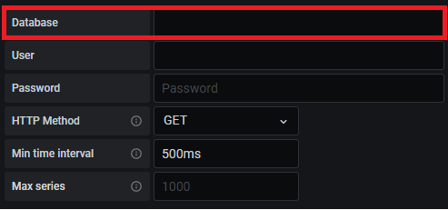


<!-- multilingual suffix: en, es -->

<!-- [en] -->

**Throughout this document it will be clearly indicated at which points of the process (specifically there are 3) you are expected to take screenshots to demonstrate that your implementation works correctly. A green box will be used like the one that frames this text to make it as easy as possible to identify it.**
## Available resources
You have additional documentation of the technologies used throughout the project:

- Communications protocols.

- Virtual machines and Azure.

- SSH and cryptographic keys.

- Docker and Docker Compose.

- InfluxDB.

- Node-RED.

- Grafana.

- MATLAB Online.

In addition, in Atenea you will find videos that introduce Node-RED and Influx in a practical way, so that you can see how you are expected to interact with both software.

# Create the virtual machine
To generate virtual machines you will create an Azure student account with your email **@estudiant.upc.edu**. Once this is done, you will have to activate an Azure subscription for students, with which you will have access to some services of the platform, in which you can spend 100 dollars that the platform will assign you for free. You do not need to give bank card information or make any real expenses to register the service at any time in the process.

Next, you have the web pages where you can register for the services.

- **WebUPC Azure.** To register the account, it must be with a student email. You will have to authenticate the account several times and put your phone number to receive the verification codes.

<https://serveistic.upc.edu/ca/distsoft/faq/microsoft-imagine/acord-upc-microsoft-imagine>

- **Azure website where to activate the free service for students.** There are two free promotions, the common one of €170 for one month, and the student version, which provides €100 for 12 months. The latter is the one that you must activate from the following web page.

<https://azure.microsoft.com/es-es/free/students/>

Once this process is done, you will be able to access the Azure portal by clicking on the “Portal” button on the Microsoft Azure website indicated first or by going directly to <https://portal.azure.com>, as seen in the following screenshots.

Once inside the portal, you must see the following web:

Once inside the portal, you must click on “All services” and search for “Education”, to verify that you have the 100 USD available at the beginning of the project and to check the remaining amount throughout the project.

Once this is done, you can start up your virtual machine, which will be the main evaluable element of your project that will be tutored, but not solved by the teacher. In case you have doubts about operating the platform, you should first look for solutions and information through the professional Azure manuals.

To start working, you must enter the Azure home page and look for the Virtual Machines button.

Once there you can access the creator of virtual machines. Below you have the captures of the characteristics of the machine that you must generate. As you can see, it is NOT the cheapest machine possible since you will use a more powerful machine to carry out the initial installation. Throughout the guide we will indicate when you can modify the features of the machine so that the architecture works on the cheapest machine, with a cost of €3.40 per month being active 24 hours.

You will have them connected much less time, therefore, you could opt for a virtual machine with more features (be careful, spending the 100 USD of the account implies the end of free access to services, with an impact on the execution of the project!) . Since financial and time management is important in any real implementation, please be careful.

Below, the screenshots show the steps to generate the virtual machine:

Step 1 (Subscription type and machine type):

Step 2 (Access Method):

Step 3 (Input Port Rules):

Step 4 (Disk Options):

Step 5 (Networks):

Step 6 (Management, Auto Shutdown):

When you click on “Review and create”, you will have to wait a few seconds and the following message will be shown:

Finally, click on “Create” and the following message will be shown:

Click on “Download the private key and create the resource”. Once the resource has been created, the following message will be shown:

**You must store the private key file in the following path:**

**C:\Users\<YourPCUser>\.ssh**

If you access the virtual machine resource you will see that you can start and stop it. In addition, to avoid scares, in the configuration you will see that you have been instructed to activate the automatic shutdown of the machine every day at 12 PM, so that there are no problems if it stays on after working on it.

You can access the following web page to be able to see the balance you have left and the consumption you make:

<https://www.microsoftazuresponsorships.com>

We encourage you at this point to spend a few minutes getting to know the Azure interface. You can try to locate the information of your virtual machine (public IP, version of the operating system, information about CPU and disks). Due to the wealth of menus and options of the Azure interface it is impossible to know all of it, but we think it is important that you spend a little time locating important functions to work with your virtual machine (start, restart, stop, delete) and you can use these functions when solving problems that arise throughout the implementation of the project.
## Access to the virtual machine via SSH client
Once you start the machine you will have to connect to it to be able to execute commands and use it. This connection is achieved through SSH, a command line protocol that allows you to do something similar to remote desktop connection programs like TeamViewer. The machine created does not have to have a graphical interface, it is just a computer with a command line, as is the case at hand.

In this implementation, **you will access the virtual machine using the SSH key pair that you have already created**, instead of using a username and password. This system minimizes the chances of receiving a man-in-the-middle attack when connecting to the virtual machine.

NOTE: Linux, Mac OSX and some versions of Windows come with a factory-installed SSH client, which can be accessed from the command terminal (cmd for Windows). If you need to install it separately, here is a simple tutorial for Windows 10:

<https://www.profesionalreview.com/2018/11/30/ssh-windows-10/>

To access the virtual machine via SSH, click on the Connect button that you can see in the following screenshot:

Click on SSH in the drop-down that opens, and you will reach the following menu:

Now you must copy the path of the private key that you downloaded when creating the virtual machine and paste it in the space available in point 3. Once this is done, copy the content of point 4, since the command will be completed with the path of the private key that you have indicated.

The terminal response should be similar to the following:

At the bottom you can see that the user and the name of your virtual machine are already indicated. Therefore, you can already execute commands on the virtual machine from that line.
1. ## Enable access for the teaching team
You will be provided with a public key that you must enable within the virtual machine.

To do so, copy the public key and once inside the virtual machine execute the following commands to place yourself in the .ssh/ directory:

$ ls -a

$ cd. ssh

The following command allows you to access the file that you must configure:

$ sudo nano authorized\_keys

The *authorized\_keys* file allows you to record the public keys that the virtual machine will consider known. You will have to paste in the lower line (marked in red in the capture) to which the public key that has been provided to you is already written:

To exit save the changes with CTRL+O, press *Enter* to keep the name of the saved file and exit with CTRL+X.

Finally you can validate if there are two keys registered by entering the following command:

$ sudo cat authorized\_keys
1. ## Virtual machine handling instructions
For the general use of the Linux Bash terminal, you can use the following website that will explain the basic commands of the terminal:

<https://es.wikibooks.org/wiki/Manual_de_consola_Bash_de_Linux>

Highlight the use of the following commands:

- “**cd**”. Allows you to navigate between directories.
- “**ps –A**”. It allows you to see the processes (programs) that the operating system is running, very useful to check if the software you need is running.
- “**docker ps**”. Returns a list with information on the generated containers (identifier, image from which it was created and status).

On the other hand, for Windows users we recommend installing Windows Terminal, a program that offers a terminal with many features (navigate up and down to be able to view all the commands entered and the information returned by the machine, generate several terminal sessions in the form of tabs in the same window, …). This application is free and you can find it in the Microsoft Store.
1. # Installing containerized software
The resources that you will run in the virtual machine are:

- **Node-RED**, a communications manager with the plant and other applications in the cloud, which also allows programs to be executed (in the first part of the project, to check its operation, NodeRed will contain a generator of sinusoidal signals at a certain frequency and amplitude that will emulate the captured signal).
- **Grafana**, a low-complexity graphical interface that allows you to present data on a web in the form of graphs, maps, etc. It is easily configurable to work with InfluxDB.
- **InfluxDB**, a database server in which we will store data.

In the technological solution that you are going to implement, you will install each software in an isolated container, as you can see in the following screenshot:

1. ## Docker installation
Once connected to your virtual machine via SSH, you will need to run the commands presented in this section to download and install Docker. The commands found below are the same as those provided in the official Docker documentation, which you can find at the following link:

<https://docs.docker.com/engine/install/ubuntu/>

**NOTE:** if you have an AMR processor, consult the official documentation, <https://docs.docker.com/engine/install/ubuntu/>, since the last command will be different in your case)

$ sudo apt-get udpate

$ sudo apt-get install \

`	`apt-transport-https \

`	`ca-certificates \

`	`curl \

`	`gnupg \

`	`lsb-release

$ sudo curl -fsSL https://download.docker.com/linux/ubuntu/gpg | sudo gpg --dearmor -o /usr/share/keyrings/docker-archive-keyring.gpg

$ echo \

`  `"deb [arch=amd64 signed-by=/usr/share/keyrings/docker-archive-keyring.gpg] https://download.docker.com/linux/ubuntu \

`  `$(lsb\_release -cs) stable" | sudo tee /etc/apt/sources.list.d/docker.list > /dev/null

$ sudo apt-get update

$ sudo apt-get install docker-ce docker-ce-cli containerd.io

You can verify that Docker has been installed correctly by running the following command to download and run an image in a container, printing an informative message on the screen when doing so.

$ sudo docker run hello-world
1. ## Install Docker Compose
Next, you will need to download and install Docker-compose with the following commands:

$ sudo curl -L "https://github.com/docker/compose/releases/download/1.28.5/docker-compose-$(uname -s)-$(uname -m)" -o /usr/local/bin/docker-compose

$ sudo chmod +x /usr/local/bin/docker-compose

You can verify that it has been installed correctly by running the following command:

$ sudo docker-compose –version
1. ## Transfer files to the virtual machine
Now you must download the IIACPS\_base\_folder directory from Athena and send it to the virtual machine that you have created. This file transfer will be carried out using the SCP protocol (Security Copy Protocol) which is based on SSH.

Once cmd or Windows Terminal is open on your computer, enter the following command:

scp -r -i <rutaclaveprivada> <rutadeorigen> usuarioVM@ipVM:<ruta dedestino>

NOTE: The -r in the command indicates that a complete directory is being sent, if you need to send only one file you can use the same command, removing the -r.

In the terminal you should see the progress of the file transfer being indicated, reaching 100% when complete. It is recommended that you verify, being SSH connected to the VM, that you can easily locate the IIACPS\_base\_folder directory.

1. ## Node-RED *custom* image creation
Because we are going to need to use some specific Node-RED packages that are not included in the base version, it will be necessary for you to mount an image that includes those packages. **The docker architecture that you have sent by SCP to the virtual machine is already prepared for it**. To mount the image, you will need to go inside the IIA\_CPS\_base\_folder folder and run the following command (NOTE: The dot after <tag> is included in the command):

$ sudo docker build -t nodered:<tag> .

You will notice when you press “Enter” that a sequence of 4 steps begins.

When the sequence is finished, you can verify that it was created correctly with the following command:

$ sudo docker image ls

Once finished, **you will have to edit the file “docker-compose.yml” the tag of the image that you have just mounted**. You can leave the Node-Red directory with the following command:

$ cd ..

Once in the folder where “docker-compose.yml” is located, you can edit the file with the following command:

$ sudo nano docker-compose.yml

Be careful not to add spaces or tabs. You only have to edit the line that is shown in the following screenshot, modifying the tag that you have chosen for your image. You can navigate through the file with the directional arrows on the keyboard.

When you have made the modification, remember that you can save the changes by means of “CTRL+O”, it will ask you to name the file and you must not modify the name, so it will be enough to press “Enter”. Finally, to exit the nano file editor, use "CTRL+X". The process of creating the custom image for Node-RED will only have to be done once.

Now, to verify that the image has been generated correctly, you will run the “docker-compose.yml” file (you will find the command to do so on the next page). **You must perform this operation every time you connect to the virtual machine** since, even if you leave the containers mounted, they will be deleted when the virtual machine automatically shuts down at 00:00.
1. ## Grafana *custom* image creation
In the case of Grafana it will also be necessary to generate an image. To mount the image, you will need to go inside the IIA\_CPS\_base\_folder folder and run the following command (NOTE: The dot after <tag> is included in the command):

$ sudo docker build -t grafana:<tag> .

Access the “docker-compose.yml” file as indicated in the previous section and in the Grafana service write the tag of the image you have mounted.

1. ## Container lifting
The following command takes the information collected in the docker-compose to generate the containers. In the case at hand, the docker-compose file you're using has been written to pull up a container for each piece of software, three in total.

$ sudo docker-compose up

**The terminal session you are using will get stuck returning information about the containers in the form of logs, this can be useful in determining what happens if something doesn't work as expected. You will have to open a new one to continue working.**

Alternatively, it is possible to launch the containers without the session being blocked and therefore the logs not being received. To do this, you must add -d to the previous command, being as follows:

$ sudo docker-compose up -d

In either case, to verify that the containers are active, use the following command, which returns the list of containers:

$ sudo docker ps

In the console you should see a list like the following. Keep in mind that it is possible that the first time you execute the command, the three containers have not been generated. Re-enter the command until you verify that all three containers are working.

At this point, if you wish, you can already modify the features of the virtual machine because all the necessary software has already been installed. The cheapest option is B1ls, see the following screenshot. 

1. # Configuring the ports of the virtual machine
In technological solutions such as the one you are implementing, it is necessary to access the configuration of the software elements to guarantee that their operation will comply with the required performance. To program and configure these programs it will be necessary to enable the communication ports in the virtual machine.

Because InfluxDB is a database that we are not going to access from the outside, but other applications will access it when they perform data read or write operations, you will only have to enable the Node-RED and Grafana ports. **By default, Node-RED occupies port 1880 and Grafana 3000.**

In Azure, you will need to access your virtual machine. You can do it through the “Virtual machines” icon, highlighted in the following screenshot.

You will access the list of virtual machines created, and clicking on yours will open the general information of the virtual machine. Now, in the "Networks" section of the configuration menu, a list will be displayed. You will need to define new input port rules, one rule for each port, in order to access and configure each software. As an example, below, you can see what data to fill in to configure the port corresponding to Node-RED.

NOTE: When you click “Add” it may take a few seconds for the new rule to be reflected in the list of port of entry rules.

Once you have both rules defined, you should see a list of input port rules like the one in the screenshot below:

Although it is not necessary to do so, you can also generate a rule with the InfluxDB port, which is 8086. In this way, you will be able to communicate from the browser with the database that you will create in InfluxDB of the virtual machine.

The following HTTP address example makes a GET request to the “endpoint” query, with the “q” and “pretty” parameters. According to the InfluxDB API, the “q” parameter must contain the command that we want to execute, in this case “SHOW DATABASES”, and the “pretty” parameter contains a boolean to indicate that the response is with easy-to-view line breaks.

This is the request:

*http://”IPpublicaDeVuestraVM”:8086/query?q=show databases&pretty=true*

And this is a response message similar to the one you will receive:

To access Node-RED or Grafana you will use the port of each one, the one you have configured in the input port rules of your virtual machine.

**To access NodeRed through the browser you must use:**

*http://”IPpublicaDeVuestraVM”:1880*

**And to access Grafana you must use:**

*http://”IPpublicaDeVuestraVM”:3000*

Now we recommend that, through your browser, you access the Node-RED installation created in a specific container for this software and verify that the following packages have been installed correctly:

- Modbus.
- InfluxDB
- Dashboard.

You can do it by consulting the list of available blocks in the vertical bar to the left of your screen, highlighted in the following screenshot.

If you type the names of the packages in the node browser, at the top of the nodes palette, you can verify that you have available the blocks of the Modbus package (in red), the blocks of the Influxdb package (in brown) and the blocks of the dashboard package (in blue).

1. # Access to the InfluxDB database
Once the containers are up, it will be necessary to generate a database inside the container that runs the InfluxDB software. To do so, you will enter the container's dedicated terminal and access the InfluxDB command line interface.

First of all, you must identify the name of the Influxdb container, as indicated in the following screenshot:

Now you must enter the following command to access the container terminal:

$ sudo docker exec -it <nombre\_del\_contenedor> bash

Next, you must enter the word "influx" to access the InfluxDB command line interface, receiving a response like the one in the following screenshot.

Finally, using the following command you can generate a database:

\> create database <nombre\_de\_la\_base\_de\_datos>

To verify that you have done it correctly, you can access the list of databases created by entering the following command:

\> show databases

The terminal should return a list in which you will find two databases: one with the name “\_internal”, which stores internal InfluxDB data, and the one you have created.

You can find all the documentation regarding the commands used to manage databases from the Influxdb command line interface at the following link:

<https://docs.influxdata.com/influxdb/v1.8/query_language/manage-database/>

1. # Generation and dumping of data in Node-RED
The next step will be to **program a communication flow on Node-RED capable of generating artificial data and dump it into the InfluxDB database that you have created.**

Remember that to access the Node-RED container through the browser you can use the following address:  *http://”IPpublicVM”:1880*

Progressively and fulfilling the objectives that we are setting for you, we propose to generate a flow with the following structure:

1. ## Debug Block
Although debug blocks are not included in the structure of the flow that you have to program, it is recommended that you use the debug blocks to verify that the modifications you make to the Flow produce the expected effect.

The debug blocks can be connected to the output of any block and will show the information they have received on the right side of the screen, specifically in the debug tab.

Therefore, it is not unreasonable to use a debug block at the output of each block that generates or modifies data. Doing so can allow you to quickly spot which block is not performing the desired operation. Once it has been validated that the operation is as expected, deleting the debug blocks will not have any effect.

Below are several sections dedicated to the different types of blocks you will need. It is intended that the objectives that we set for you at the end of each section serve to verify that you have understood how to work with each type of block. To complete these objectives you will need to combine the blocks that have already been presented, cumulatively, with which you will end up generating the complete flow.
1. ## Inject Block
The *inject* blocks allow the generation of messages in the *flow* manually, by means of a button (blue square, on the left side of the block) that can be clicked, or periodically. These messages are objects that contain information and store it in a predefined structure. Normally the messages will have an element called *payload* (which can be accessed through *msg.payload*) where the data contained in the message is usually stored.

In the configuration of your inject block you can decide what you want to be included in the payload of the emitted object. By default, a *timestamp* is sent, that is, the time stamp (in Unix Time format) of the moment in which that inject block has been executed.

In this first part of the project, this block replaces the set of blocks in charge of taking data from a sensor, database, weather station or PLC.

**Goal**

1. **You must verify that you are able to program a Flow in which an *inject* block generates messages manually and also periodically.**
   1. ## Function Block
*Function* blocks allow messages to be manipulated and are programmed in the *JavaScript* language. You can consult the following tutorial to know what the *JavaScript* syntax is for each case.

<https://www.w3schools.com/js/default.asp>

The code that you write in the *function* block, inside the blank space that you can see in the following screenshot, will be executed every time this block receives a message.

You will find information on the operational capabilities offered by this type of block in the following link:

<https://nodered.org/docs/user-guide/writing-functions>

**Goals**

1. **Program a constant numeric value to be assigned to the message *payload*. Verify that this is the case using a *debug* block.**
1. **Program variable data to be generated over time (Some examples may be periodic mathematical functions, counters, or simply random values; the “JS Math” section of the tutorial indicated above may be useful). Verify that it works correctly using a *debug* block.**

The next goal, specified on the next page, is to program the *function* block to output data in the format accepted by InfluxDB databases.

The following screenshot is an example of a function to prepare the message to be dumped to the database through an “Influx Batch” block. As you can see, for each *measurement* that you want to write in the data series, which is indicated as measurement, from the database we can include values that correspond to the data that you want to store, and tags, which are indicators that allow you to filter the data afterwards.

For example, in a *measurement* where data from several temperature sensors is stored, there would be a single temperature column and a column indicating which sensor it is. The data would be organized as in the following table, where the temperature column, which would be the data to be stored, would be a *field* type column, and the name of the sensor to which that measurement corresponds would be a *tag* type column.

|**Temperature**|**Sensor**|
| :-: | :-: |
|23|sensor1|
|21|sensor1|
|29|sensor2|

1. **Program the signal you want to write to the database and see in Grafana (this means that you should no longer modify the *function* block). Adapt the structure and data of the message so that the Influx block can dump them into the database.**

**You must provide a screenshot or screenshot of the code** that you have programmed in the function block to generate the signal that you will later write to the database. Later on, you will be asked for a screenshot of the data written to the database where you can see that the data written by the Node-RED flow is the same as what you see in the InfluxDB database. That is why it is referred to that the function block is not modified during the rest of this first part of the project.	

1. ## InfluxDB Batch Block
The InfluxDB block allows you to connect the Node-RED flow to an InfluxDB database. The steps to configure the block are as follows:

1) Click on the pencil to edit the information regarding the database to which the block is going to connect.

1) In the node editing options, you must fill in the host and port fields with the capture information. Note that this IP has been manually assigned to the InfluxDB container in the docker-compose file. Although it would be totally equivalent to use the IP of the virtual machine indicating port 8086, remember that the IP of the virtual machine changes every time you start it (which would imply modifying this parameter in the Flow of Node-RED each time), while the IP of the container will always be the same.

1) Finally, you must fill in the database field with the name that you have given to your database, the one that you have previously created in the InfluxDB container.

Click Update or Add when you're done to save your changes.

**Objetive**

**Generate multiple messages manually using the Inject block. Confirm that the data has been correctly written to the database by following the procedure below:**

Repeat the process that was carried out to create the database in the Influx container ([click here to return to the instructions for that process](#_heading=h.z337ya)). Once inside the Influx container, enter the following commands:

\> use <name\_of\_the\_database>

This command is used to indicate that from now on the commands entered will refer to a specific database.

\> select \* from <name\_of\_series\_of\_measures>

This is how we tell influx that we want to display all the columns (\*) of (from) a particular series of measurements. As an example we show you a response similar to the one you should receive in the terminal.

Keep in mind that if you have kept the Node-RED flow writing periodically, the list of measures that you will see can be very long.

1. **Generate a signal for a while (2 minutes is enough if you are writing a measure every second, since 120 measures would come out). This signal will be the one you should visualize in Grafana; how to do it is explained in the next section.**

**You must provide a screenshot of the data written to the InfluxDB database.** Remember that at this point you are demonstrating that the synthetic data generated by how you have programmed in the function block (which has been reflected in the last capture that we have asked you for) arrive correctly at the database. As an example, think that if you have generated a sinusoidal signal with an amplitude between -1 and 1, it is very easy to see that it is the same signal in the database. 

1. # Data visualization in Grafana
With the containers raised, you can access the container containing Grafana through your browser using the following URL:

*http://”public\_IP\_of\_yourVM”:3000*

To log in you will use the following credentials that are indicated in the “docker-compose.yml” file, which are the following:

**User: admin**

**Password: supersecretpassword**

Now you must configure the database from which you want Grafana to read data. To do this, you must access the configuration menu and access the Data Sources section.

Click Add Data Source and select InfluxDB as the database type.

You must give a name to this Data Source (it does not have to be the same as the InfluxDB database) and indicate the URL address of the InfluxDB container.

In the *Database* field you must enter the name of your database. Make sure that the *HTTP Method* and *Min time* Interval fields remain as in the screenshot.

You can validate that Grafana has detected the database by clicking the *Save & Test* button. A successful result should return the following message:

To view the data written in the InfluxDB database, you must create a Grafana *Dashboard*:

Click on *Add new panel* and a panel will open that will be updated with the information you add in the *Query* tab. Now you must modify the highlighted fields in the screenshot with the name of the InfluxDB measurement series where you have written the data and the variable that contains the numerical values of the measurements.

Once you have done it, in the graphic panel at the top you will be able to visualize the synthetic data that you have generated in Node-RED. You can select a period of time on which to zoom in to better see the data. **With this you will have fulfilled the objective set for this first part of the project, good job!**

Click Apply in the top right corner of the screen to save the panel changes you've generated. Once done, at the top of the *dashboard* you also have an option to save the changes to the *dashboard*.

**You must provide a screenshot of the Grafana dashboard where you can clearly see the data that is written in the InfluxDB database.** Configure the dashboard so that you can clearly see the behavior of the data.

31

<!-- [en] -->
# Development of an IIoT architecture in the cloud (cloud computing)

This guidance document only covers the first part of the project, which aims to build the IIoT architecture and verify that it has the ability to manage data flows. Communications with the industrial environment and data processing will be carried out in the second part of the project.

**In section 1. the structure of the IIoT architecture is presented and the objectives of this first part of the project are defined, as well as the results that you must obtain and contribute.**
# Introduction to the first part of the project
In the IIoT architecture, you will generate artificial data within the communication flow management software itself (Node-RED) that will allow you to verify that the database and the visualization panels work as expected. You are expected to follow the sections in order as they cover the steps necessary to implement the proposed IIoT architecture.
<!-- [es] -->
# Desarrollo de una arquitectura IIoT en la nube (*cloud computing*)

Este documento guía solo cubre la primera parte del proyecto, que tiene por objetivo generar la arquitectura IIoT y verificar que tiene la capacidad de gestionar flujos de datos. Las comunicaciones con el entorno industrial y el procesado de datos se llevarán a cabo en la segunda parte del proyecto.

**En la sección 1. se presenta la estructura de la arquitectura IIoT y se definen los objetivos de esta primera parte del proyecto, así como los resultados que debéis obtener y aportar.**

# Introducción a la primera parte del proyecto

En la arquitectura IIoT, vosotros mismos generaréis datos artificiales dentro del propio software de gestión de flujos de comunicación (Node-RED) que os permitan verificar que la base de datos y los paneles de visualización funcionan como se espera. Se espera que sigáis las secciones en orden ya que van tratando de forma pautada los pasos necesarios para implementar la arquitectura IIoT propuesta.
<!-- [common] -->
{: .center}
<!-- [en] -->
When you have achieved it, you will be able to advance to the second part of the project, which also has its respective guide, which consists of the integration of the IIoT architecture that you have generated in a cyber-physical system (CPS architecture).
## Motivation
Validation of the correct operation of an IIoT architecture in isolation is essential to ensure that, in the future, when it is integrated into the design of the technological solution of which it is a part, it complies with the desired specifications.

In an industrial environment, where it may be necessary to scale a solution like the one you are going to generate due to the need to connect several PLCs and databases, it is especially important to make sure that the solution has been correctly designed. In this way it will be possible to deal more effectively with the problems inherent to the integration of this solution in an industrial environment, starting from the assumption that the designed solution can be treated as a product in the form of a closed package, which admits certain types of data as inputs and manage them in a specific way.

## Objectives of the first part of the project
In this first part of the project you must achieve **three** objectives:
1. Set up a virtual environment (cloud computing) using a Microsoft Azure platform virtual machine and the Docker software packaging system.
1. Generate a base IIoT architecture on which you will be able to develop aspects related to industrial communications in the second part of the practice.
1. Launch applications that will perform specific functions through the following software: NodeRED, InfluxDB and Grafana.
   ## Results of the first part of the project
- Taking into account the objectives that have been mentioned in the previous section, the results that you must obtain and contribute at the end of this first part of the practice are:
- Ensure that the virtual machine is operational and that the necessary software is correctly installed.
- Demonstrate through screenshots that you are able to generate synthetic data in Node-RED and can visualize it in an InfluxDB database.

- Demonstrate through screenshots that you generate a Grafana dashboard that allows you to view the data stored in an InfluxDB database.
<!-- [es] -->
Cuando lo hayáis logrado, podréis avanzar a la segunda parte del proyecto, que también dispone de su respectiva guía, que consiste en la integración de la arquitectura IIoT que habéis generado en un sistema ciber-físico (arquitectura CPS).
## Motivación
La validación del correcto funcionamiento de una arquitectura IIoT de forma aislada resulta fundamental para garantizar que, en el futuro, cuando se integre en el diseño de la solución tecnológica de la que forma parte, cumpla con las especificaciones deseadas. 

En un entorno industrial, donde pueda ser necesario escalar una solución como la que vais a generar debido a que se quiera conectar varios PLCs y bases de datos, es especialmente importante asegurarse que la solución ha sido correctamente diseñada. De esta forma será posible abordar con más eficacia los problemas propios de la integración de esta solución en un entorno industrial, partiendo del supuesto que la solución diseñada puede tratarse como un producto en forma de paquete cerrado, que admite como *inputs* determinados tipos de datos y los gestiona de una forma concreta.

## Objetivos de la primera parte del proyecto
En esta primera parte del proyecto debéis cumplir **tres objetivos**:

1. Configurar un entorno virtual (*cloud computing*) utilizando una máquina virtual de la plataforma Azure de Microsoft y el sistema de encapsulado de software de Docker.
1. Generar una arquitectura IIoT base sobre la que podréis desarrollar aspectos relacionados con las comunicaciones industriales en la segunda parte de la práctica.
1. Poner en marcha aplicaciones que realizarán funciones específicas a través del siguiente software: NodeRED, InfluxDB y Grafana.
   ## Resultados de la primera parte del proyecto
Teniendo en cuenta los objetivos que se han mencionado en el apartado anterior, los **resultados** que debéis obtener y aportar al final de esta primera parte de la práctica son:

- Lograr que la máquina virtual esté operativa y que el software necesario está correctamente instalado.
- **Demostrar mediante capturas de pantalla** que sois capaces de generar datos sintéticos en Node-RED y los podéis visualizar en una base de datos de InfluxDB.

- **Demostrar mediante capturas de pantalla** que el generáis un *dashboard* de Grafana que os permite visualizar los datos almacenados en una base de datos de InfluxDB.

**A lo largo de este documento se indicará claramente en que puntos del proceso (en concreto son 3) se espera que toméis capturas para demostrar que vuestra implementación funciona correctamente. Se empleará un recuadro verde como el que enmarca este texto para su facilitar al máximo su identificación.**
## Recursos disponibles
Tenéis a vuestra disposición documentación adicional de las tecnologías que se utilizan a lo largo del proyecto:

- Protocolos de comunicaciones.
- Máquinas virtuales y Azure.
- SSH y claves criptográficas.
- Docker y Docker Compose.
- InfluxDB.
- Node-RED.
- Grafana.
- MATLAB Online.

Además, en Atenea encontraréis vídeos que introducen Node-RED e Influx de forma práctica, para que podáis ver como se espera que interactuéis con ambos softwares. 

# Creación de la máquina virtual
Para generar máquinas virtuales crearéis una cuenta personal de Azure a la que, posteriormente, le asignaréis vuestro email **@estudiant.upc.edu**. Una vez hecho esto deberéis activar una subscripción de Azure para estudiantes, con lo que tendréis acceso a algunos servicios de la plataforma, en los que podréis gastar 100 dólares que la plataforma os asignará gratuitamente. No es necesario que deis información de tarjetas bancarias ni realizar ningún gasto real para dar de alta el servicio en ningún momento del proceso.

A continuación, tenéis las páginas web donde poder daros de alta en los servicios.

- **Web UPC Azure.** Para dar de alta la cuenta, debe ser con un email personal, después podréis poner el email de la UPC. Deberéis autenticar la cuenta varias veces y poner vuestro número de teléfono para recibir los códigos de verificación. 

<https://serveistic.upc.edu/ca/distsoft/faq/microsoft-imagine/acord-upc-microsoft-imagine>

- **Web de Azure donde activar el servicio gratuito para estudiantes.** Existen dos promociones gratuitas, la común de 170€ durante un mes, y la versión de estudiantes, que proporciona 100€ durante 12 meses. Esta última es la que deberéis activar desde la siguiente página web. 

<https://azure.microsoft.com/es-es/free/students/>

Una vez realizado este proceso podréis acceder al portal de Azure en el botón “Portal” de la web de Microsoft Azure indicada primeramente o accediendo directamente a <https://portal.azure.com> , como se ve en las siguientes capturas de pantalla.
<!-- [common] -->

<!-- [es] -->
Una vez en el portal deberíais ver el siguiente web:
<!-- [common] -->

<!-- [es] -->
Una vez dentro del portal debéis hacer clic en “Todos los servicios” y buscar “Education”, para verificar que tenéis disponibles los 100 USD en el inicio del proyecto y para consultar la cantidad restante a lo largo del mismo.
<!-- [common] -->

<!-- [es] -->
Una vez hecho esto ya podéis poner en marcha vuestra máquina virtual, que será el principal elemento evaluable de vuestro proyecto que será tutorizado, pero no resuelto por el profesor. En caso de que tengáis dudas de operación con la plataforma deberéis primero buscar soluciones e información mediante los manuales profesionales de Azure. 

Para empezar a trabajar, deberéis entrar la página de inicio de Azure y buscar el botón Máquinas Virtuales. 
<!-- [common] -->

<!-- [es] -->

Una vez allí podréis acceder al creador de máquinas virtuales. Más abajo tenéis las capturas de las características de la máquina que debéis generar. Como podéis comprobar, **NO se trata de la máquina más económica posible ya que emplearéis una máquina más potente para llevar a cabo la instalación inicial**. Os indicaremos a lo largo de la guía en qué momento podéis modificar las prestaciones de la máquina para que la arquitectura funcione sobre la máquina más económica, con un coste de 3,40€ al mes estando 24 horas activa. 

Vosotros las tendréis conectada mucho menos tiempo, por tanto, podríais optar por una máquina virtual con más prestaciones (¡cuidado, gastar los 100 USD de la cuenta implica el fin del acceso gratuito a los servicios, con impacto en la ejecución del proyecto!). Dado que la gestión económica y temporal es importante en cualquier implementación real, se os ruega que seáis cuidadosos.

A continuación, as capturas de pantalla muestran los pasos a realizar para generar la máquina virtual:

Paso 1 (Tipo de suscripción y tipo de máquina):
<!-- [common] -->

<!-- [es] -->
Paso 2 (Método de acceso):
<!-- [common] -->

<!-- [es] -->

Paso 3 (Reglas de puerto de entrada):
<!-- [common] -->

<!-- [es] -->
Paso 4 (Opciones de disco):
<!-- [common] -->

<!-- [es] -->

Paso 5 (Redes):
<!-- [common] -->

<!-- [es] -->
Paso 6 (Administración, apagado automático):
<!-- [common] -->

<!-- [es] -->
Al hacer clic en “Revisar y crear”, deberéis esperar unos segundos y se os mostrará el siguiente mensaje:
<!-- [common] -->

<!-- [es] -->
Finalmente, hacer clic en “Crear” y se os mostrará el siguiente mensaje:
<!-- [common] -->

<!-- [es] -->
Hacer clic en “Descargar la clave privada y crear el recurso”. Una vez se haya creado el recurso se os mostrará el siguiente mensaje:
<!-- [common] -->

<!-- [es] -->
**Deberéis almacenar el archivo de la clave privada en la siguiente ruta:**

***C:\Users\<UsuariodevuestroPC>\.ssh***

Si accedéis al recurso máquina virtual veréis que podéis iniciarla y detenerla. Además, para evitar sustos, en la configuración veréis que se os ha indicado que activéis el apagado automático de la máquina cada día a las 24:00:00, para que no haya problemas si se queda encendida después de trabajar en ella. 

Podréis acceder a la siguiente página web para poder ver el saldo que os queda y el consumo que realizáis:

<https://www.microsoftazuresponsorships.com>

Os animamos en este punto a dedicar unos minutos a conocer la interfaz de Azure. Podéis intentar localizar la información de vuestra máquina virtual (IP pública, versión de sistema operativo, información acerca de CPU y discos). Debido a la riqueza de menús y opciones de la interfaz de Azure es imposible conocerla entera, pero creemos que es importante que dediquéis un poco de tiempo a localizar funciones importantes para trabajar con vuestra máquina virtual (iniciar, reiniciar, detener, eliminar) y podáis emplear dichas funciones a la hora de resolver problemas que vayan surgiendo a lo largo de la implementación del proyecto.
## Acceso a la máquina virtual mediante cliente SSH
Una vez arranquéis la maquina deberéis conectaros a ella para poder ejecutar comandos y utilizarla. Esta conexión se logra mediante SSH, un protocolo de línea de comandos que permite hacer algo parecido a programas de conexión remota de escritorios como TeamViewer. La máquina creada no tiene por qué tener una interfaz gráfica, es solo un ordenador con línea de comando, como es el caso que os ocupa.

En esta implementación, **accederéis a la máquina virtual mediante el par de claves SSH que ya habéis creado**, en lugar de utilizar usuario y contraseña. Este sistema minimiza las posibilidades que se reciba un ataque de intermediario (*man-in-the-middle attack*) a la hora de conectarse a la máquina virtual.

NOTA: Linux, Mac OSX y algunas versiones de Windows traen un cliente SSH instalado de fábrica, al que se puede acceder des del terminal de comandos (cmd para Windows). Si necesitáis instalarlo a parte, aquí tenéis un tutorial sencillo para Windows 10:

<https://www.profesionalreview.com/2018/11/30/ssh-windows-10/>

Para acceder a la máquina virtual mediante SSH hacer clic en el botón Conectar que podéis ver en la siguiente captura:
<!-- [common] -->

<!-- [es] -->
Haced clic en *SSH* en el desplegable que se os abre, y llegaréis al siguiente menú:
<!-- [common] -->

<!-- [es] -->
Ahora deberéis copiar la ruta de la clave privada que habéis descargado al crear la máquina virtual y pegarla en el espacio disponible en el punto 3. Una vez hecho esto, copiad el contenido del punto 4, ya que el comando se completará con la ruta de la clave privada que habéis indicado.

La respuesta del terminal debería ser parecida a la siguiente:
<!-- [common] -->

<!-- [es] -->
En la parte inferior podéis ver que ya se indica el usuario y el nombre de vuestra máquina virtual. Por tanto, ya podréis ejecutar comandos sobre la máquina virtual a partir de esa línea.
## Habilitar acceso para el equipo docente
Se os proporcionará una clave pública que deberéis habilitar dentro de la máquina virtual.

Para hacerlo, copiad dicha clave pública y una vez dentro de la máquina virtual ejecutad los siguientes comandos para situaros en el directorio .ssh/:

      $ ls -a

      $ cd. ssh

El siguiente commando permite acceder al archivo que debéis configurar:

      $ sudo nano authorized\_keys
<!-- [common] -->

<!-- [es] -->

El archivo *authorized\_keys* permite registrar las claves públicas que la máquina virtual considerará conocidas. Deberéis pegar en la línea inferior (marcada en rojo en la captura) a la que ya está escrita la clave pública que se os ha proporcionado:
<!-- [common] -->

<!-- [es] -->
Para salir guardad los cambios con CTRL+O, pulsad *Enter* para mantener el nombre del archivo guardado y salid con CTRL+X.

Finalmente podéis validar si hay dos claves registradas introduciendo el siguiente comando:

      $ sudo cat authorized\_keys
## Instrucciones de manejo de la máquina virtual
De cara al uso general del terminal Bash de Linux, podéis utilizar la siguiente web que os explicará los comandos básicos del terminal:

<https://es.wikibooks.org/wiki/Manual_de_consola_Bash_de_Linux>

Resaltar el uso de los siguientes comandos:

- “**cd**”. Permite desplazarse entre directorios.
- “**ps –A**”. Permite ver los procesos (programas) que está ejecutando el sistema operativo, muy útil para comprobar si el software que necesitareis está en ejecución.
- “**docker ps**”. Devuelve una lista con información de los contenedores generados (identificador, imagen a partir de la que se ha creado y estado).

Por otro lado, para los usuarios de Windows recomendamos instalar Windows Terminal, un programa que ofrece un terminal con muchas funcionalidades (navegar arriba y abajo para poder visualizar todos los comandos introducidos y la información devuelta por la máquina, generar varias sesiones de terminal en forma de pestañas en una misma ventana, …). Esta aplicación es gratuita y la podéis encontrar en la Microsoft Store.
# Instalación de software en contenedores
Los recursos que haréis correr en la máquina virtual son:

- **Node-RED**, un gestor de comunicaciones con la planta y otras aplicaciones en nube, que permite además ejecutar programas (en la primera parte del proyecto, para comprobar su funcionamiento, NodeRed contendrá un generador de señales sinusoidales a cierta frecuencia y amplitud que emulará la señal capturada).
- **Grafana**, un interfaz gráfico de baja complejidad que permite presentar datos en una web en forma de gráficos, mapas, etc. Es fácilmente configurable para trabajar con InfluxDB.
- **InfluxDB**, un servidor de base de datos en el que almacenaremos data.

En la solución tecnológica que vais a implementar instalaréis cada software en un contenedor aislado (*container*), como podéis ver en la siguiente captura:
<!-- [common] -->

<!-- [es] -->
## Instalación de Docker
Una vez conectados a vuestra máquina virtual mediante SSH, deberéis ejecutar los comandos que se presentan en esta sección para descargar e instalar Docker. Los comandos que se encuentran a continuación son los mismos que se aportan en la documentación oficial de Docker, que podéis encontrar en el siguiente enlace:

<https://docs.docker.com/engine/install/ubuntu/>

**NOTA**: si disponéis de un procesador AMR consultad la documentación oficial, <https://docs.docker.com/engine/install/ubuntu/>, ya que el último comando será diferente en vuestro caso)

      $ sudo apt-get udpate

      $ sudo apt-get install \

         apt-transport-https \

         ca-certificates \

         curl \

         gnupg \

         lsb-release

      $ sudo curl -fsSL https://download.docker.com/linux/ubuntu/gpg | sudo gpg --dearmor -o /usr/share/keyrings/docker-archive-keyring.gpg

      $ echo \

         "deb [arch=amd64 signed-by=/usr/share/keyrings/docker-archive-keyring.gpg] https://download.docker.com/linux/ubuntu \

      $(lsb\_release -cs) stable" | sudo tee /etc/apt/sources.list.d/docker.list > /dev/null

      $ sudo apt-get update

      $ sudo apt-get install docker-ce docker-ce-cli containerd.io

Podéis verificar que Docker se ha instalado correctamente ejecutando el siguiente comando, para descargar y ejecutar una imagen en un contenedor, imprimiendo al hacerlo un mensaje informativo por pantalla.

      $ sudo docker run hello-world
## Instalación de Docker Compose
A continuación, deberéis descargar e instalar Docker-compose con los siguientes comandos:

      $ sudo curl -L "https://github.com/docker/compose/releases/download/1.28.5/docker-compose-$(uname -s)-$(uname -m)" -o /usr/local/bin/docker-compose

      $ sudo chmod +x /usr/local/bin/docker-compose

Podéis verificar que se ha instalado correctamente ejecutando el siguiente comando:

      $ sudo docker-compose –version
## Transferencia de archivos a la máquina virtual
Ahora deberéis descargar el directorio IIACPS\_base\_folder de Atenea y enviarlo a la máquina virtual que habéis creado. Esta transferencia de archivos se llevará a cabo mediante el protocolo SCP (Security Copy Protocol) que está basado en SSH.

Una vez abierto *cmd* o *Windows Terminal* en vuestro ordenador, introducir el siguiente comando:

      scp -r -i <rutaclaveprivada> <rutadeorigen> usuarioVM@ipVM:<ruta dedestino>

NOTA: La **-r** en el comando indica que se está enviando un directorio completo, si necesitáis enviar solo un archivo podéis utilizar el mismo comando, eliminando la **-r**.

En el terminal deberíais observar que se indica el progreso de la transferencia de archivos, alcanzando el 100% cuando se haya completado. Se recomienda que verifiquéis, estando conectados por SSH a la VM, que podéis localizar fácilmente el directorio IIACPS\_base\_folder.
<!-- [common] -->

<!-- [es] -->
## Creación de imagen *custom* de Node-RED
Debido a que vamos a necesitar usar algunos paquetes concretos de Node-RED que no vienen incluidos en la versión base, será necesario que montéis una imagen que incluya dichos paquetes. **La arquitectura docker que habéis enviado por SCP a la máquina virtual ya está preparada para ello**. Para montar la imagen, deberéis situaros dentro de la carpeta IIA\_CPS\_base\_folder y ejecutar el siguiente comando (NOTA: El punto después de **tag** está incluido en el comando):

      $ sudo docker build -t nodered:<tag> .

Observaréis al pulsar “Enter” que se inicia una secuencia de 4 pasos. 
<!-- [common] -->

<!-- [es] -->
Cuando finalice la secuencia, podéis verificar que se ha creado correctamente con el siguiente comando:

      $ sudo docker image ls
<!-- [common] -->

<!-- [es] -->
Una vez terminada, **deberéis editar el archivo “docker-compose.yml” el tag de la imagen que acabáis de montar**.  Podéis salir del directorio de Nodered con el siguiente comando:

      $ cd ..

Una vez en la carpeta donde se encuentra “docker-compose.yml”, podéis editar el archivo con el siguiente comando:

      $ sudo nano docker-compose.yml

Tened cuidado de no añadir espacios o tabulaciones. Solo debéis editar la línea que se muestra en la siguiente captura modificando el tag que habéis elegido para vuestra imagen. Podréis navegar por el archivo con las flechas direccionales del teclado.
<!-- [common] -->

<!-- [es] -->

Cuando hayáis realizado la modificación, recordar que podéis guardar los cambios mediante “CTRL+O”, os pedirá que nombréis el archivo y no debéis modificar el nombre, así que será suficiente con pulsar “Enter”. Finalmente, para salir del editor de archivos *nano*, usad “CTRL+X”. El proceso de crear la imagen *custom* para Node-RED solo deberéis realizarlo una vez.

Ahora, para verificar que la imagen se ha generado correctamente ejecutaréis el archivo “docker-compose.yml” (encontraréis el comando con el que hacerlo en la página siguiente). **Esta operación la deberéis realizar cada vez que os conectéis a la máquina virtual** ya que, aunque dejéis los contenedores montados, se eliminarán cuando la máquina virtual se apague automáticamente a las 00:00.
## Creación de imagen *custom* de Grafana
Para el caso de Grafana también será necesario generar una imagen. Para montar la imagen, deberéis situaros dentro de la carpeta IIA\_CPS\_base\_folder y ejecutar el siguiente comando (NOTA: El punto después de **tag** está incluido en el comando):

      $ sudo docker build -t grafana:<tag> .

Acceded al archive “docker-compose.yml” como se indica en la sección anterior y en el servicio de Grafana escribid el tag de la imagen que habéis montado.
<!-- [common] -->

<!-- [es] -->

## Levantado de contenedores
El siguiente comando toma la información recogida en el docker-compose para generar los contenedores. En el caso que nos ocupa, el archivo docker-compose que estáis utilizando ha sido escrito para que levante un contenedor para cada software, tres en total.  

      $ sudo docker-compose up

**La sesión de terminal que estáis utilizando se quedará bloqueada devolviendo información acerca de los contenedores en forma de logs, esto puede ser útil a la hora de determinar que sucede si algo no funciona como esperabais. Deberéis abrir una nueva para continuar trabajando.** 

Alternativamente es posible levantar los contenedores sin que la sesión se quede bloqueada y por tanto no se reciban los logs. Para ello, debéis añadir *-d* al comando anterior, quedando como sigue:

      $ sudo docker-compose up -d

En cualquiera de los dos casos, para verificar que los contenedores están activos utilizad el siguiente comando, que devuelve la lista de contenedores:

      $ sudo docker ps

En la consola deberíais visualizar una lista como la siguiente. Tened en cuenta que es posible que la primera vez que ejecutáis el comando no se hayan generado los tres contenedores. Volved a introducir el comando hasta verificar que los tres contenedores están funcionando.
<!-- [common] -->

<!-- [es] -->

En este punto, si lo deseáis, ya podéis modificar las prestaciones de la máquina virtual debido a que **ya se ha instalado todo el software necesario**. La opción más económica es **B1ls**, ver la siguiente captura. 
<!-- [common] -->

<!-- [es] -->

# Configuración de los puertos de la máquina virtual
En soluciones tecnológicas como la que estáis implementando, se requiere acceder a la configuración de los elementos de software para garantizar que su operación cumplirá con el funcionamiento requerido. Para programar y configurar dichos programas será necesario habilitar los puertos de comunicaciones en la máquina virtual.

Debido a que InfluxDB se trata de una base de datos a la que no vamos a acceder des del exterior, sino que accederán las otras aplicaciones cuando realicen operaciones de lectura o escritura de datos, solo deberéis habilitar los puertos de Node-RED y Grafana. **Por defecto, Node-RED ocupa el puerto 1880 y Grafana el 3000.**

En Azure, deberéis acceder a vuestra máquina virtual. Lo podéis hacer mediante el icono de “Máquinas virtuales”, remarcado en la siguiente captura.

Accederéis a la lista de máquinas virtuales creadas, y haciendo clic en la vuestra se os abrirá la información general de la máquina virtual. Ahora, en el apartado “Redes” del menú de configuración, se desplegará una lista.  Deberéis definir nuevas reglas de puertos de entrada, una regla para cada puerto, para poder acceder a cada software y configurarlo. Como ejemplo, a continuación, podéis ver que datos rellenar para configurar el puerto correspondiente a Node-RED.

NOTA: Cuando hagáis clic en “Agregar” es posible que tarde unos segundos en verse reflejada la nueva regla en la lista de reglas de puerto de entrada.

Una vez tengáis ambas reglas definidas, deberíais ver una lista de reglas de puerto de entrada como la de la captura siguiente:

Pese a que no es necesario hacerlo, también se puede generar una regla con el puerto de InfluxDB, que es el 8086. De esta forma, os podréis comunicar des del navegador con la base de datos que crearéis en InfluxDB de la máquina virtual.

El siguiente ejemplo de dirección HTTP realiza una petición GET al “endpoint” query, con los parámetros “q” y “pretty”. Según la API de InfluxDB, el parámetro “q” debe contener el comando que queremos ejecutar, en este caso “SHOW DATABASES”, y el parámetro “pretty” contiene un booleano para indicar que la respuesta sea con saltos de línea fáciles de visualizar. 

Esta es la petición:

*http://”IPpublicaDeVuestraVM”:8086/query?q=show databases&pretty=true*

Y este un mensaje de respuesta semejante al que vosotros recibiréis:

Para acceder a Node-RED o Grafana utilizaréis el puerto de cada uno, el que habéis configurado en las reglas de puertos de entrada de vuestra máquina virtual. 

**Así, para acceder a NodeRed mediante el navegador debéis usar:**

[*http://”IPpublicaDeVuestraVM”:1880*]()

**Y para acceder a Grafana debéis usar:**

[*http://”IPpublicaDeVuestraVM”:3000*]()

Ahora recomendamos que, mediante vuestro navegador, accedáis a la instalación de Node-RED creada en un contenedor específico para este software y verifiquéis que se han instalado correctamente los siguientes paquetes:

- Modbus.
- InfluxDB
- Dashboard.

Lo podéis hacer consultando la lista de bloques disponibles en la barra vertical a la izquierda de vuestra pantalla, remarcada en la siguiente captura.

Si tecleáis los nombres de los paquetes en el buscador de nodos, en la parte superior de la paleta de nodos, podréis verificar que tenéis disponibles los bloques del paquete Modbus (de color rojo), los bloques del paquete Influxdb (de color marrón) y los bloques del paquete dashboard (de color azul).

# Acceso a la base de datos InfluxDB
Una vez levantados los contenedores, será necesario generar una base de datos dentro del contenedor que ejecuta el software InfluxDB. Para hacerlo, entraréis al terminal dedicado del contenedor y accederéis a la interfaz de línea de comandos de InfluxDB.

En primer lugar, deberéis identificar el nombre del contenedor de Influxdb, como se indica en la siguiente captura:
<!-- [common] -->

<!-- [es] -->
Ahora deberéis introducir el siguiente comando para acceder al terminal del contenedor:

      $ sudo docker exec -it <nombre\_del\_contenedor> bash

A continuación, deberéis introducir la palabra “influx” para acceder a la interfaz de línea de comandos de InfluxDB, recibiendo una respuesta como la de la siguiente captura.
<!-- [common] -->

<!-- [es] -->
Finalmente, mediante el siguiente comando podréis generar una base de datos:

      > create database <nombre\_de\_la\_base\_de\_datos>

Para verificar que lo habéis hecho correctamente, podéis acceder a la lista de bases de datos creadas introduciendo el siguiente comando:

      > show databases

El terminal os debería devolver una lista en la que encontraréis dos bases de datos: una con el nombre “\_internal”, que almacena datos internos de InfluxDB, y la que habéis creado vosotros.

Podéis encontrar toda la documentación referente a los comandos que sirven para gestionar bases de datos a partir de la interfaz de línea de comandos de Influxdb en el siguiente enlace:

<https://docs.influxdata.com/influxdb/v1.8/query_language/manage-database/>

# Generación y volcado de datos en Node-RED
El siguiente paso será **programar sobre Node-RED un flujo de comunicaciones capaz de generar datos artificiales y volcarlos en la base de datos de InfluxDB que habéis creado.**

Recordad que para acceder al contenedor de Node-RED mediante el navegador podéis utilizar la siguiente dirección: [*http://”IPpublicaDeVuestraVM”:1880*]()

De forma progresiva y cumpliendo los objetivos que os vamos marcando, se os propone generar un *flow* con la siguiente estructura:
<!-- [common] -->

<!-- [es] -->
## Bloque Debug
Pese a que no se incluyan bloques *debug* en la estructura del *flow* que tenéis que programar, se recomienda que utilicéis los bloques *debug* para verificar que las modificaciones que hacéis en el Flow producen el efecto esperado.

Los bloques *debug* pueden conectarse a la salida de cualquier bloque y mostrarán en la parte derecha de la pantalla, concretamente en la pestaña *debug*, la información que han recibido.

Por tanto, no es descabellado utilizar un bloque *debug* a la salida de cada bloque que genere o modifique datos. Hacerlo puede permitir localizar rápidamente que bloque no ejecuta la operación que se desea. Una vez validado que el funcionamiento es el esperado, eliminar los bloques *debug* no tendrá ningún efecto.
<!-- [common] -->

<!-- [es] -->
A continuación, se presentan varias secciones dedicadas a los distintos tipos de bloques que vais a necesitar. Se pretende que los objetivos que os fijamos al final de cada sección sirvan para verificar que habéis entendido como trabajar con cada tipo de bloque. Para completar dichos objetivos vais a necesitar combinar los bloques que ya se hayan presentado, de forma acumulativa, con lo que terminaréis generando el *flow* completo.
   ## Bloque inject
Los bloques *inject* permiten la generación de mensajes en el *flow* de manera manual, mediante un botón (cuadrado de color azul, en la parte izquierda del bloque) en el que es posible hacer clic, o de manera periódica.  Estos mensajes son objetos que contienen información y la almacenan en una estructura predefinida. Normalmente los mensajes tendrán un elemento llamado *payload* (al que se puede acceder mediante *msg.payload*) donde se acostumbra a almacenar los datos que contiene el mensaje.

En la configuración de vuestro bloque *inject* podréis decidir qué queréis que se incluya en el *payload* del objeto emitido. Por defecto se envía un *timestamp*, es decir, la maca de tiempo (en formato *Tiempo Unix*) del momento en el que se ha ejecutado ese bloque *inject*.

En esta primera parte del proyecto, este bloque sustituye al conjunto de bloques encargado de tomar datos de algún sensor, base de datos, estación meteorológica o PLC. 

**Objetivo**

1. **Deberéis verificar que sois capaces de programar un Flow en el que un bloque *inject* genera mensajes manualmente y también de forma periódica.**
## Bloque function
Los bloques *function* permiten manipular los mensajes y se programan en lenguaje *JavaScript*. Podéis consultar el siguiente tutorial para conocer cual es la sintaxis de *JavaScript* para cada caso.

<https://www.w3schools.com/js/default.asp>

El código que escribáis en el bloque *function*, dentro del espacio en blanco que podéis ver en la siguiente captura, se ejecutará cada vez que este bloque reciba un mensaje.
<!-- [common] -->

<!-- [es] -->
Encontrareis información sobre las capacidades operativas que ofrece este tipo de bloques en el siguiente link: 

<https://nodered.org/docs/user-guide/writing-functions>

**Objetivos**

1. **Programad que se asigne un valor numérico constante al *payload* del mensaje. Verificad que es así mediante un bloque *debug*.**
1. **Programad que se generen datos variables a lo largo del tiempo (Algunos ejemplos pueden ser funciones matemáticas periódicas, contadores, o simplemente valores aleatorios; el apartado “JS Math” del tutorial indicado anteriormente puede ser de utilidad). Verificad que funciona correctamente mediante un bloque *debug*.**

El siguiente objetivo, que se especifica en la próxima página, consiste en programar el bloque *function* para que genere datos en el formato que aceptan las bases de datos InfluxDB. 

La siguiente captura es un ejemplo de *function* para preparar el mensaje para ser volcado a la base de datos mediante un bloque “Influx Batch”. Como veis, por cada medida que se quiera escribir en la serie de datos, que se indica como *measurement*, de la base de datos podemos incluir valores, que correspondan a los datos que se quieran almacenar, y tags, que son indicadores que permiten filtrar los datos a posteriori. 
<!-- [common] -->

<!-- [es] -->
Por ejemplo, en un *measurement* donde se almacenen datos de varios sensores de temperatura, existiría una sola columna de temperatura y una columna donde indicase de que sensor se trata. Los datos se organizarían como en la siguiente tabla, donde la columna de temperatura, que sería el dato a almacenar, sería una columna de tipo *field*, y el nombre del sensor al que corresponde esa medición sería una columna de tipo *tag*.

|**Temperatura**|**Sensor**|
| :-: | :-: |
|23|sensor1|
|21|sensor1|
|29|sensor2|

3. **Programad la señal que deseéis escribir en la base de datos y ver en Grafana (ello implica que ya no deberíais volver a modificar el bloque *function)*. Adaptar la estructura y los datos del mensaje para que el bloque Influx los pueda volcar en la base de datos.**

**Debéis aportar una captura o recorte de pantalla** del código que habéis programado en el bloque *function* para generar la señal que posteriormente escribiréis en la base de datos. Más adelante, se os pedirá una captura de los datos escritos en la base de datos donde se pueda apreciar que los datos escritos por el *flow* de Node-RED son los mismos que visualizáis en la base de datos de InfluxDB. Por eso se hace referencia a que no se modifique el bloque *function* durante el resto de esta primera parte del proyecto.	

## Bloque InfluxDB Batch
El bloque InfluxDB permite conectar el *flow* de Node-RED con una base de datos de InfluxDB. Los pasos para configurar el bloque son los siguientes:

1) Hacer clic sobre el lápiz para editar la información referente a la base de datos a la que se va a conectar el bloque.
<!-- [common] -->

<!-- [es] -->
2) En las opciones de edición del nodo, deberéis rellenar los campos *host* y *port* con la información de la captura. Tened en cuenta que esta IP ha sido asignada manualmente al container de InfluxDB en el archivo *docker-compose*. Pese a que sería totalmente equivalente utilizar la IP de la máquina virtual indicando el puerto 8086, recordad que la IP de la máquina virtual cambia cada vez que la arrancáis (lo que implicaría modificar este parámetro en el Flow de Node-RED cada vez), mientras que la IP del container será siempre la misma.

3) Finalmente, deberéis rellenar el campo *database* con el nombre que le habéis dado a vuestra base de datos, la que anteriormente habéis creado en el contenedor de InfluxDB.
<!-- [common] -->

<!-- [es] -->
Haced clic en *Update* o *Add* cuando terminéis para guardar los cambios.

**Objetivo**

1. **Generad varios mensajes de forma manual mediante el bloque *Inject*. Confirmad que los datos se han escrito correctamente en la base de datos siguiendo el siguiente procedimiento:**

Repetid el proceso que se ha llevado a cabo para crear la base de datos en el contenedor de Influx ([haced clic aquí para volver a las instrucciones para dicho proceso](#_Acceso_a_la)). Una vez dentro del contenedor de Influx, introducid los siguientes comandos:

      > use <nombre\_de\_la\_base\_de\_datos>

Este comando sirve para indicar que a partir de ahora los comandos introducidos se referirán a una base de datos concreta.

      > select \* from <nombre\_de\_la\_serie\_de\_medidas>

Así le indicamos a influx que queremos visualiar todas las columnas (\*) de (*from*) una serie de medidas en particular. Como ejemplo os mostramos una respuesta semejante a la que deberíais recibir en el terminal. 
<!-- [common] -->

<!-- [es] -->
Tened en cuenta que si habéis mantenido el *flow* de Node-RED escribiendo periódicamente, la lista de medidas que visualizaréis puede ser muy larga.

2. **Generad una señal durante un tiempo (2 minutos es suficiente si estáis escribiendo una medida cada segundo, ya que saldrían 120 medidas). Esta señal será la que deberéis visualizar en Grafana; se explica cómo hacerlo en el siguiente apartado.**

**Debéis aportar una captura de pantalla de los datos escritos en la base de datos de InfluxDB.** Recordad que en este punto estáis demostrando que los datos sintéticos generados por como habéis programado en el bloque *function* (que ha quedado reflejado en la última captura que os hemos pedido) llegan correctamente a la base de datos. Como ejemplo, pensad que si habéis generado una señal senoidal de amplitud entre -1 y 1, es muy fácil apreciar que se trata de la misma señal en la base de datos. 

# Visualización de datos en Grafana

Con los contenedores levantados, podréis acceder mediante vuestro navegador al contenedor que contiene Grafana utilizando la siguiente URL:

[*http://”IPpublicaDeVuestraVM”:3000*]()

Para iniciar sesión utilizaréis las siguientes credenciales que se indican en el archivo “docker-compose.yml”, que son las siguientes:

**User: admin**

**Password: supersecretpassword**

Ahora deberéis configurar la base de datos que de la que queréis que Grafana haga la lectura de datos. Para ello, deberéis acceder al menú de configuración y acceder al apartado de *Data Sources*.
<!-- [common] -->

<!-- [es] -->
Haced clic en *Add Data Source* y seleccionad como tipo de base de datos *InfluxDB*.
<!-- [common] -->

<!-- [es] -->
Deberéis dar un nombre a esta Fuente de datos (no tiene porque ser el mismo que el de la base de datos de InfluxDB) e indicar la dirección URL del container de InfluxDB.
<!-- [common] -->

<!-- [es] -->
En el campo *Database* deberéis introducir el nombre de vuestra base de datos. Aseguraos que los campos *HTTP Method* y *Min time Interval* quedan como en la captura.
<!-- [common] -->

<!-- [es] -->
Podéis validar que Grafana ha detectado la base de datos haciendo clic en el botón *Save & Test*. Un resultado satisfactorio debería devolver el siguiente mensaje:
<!-- [common] -->

<!-- [es] -->

Para visualizar los datos escritos en la base de datos de InfluxDB, deberéis crear un *Dashboard* de Grafana:
<!-- [common] -->

<!-- [es] -->
Haced clic en *Add new panel* y se os abrirá un panel que se va a ir actualizando con la información que añadáis en la pestaña *Query*. Ahora deberéis modificar los campos destacados en la captura con el nombre de la serie de medidas de InfluxDB donde habéis escrito los datos y la variable que contiene los valores numéricos de las medidas.
<!-- [common] -->

<!-- [es] -->
Una vez lo hayáis hecho, en el panel gráfico de la parte superior podréis visualizar los datos sintéticos que habéis generado en Node-RED. Podéis seleccionar un período de tiempo sobre el que hacer *zoom* para ver mejor los datos. **Con esto habréis cumplido el objetivo fijado para esta primera parte del proyecto, ¡buen trabajo!**

Haced clic en *Apply* en la esquina superior derecha de la pantalla para guardar los cambios en el panel que habéis generado. Una vez hecho, en la parte superior del *dashboard* tenéis también una opción para guardar los cambios en el *dashboard*.

**Debéis aportar una captura del dashboard de Grafana donde se puedan ver claramente los datos que están escritos en la base de datos de InfluxDB.** Configurad el dashboard de forma que se pueda apreciar claramente el comportamiento de los datos.
