
<!-- multilingual suffix: en, es -->

<!-- [en] -->

# Create the virtual machine

<!-- [es] -->

# Creación de la máquina virtual

<!-- [en] -->

To generate virtual machines you will create an Azure student account with your email **@estudiant.upc.edu**. Once this is done, you will have to activate an Azure subscription for students, with which you will have access to some services of the platform, in which you can spend 100 dollars that the platform will assign you for free. You do not need to give bank card information or make any real expenses to register the service at any time in the process.

Next, you have the web pages where you can register for the services.

- **WebUPC Azure.** To register the account, it must be with a student email. You will have to authenticate the account several times and put your phone number to receive the verification codes.

<https://serveistic.upc.edu/ca/distsoft/faq/microsoft-imagine/acord-upc-microsoft-imagine>

- **Azure website where to activate the free service for students.** There are two free promotions, the common one of €170 for one month, and the student version, which provides €100 for 12 months. The latter is the one that you must activate from the following web page.

<https://azure.microsoft.com/es-es/free/students/>

Once this process is done, you will be able to access the Azure portal by clicking on the “Portal” button on the Microsoft Azure website indicated first or by going directly to <https://portal.azure.com>, as seen in the following screenshots.

{: .center}

Una vez en el portal deberíais ver el siguiente web:

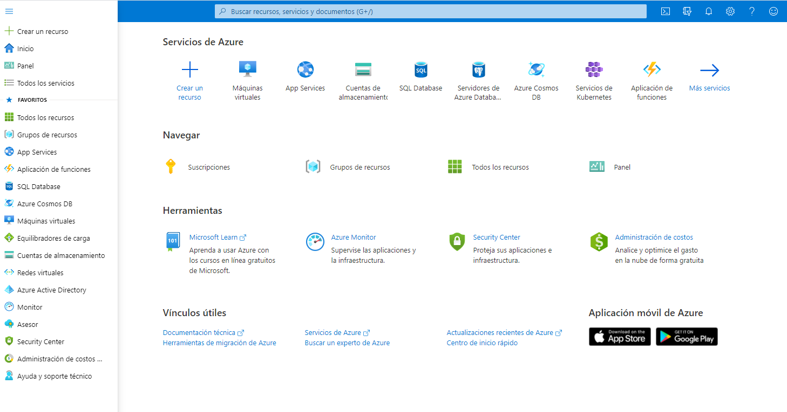{: .center}

Once inside the portal, you must click on “All services” and search for “Education”, to verify that you have the 100 USD available at the beginning of the project and to check the remaining amount throughout the project.

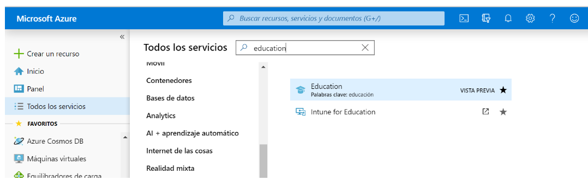{: .center}

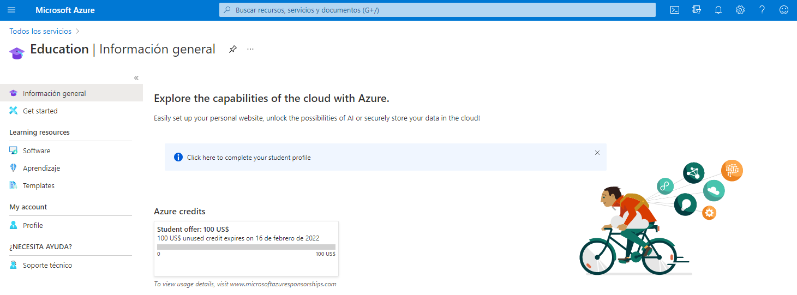{: .center}

Once this is done, you can start up your virtual machine, which will be the main evaluable element of your project that will be tutored, but not solved by the teacher. In case you have doubts about operating the platform, you should first look for solutions and information through the professional Azure manuals.

To start working, you must enter the Azure home page and look for the Virtual Machines button.


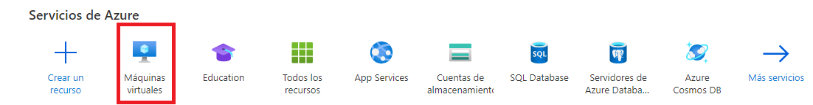{: .center}

> Once there you can access the creator of virtual machines. Below you have the captures of the characteristics of the machine that you must generate. As you can see, it is NOT the cheapest machine possible since you will use a more powerful machine to carry out the initial installation. Throughout the guide we will indicate when you can modify the features of the machine so that the architecture works on the cheapest machine, with a cost of €3.40 per month being active 24 hours.
>
> You will have them connected much less time, therefore, you could opt for a virtual machine with more features (be careful, spending the 100 USD of the account implies the end of free access to services, with an impact on the execution of the project!) . Since financial and time management is important in any real implementation, please be careful.

Below, the screenshots show the steps to generate the virtual machine:

Step 1 (Subscription type and machine type):

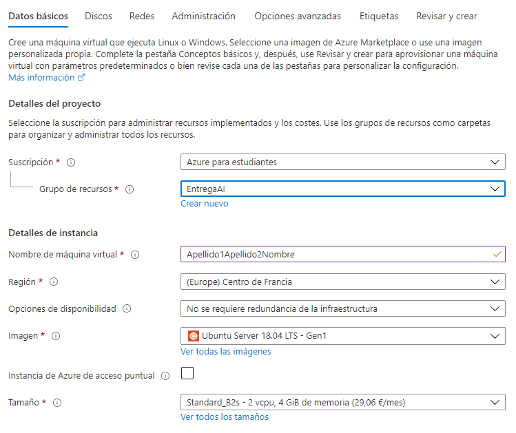{: .center}

Step 2 (Access Method):

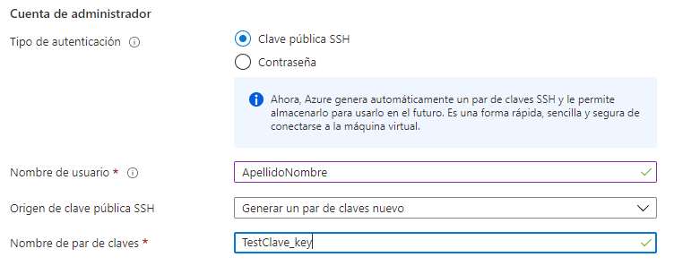{: .center}


Step 3 (Input Port Rules):

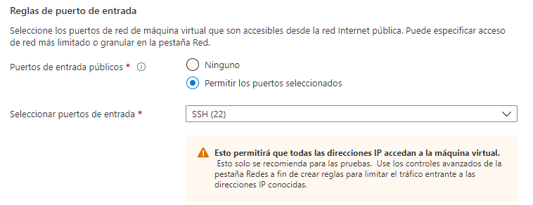{: .center}

Step 4 (Disk Options):

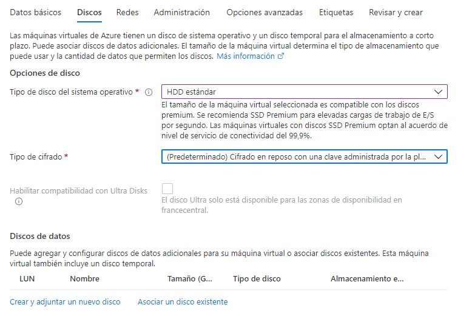{: .center}


Step 5 (Networks):

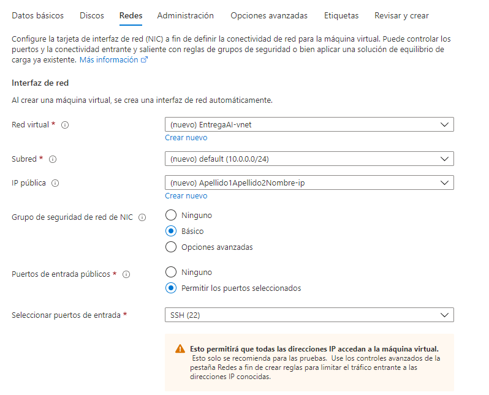{: .center}

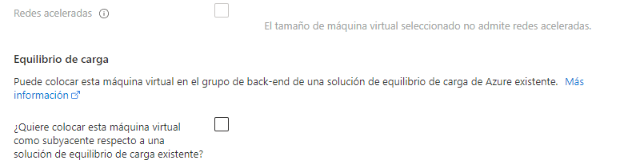{: .center}

Step 6 (Management, Auto Shutdown):

{: .center}

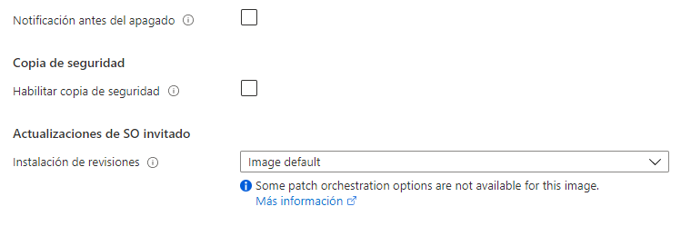{: .center}

When you click on “Review and create”, you will have to wait a few seconds and the following message will be shown:

{: .center}

Finally, click on “Create” and the following message will be shown:

{: .center}

Click on “Download the private key and create the resource”. Once the resource has been created, the following message will be shown:

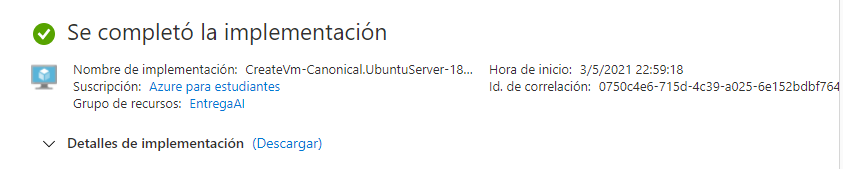{: .center}

**You must store the private key file in the following path:**

**C:\Users\<YourPCUser>\.ssh**


If you access the virtual machine resource you will see that you can start and stop it. In addition, to avoid scares, in the configuration you will see that you have been instructed to activate the automatic shutdown of the machine every day at 12 PM, so that there are no problems if it stays on after working on it.

> You can access the following web page to be able to see the balance you have left and the consumption you make:
<https://www.microsoftazuresponsorships.com>

We encourage you at this point to spend a few minutes getting to know the Azure interface. You can try to locate the information of your virtual machine (public IP, version of the operating system, information about CPU and disks). Due to the wealth of menus and options of the Azure interface it is impossible to know all of it, but we think it is important that you spend a little time locating important functions to work with your virtual machine (start, restart, stop, delete) and you can use these functions when solving problems that arise throughout the implementation of the project.
## Access to the virtual machine via SSH client
Once you start the machine you will have to connect to it to be able to execute commands and use it. This connection is achieved through SSH, a command line protocol that allows you to do something similar to remote desktop connection programs like TeamViewer. The machine created does not have to have a graphical interface, it is just a computer with a command line, as is the case at hand.

In this implementation, **you will access the virtual machine using the SSH key pair that you have already created**, instead of using a username and password. This system minimizes the chances of receiving a man-in-the-middle attack when connecting to the virtual machine.

NOTE: Linux, Mac OSX and some versions of Windows come with a factory-installed SSH client, which can be accessed from the command terminal (cmd for Windows). If you need to install it separately, here is a simple tutorial for Windows 10:

<https://www.profesionalreview.com/2018/11/30/ssh-windows-10/>

To access the virtual machine via SSH, click on the Connect button that you can see in the following screenshot:

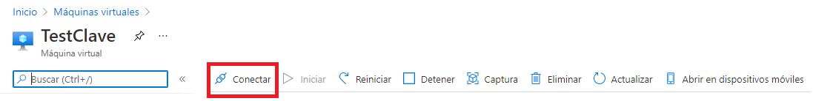{: .center}

Click on SSH in the drop-down that opens, and you will reach the following menu:

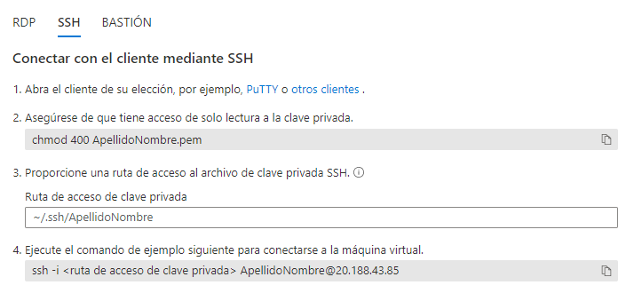{: .center}

Now you must copy the path of the private key that you downloaded when creating the virtual machine and paste it in the space available in point 3. Once this is done, copy the content of point 4, since the command will be completed with the path of the private key that you have indicated.

The terminal response should be similar to the following:

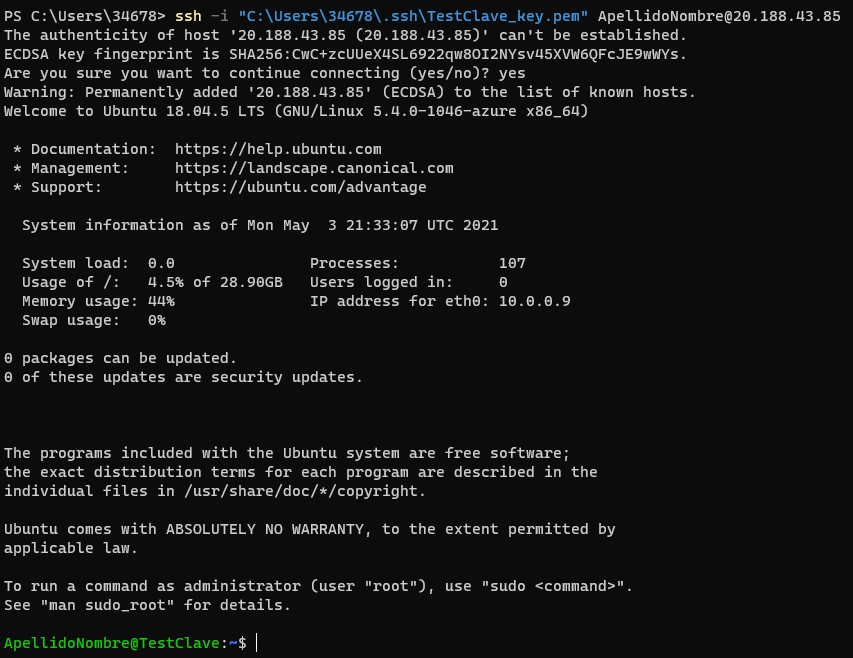{: .center}

At the bottom you can see that the user and the name of your virtual machine are already indicated. Therefore, you can already execute commands on the virtual machine from that line.
## Enable access for the teaching team
You will be provided with a public key that you must enable within the virtual machine.

To do so, copy the public key and once inside the virtual machine execute the following commands to place yourself in the .ssh/ directory:

```bash
ls -a

cd. ssh
```

The following command allows you to access the file that you must configure:

```bash
sudo nano authorized\_keys
```

{: .center}


The *authorized\_keys* file allows you to record the public keys that the virtual machine will consider known. You will have to paste in the lower line (marked in red in the capture) to which the public key that has been provided to you is already written:

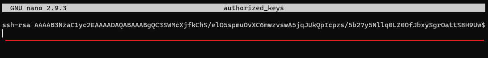{: .center}

To exit save the changes with CTRL+O, press *Enter* to keep the name of the saved file and exit with CTRL+X.

Finally you can validate if there are two keys registered by entering the following command:

```bash
sudo cat authorized\_keys
```
## Virtual machine handling instructions
For the general use of the Linux Bash terminal, you can use the following website that will explain the basic commands of the terminal:

<https://es.wikibooks.org/wiki/Manual_de_consola_Bash_de_Linux>

Highlight the use of the following commands:

- “**cd**”. Allows you to navigate between directories.
- “**ps –A**”. It allows you to see the processes (programs) that the operating system is running, very useful to check if the software you need is running.
- “**docker ps**”. Returns a list with information on the generated containers (identifier, image from which it was created and status).

On the other hand, for Windows users we recommend installing Windows Terminal, a program that offers a terminal with many features (navigate up and down to be able to view all the commands entered and the information returned by the machine, generate several terminal sessions in the form of tabs in the same window, …). This application is free and you can find it in the Microsoft Store.

<!-- [es] -->

Para generar máquinas virtuales crearéis una cuenta personal de Azure a la que, posteriormente, le asignaréis vuestro email **@estudiant.upc.edu**. Una vez hecho esto deberéis activar una subscripción de Azure para estudiantes, con lo que tendréis acceso a algunos servicios de la plataforma, en los que podréis gastar 100 dólares que la plataforma os asignará gratuitamente. No es necesario que deis información de tarjetas bancarias ni realizar ningún gasto real para dar de alta el servicio en ningún momento del proceso.

A continuación, tenéis las páginas web donde poder daros de alta en los servicios.

- **Web UPC Azure.** Para dar de alta la cuenta, debe ser con un email personal, después podréis poner el email de la UPC. Deberéis autenticar la cuenta varias veces y poner vuestro número de teléfono para recibir los códigos de verificación. 

<https://serveistic.upc.edu/ca/distsoft/faq/microsoft-imagine/acord-upc-microsoft-imagine>

- **Web de Azure donde activar el servicio gratuito para estudiantes.** Existen dos promociones gratuitas, la común de 170€ durante un mes, y la versión de estudiantes, que proporciona 100€ durante 12 meses. Esta última es la que deberéis activar desde la siguiente página web. 

<https://azure.microsoft.com/es-es/free/students/>

Una vez realizado este proceso podréis acceder al portal de Azure en el botón “Portal” de la web de Microsoft Azure indicada primeramente o accediendo directamente a <https://portal.azure.com> , como se ve en las siguientes capturas de pantalla.

{: .center}

Una vez en el portal deberíais ver el siguiente web:

{: .center}

Una vez dentro del portal debéis hacer clic en “Todos los servicios” y buscar “Education”, para verificar que tenéis disponibles los 100 USD en el inicio del proyecto y para consultar la cantidad restante a lo largo del mismo.

{: .center}

{: .center}

Una vez hecho esto ya podéis poner en marcha vuestra máquina virtual, que será el principal elemento evaluable de vuestro proyecto que será tutorizado, pero no resuelto por el profesor. En caso de que tengáis dudas de operación con la plataforma deberéis primero buscar soluciones e información mediante los manuales profesionales de Azure. 

Para empezar a trabajar, deberéis entrar la página de inicio de Azure y buscar el botón Máquinas Virtuales. 

{: .center}

> Una vez allí podréis acceder al creador de máquinas virtuales. Más abajo tenéis las capturas de las características de la máquina que debéis generar. Como podéis comprobar, **NO se trata de la máquina más económica posible ya que emplearéis una máquina más potente para llevar a cabo la instalación inicial**. Os indicaremos a lo largo de la guía en qué momento podéis modificar las prestaciones de la máquina para que la arquitectura funcione sobre la máquina más económica, con un coste de 3,40€ al mes estando 24 horas activa. 
>
>Vosotros las tendréis conectada mucho menos tiempo, por tanto, podríais optar por una máquina virtual con más prestaciones (¡cuidado, gastar los 100 USD de la cuenta implica el fin del acceso gratuito a los servicios, con impacto en la ejecución del proyecto!). Dado que la gestión económica y temporal es importante en cualquier implementación real, se os ruega que seáis cuidadosos.

A continuación, as capturas de pantalla muestran los pasos a realizar para generar la máquina virtual:

Paso 1 (Tipo de suscripción y tipo de máquina):

{: .center}

Paso 2 (Método de acceso):

{: .center}

Paso 3 (Reglas de puerto de entrada):

{: .center}

Paso 4 (Opciones de disco):

{: .center}

Paso 5 (Redes):

{: .center}

{: .center}

Paso 6 (Administración, apagado automático):

{: .center}

{: .center}

Al hacer clic en “Revisar y crear”, deberéis esperar unos segundos y se os mostrará el siguiente mensaje:

{: .center}

Finalmente, hacer clic en “Crear” y se os mostrará el siguiente mensaje:

{: .center}

Hacer clic en “Descargar la clave privada y crear el recurso”. Una vez se haya creado el recurso se os mostrará el siguiente mensaje:

{: .center}

**Deberéis almacenar el archivo de la clave privada en la siguiente ruta:**

***C:\Users\<UsuariodevuestroPC>\.ssh***

Si accedéis al recurso máquina virtual veréis que podéis iniciarla y detenerla. Además, para evitar sustos, en la configuración veréis que se os ha indicado que activéis el apagado automático de la máquina cada día a las 24:00:00, para que no haya problemas si se queda encendida después de trabajar en ella. 

> Podréis acceder a la siguiente página web para poder ver el saldo que os queda y el consumo que realizáis:
<https://www.microsoftazuresponsorships.com>

Os animamos en este punto a dedicar unos minutos a conocer la interfaz de Azure. Podéis intentar localizar la información de vuestra máquina virtual (IP pública, versión de sistema operativo, información acerca de CPU y discos). Debido a la riqueza de menús y opciones de la interfaz de Azure es imposible conocerla entera, pero creemos que es importante que dediquéis un poco de tiempo a localizar funciones importantes para trabajar con vuestra máquina virtual (iniciar, reiniciar, detener, eliminar) y podáis emplear dichas funciones a la hora de resolver problemas que vayan surgiendo a lo largo de la implementación del proyecto.
## Acceso a la máquina virtual mediante cliente SSH
Una vez arranquéis la maquina deberéis conectaros a ella para poder ejecutar comandos y utilizarla. Esta conexión se logra mediante SSH, un protocolo de línea de comandos que permite hacer algo parecido a programas de conexión remota de escritorios como TeamViewer. La máquina creada no tiene por qué tener una interfaz gráfica, es solo un ordenador con línea de comando, como es el caso que os ocupa.

En esta implementación, **accederéis a la máquina virtual mediante el par de claves SSH que ya habéis creado**, en lugar de utilizar usuario y contraseña. Este sistema minimiza las posibilidades que se reciba un ataque de intermediario (*man-in-the-middle attack*) a la hora de conectarse a la máquina virtual.

NOTA: Linux, Mac OSX y algunas versiones de Windows traen un cliente SSH instalado de fábrica, al que se puede acceder des del terminal de comandos (cmd para Windows). Si necesitáis instalarlo a parte, aquí tenéis un tutorial sencillo para Windows 10:

<https://www.profesionalreview.com/2018/11/30/ssh-windows-10/>

Para acceder a la máquina virtual mediante SSH hacer clic en el botón Conectar que podéis ver en la siguiente captura:

{: .center}

Haced clic en *SSH* en el desplegable que se os abre, y llegaréis al siguiente menú:

{: .center}

Ahora deberéis copiar la ruta de la clave privada que habéis descargado al crear la máquina virtual y pegarla en el espacio disponible en el punto 3. Una vez hecho esto, copiad el contenido del punto 4, ya que el comando se completará con la ruta de la clave privada que habéis indicado.

La respuesta del terminal debería ser parecida a la siguiente:

{: .center}

En la parte inferior podéis ver que ya se indica el usuario y el nombre de vuestra máquina virtual. Por tanto, ya podréis ejecutar comandos sobre la máquina virtual a partir de esa línea.
## Habilitar acceso para el equipo docente
Se os proporcionará una clave pública que deberéis habilitar dentro de la máquina virtual.

Para hacerlo, copiad dicha clave pública y una vez dentro de la máquina virtual ejecutad los siguientes comandos para situaros en el directorio .ssh/:

```bash
ls -a

cd. ssh
```

El siguiente commando permite acceder al archivo que debéis configurar:

```bash
sudo nano authorized\_keys
```
{: .center}

El archivo *authorized\_keys* permite registrar las claves públicas que la máquina virtual considerará conocidas. Deberéis pegar en la línea inferior (marcada en rojo en la captura) a la que ya está escrita la clave pública que se os ha proporcionado:

{: .center}

Para salir guardad los cambios con CTRL+O, pulsad *Enter* para mantener el nombre del archivo guardado y salid con CTRL+X.

Finalmente podéis validar si hay dos claves registradas introduciendo el siguiente comando:

```bash
sudo cat authorized\_keys
```
## Instrucciones de manejo de la máquina virtual
De cara al uso general del terminal Bash de Linux, podéis utilizar la siguiente web que os explicará los comandos básicos del terminal:

<https://es.wikibooks.org/wiki/Manual_de_consola_Bash_de_Linux>

Resaltar el uso de los siguientes comandos:

- “**cd**”. Permite desplazarse entre directorios.
- “**ps –A**”. Permite ver los procesos (programas) que está ejecutando el sistema operativo, muy útil para comprobar si el software que necesitareis está en ejecución.
- “**docker ps**”. Devuelve una lista con información de los contenedores generados (identificador, imagen a partir de la que se ha creado y estado).

Por otro lado, para los usuarios de Windows recomendamos instalar Windows Terminal, un programa que ofrece un terminal con muchas funcionalidades (navegar arriba y abajo para poder visualizar todos los comandos introducidos y la información devuelta por la máquina, generar varias sesiones de terminal en forma de pestañas en una misma ventana, …). Esta aplicación es gratuita y la podéis encontrar en la Microsoft Store.