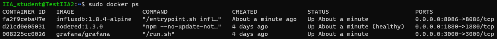
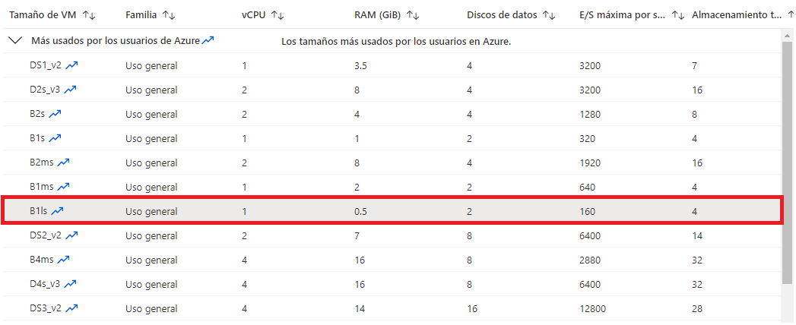
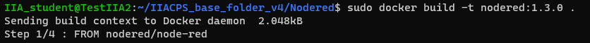
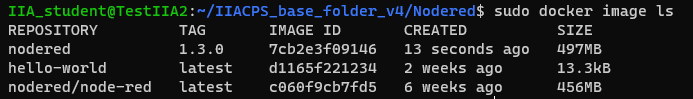
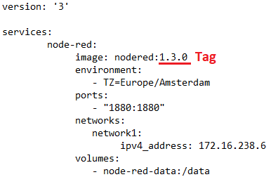

<!-- multilingual suffix: en, es -->

<!-- [en] -->

# Installing containerized software

<!-- [es] -->

# Instalación de software en contenedores

<!-- [en] -->

The resources that you will run in the virtual machine are:

- **Node-RED**, a communications manager with the plant and other applications in the cloud, which also allows programs to be executed (in the first part of the project, to check its operation, NodeRed will contain a generator of sinusoidal signals at a certain frequency and amplitude that will emulate the captured signal).
- **Grafana**, a low-complexity graphical interface that allows you to present data on a web in the form of graphs, maps, etc. It is easily configurable to work with InfluxDB.
- **InfluxDB**, a database server in which we will store data.

In the technological solution that you are going to implement, you will install each software in an isolated container, as you can see in the following screenshot:

{: .center}

## Docker 
To create the containers mentioned above we will use Docker technology. A Docker container is a format that packages all of an application's code and dependencies in a standard format that enables it to run quickly and reliably in computing environments. It is a lightweight, stand-alone executable that integrates everything needed to run an application, including libraries, system tools, code, and runtime.
Docker is also a software platform that enables developers to quickly build, test, and deploy containerized applications.
We will define some docker terms:
- **Docker Registry**, place to store and download images. Registry is a scalable, stateless server application that stores and distributes Docker images. **Docker Hub** is a Docker Registry hosted and managed by Docker. It has over 100,000 container images from software vendors, open source projects, and the community. It also contains software and applications from official repositories.
Below is the link to search for Docker images:
<https://hub.docker.com/search?q=>

{: .center}

- **Containers**,Unlike a virtual machine that provides hardware virtualization, a container provides lightweight virtualization at the operating system level by abstracting "user space." Containers share the **core of the host system** with other containers. A container, running on the host operating system, is a standard software unit that packages code and all of its dependencies so that applications can run quickly and reliably from one environment to another. Containers are not persistent and are activated from **images**.

{: .center}

- **Images from Docker**, cA choice of software to run as a container that includes a set of instructions for creating a container that can run on the Docker platform. Images are not modifiable, so to make changes to an image you must create a new one.

With that said we can conclude that a Docker image contains everything you need to run your software and a Docker container is a running instance of a Docker image.

Using Docker has two big advantages that change the way we build, ship, and run software:

- Improves the process to get applications reliably from development to production.
- Provides a standard image format for moving from on-premises to the cloud.

## Docker instalation
With these basic concepts and once connected to your virtual machine via SSH, you must execute the commands presented in this section to download and install Docker. The commands found below are the same as those provided in the official Docker documentation, which you can find at the following link:

<https://docs.docker.com/engine/install/ubuntu/>

**NOTE**: if you have an AMR processor, consult the official documentation, <https://docs.docker.com/engine/install/ubuntu/>, since the last command will be different in your case).

```bash
sudo apt-get udpate

sudo apt-get install \

  apt-transport-https \

  ca-certificates \

  curl \

  gnupg \

  lsb-release

sudo curl -fsSL https://download.docker.com/linux/ubuntu/gpg | sudo gpg --dearmor -o /usr/share/keyrings/docker-archive-keyring.gpg

echo \

  "deb [arch=amd64 signed-by=/usr/share/keyrings/docker-archive-keyring.gpg] https://download.docker.com/linux/ubuntu \

  (lsb\_release -cs) stable" | sudo tee 
  /etc/apt/sources.list.d/docker.list > /dev/null

sudo apt-get update

sudo apt-get install docker-ce docker-ce-cli containerd.io
```
You can verify that Docker has been installed correctly by running the following command, to download and run an image in a container, printing an informative message on the screen while doing so.

```bash
sudo docker run hello-world
```
El resultado es el siguiente:
```bash

Unable to find image 'hello-world:latest' locally
latest: Pulling from library/hello-world
d1725b59e92d: Pull complete 
Digest: sha256:0add3ace90ecb4adbf7777e9aacf18357296e799f81cabc9fde470971e499788
Status: Downloaded newer image for hello-world:latest

Hello from Docker!
This message shows that your installation appears to be working correctly.
```
In line 1 we are running the Docker client, and we are indicating that we want to run a container from the hello-world image in the public Docker registry.

If this is the first time we have executed that image, line 2 will appear, indicating that the image cannot be found and it will proceed to search for it, by default, in the public registry. If we have an Internet connection, the image will be downloaded (line 6) and a container will automatically be created.

Whether the image has been downloaded or was already downloaded, the container will run, getting the welcome text seen in the box above.

### Useful commands
- *sudo docker pull (image name)*, to download images from the official repository.
- *sudo docker run (image name)*, to download images and create and initialize the containers.
- *sudo docker exec*, to execute a command inside a container that is already running.
- *sudo docker images*, to see the list of images that we are using.
- *sudo docker rmi (image name)*, to remove images.
- *sudo docker ps*, to see the list of system containers.
- *sudo docker container start (container name or id)* or *sudo docker start (container name or id)*, to start a stopped container.
- *sudo docker container stop (container name or id)* or *sudo docker stop (container name or id)*, to stop a started container.
- *sudo docker container rm (container name or id)* or *sudo docker rmi (container name or id), to remove containers.
- *sudo docker logs (container name or id)*, to see the outputs of that container. Very useful for detecting errors.
- *sudo docker volume create (volume name)*, to create a database.
- *sudo docker volume ls*, to see all volumes created.
- *sudo docker volume inspect (volume name)*, to view the metadata of a volume.
- *sudo docker volume rm (volume name)*, to remove volumes.
- *sudo docker --restart always*, so that the containers are always restarted in case they are closed.

### Download images with diferents versions
As we have seen before, we can download an image with the *docker run (image name)* command and the latest version will be downloaded by default. If we want to download the version of a specific image (for example due to the use of different operating systems, architectures...) we must specify its *tag* as follows: *docker run (image name:tag)*. Some examples:
```bash
docker run hello-world:latest
docker run hello-world:linux
docker run postgres:latest
docker run postgres:9.6.24
docker run postgres:alpine
docker run postgres:alpine3.17
```
In this way we can have two different versions of the same image running on the same server since each of these containers are 100% independent from each other.


### Case study

To practice more we can create another container that runs an application from an image already created.
Let's imagine that we want to create a website with *WordPress*. If we search the registry we will find an image called *wordpress*, with the official tag. The recommendation is that we always look for official images, they are maintained and well documented.

On the page we will find the different options that this image has to configure it, although we will see them in more detail later.

{: .center}

For now let's start the image as follows:
```bash
docker run -p 8080:80 wordpress
```
And we will check how the container starts:
```bash
$ docker run -p 8080:80 wordpress
Unable to find image 'wordpress:latest' locally
latest: Pulling from library/wordpress
802b00ed6f79: Pull complete 
59f5a5a895f8: Pull complete 
6898b2dbcfeb: Pull complete 
8e0903aaa47e: Pull complete 
2961af1e196a: Pull complete 
71f7016f79a0: Pull complete 
5e1a48e5719c: Pull complete 
7ae5291984f3: Pull complete 
725b65166f31: Pull complete 
e90b121f9520: Pull complete 
b5a272809bbd: Pull complete 
f045f3ae0e2b: Pull complete 
7f51c9ea2d8e: Pull complete 
5aa9d0ed164a: Pull complete 
8eea44e2bfc7: Pull complete 
48918885026e: Pull complete 
8ac3e8ada01a: Pull complete 
d3da911b920f: Pull complete 
94c7e0af5b20: Pull complete 
e1f39ac90dec: Pull complete 
Digest: sha256:7121cdf8e9f01816653a3b2d2f4fc7bfe1dab956f00db5c7e7689e5f1454029a
Status: Downloaded newer image for wordpress:latest
WordPress not found in /var/www/html - copying now...
Complete! WordPress has been successfully copied to /var/www/html
AH00558: apache2: Could not reliably determine the server's fully qualified domain name,     using 10.17.0.1. Set the 'ServerName' directive globally to suppress this message
AH00558: apache2: Could not reliably determine the server's fully qualified domain name,     using 10.17.0.1. Set the 'ServerName' directive globally to suppress this message
[DDD mmm dd hh:mm:ss.iiiiii yyyy] [mpm_prefork:notice] [pid 1] AH00163: Apache/2.4.25     (Debian) PHP/7.2.10 configured -- resuming normal operations
[DDD mmm dd hh:mm:ss.iiiiii yyyy] [core:notice] [pid 1] AH00094: Command line: 'apache2     -D FOREGROUND'
```
We see in the new line a new parameter: **-p 8080:80**. By default, a container is fully isolated. But if we are setting up a blog with WordPress we are going to need to access it from the browser.

With the parameter *-p*, short for *--publish*, we can indicate that we are binding a port on the host machine to the container. In this case we are binding port 8080 of the host machine with port 80 of the container.

We are going to open the following web page in our browser:

http://localhost:8080

Which will show us the WordPress installation wizard, which we are not going to install because we need a database that we do not yet have.
If we want to store data (a website, a database, etc.) inside a container, we need a way to store it without losing it.

Docker offers three ways:

- Through volumes, which are Docker objects such as images and containers.
- Mounting a directory on the host machine inside the container.
- Storing it in the system memory (although they would also be lost when the server is restarted).

The normal thing is to use volumes, but there will be times when it is preferable to directly mount a directory of our workspace. For example, to save the data of a database we will use volumes, but to save the code of an application or a web page we will mount the directory.
We will create a volume to store the *Wordpress* application database. To do this we will execute the following command:
```bash
sudo docker volume create wordpress-db
wordpress-db
```
We also need to have a database where to store the entries, we will create a container from the image of *MariaDB* -high performance open source relational database-. We are going to create our database using this volume.
```bash
sudo docker run -d --name wordpress-db \
    --mount source=wordpress-db,target=/var/lib/mysql \
    -e MYSQL_ROOT_PASSWORD=secret \
    -e MYSQL_DATABASE=wordpress \
    -e MYSQL_USER=manager \
    -e MYSQL_PASSWORD=secret mariadb:10.3.9
```
> The -d parameter indicates that it should run as a background process. That way we won't be able to stop it by accident with Control+C.
>
The image will be downloaded, if it wasn't already, and our MariaDB container will start:
```bash
Unable to find image 'mariadb:10.3.9' locally
10.3.9: Pulling from library/mariadb
124c757242f8: Pull complete 
9d866f8bde2a: Pull complete 
fa3f2f277e67: Pull complete 
398d32b153e8: Pull complete 
afde35469481: Pull complete 
31f2ae82b3e3: Pull complete 
3eeaf7e45ea6: Pull complete 
716982328e17: Pull complete 
34ce605c9036: Pull complete 
4502ed9073c0: Pull complete 
2afafbdf5a96: Pull complete 
43d52b11dd31: Pull complete 
30c7b70556f3: Pull complete 
8b1b39f2f89a: Pull complete 
41480b9319d7: Pull complete 
Digest: sha256:b7894bd08e5752acdd41fea654cb89467c99e67b8293975bb5d787b27e66ce1a
Status: Downloaded newer image for mariadb:10.3.9
30634831d17108aa553a5774e27f398760bdbdf32debc3179843e73aa5957956
```
Now we can check that the container has been created:
```bash
sudo docker ps
CONTAINER ID        IMAGE               COMMAND                  CREATED             STATUS              PORTS               NAMES
30634831d171        mariadb:10.3.9      "docker-entrypoint.s…"   20 seconds ago      Up 16 seconds       3306/tcp            wordpress-db
```
We are going to create our WordPress container again, but this time we are going to connect it to our database. We will need to mount the container directory where WordPress is installed with our user account on the host machine.
Let's create the workspace:
```bash
mkdir -p ~/Sites/wordpress/target && cd ~/Sites/wordpress
```
And inside this directory we start the container:
```bash 
sudo docker run -d --name wordpress \
    --link wordpress-db:mysql \
    --mount type=bind,source="$(pwd)"/target,target=/var/www/html \
    -e WORDPRESS_DB_USER=manager \
    -e WORDPRESS_DB_PASSWORD=secret \
    -p 8080:80 \
    wordpress:4.9.8
```
When the execution is finished, if we access the address http://localhost:8080/, now we can finish the installation process of our WordPress.

## Docker Compose instalation
Docker Compose is a tool to define and run multi-container solutions, which uses *YAML* files to configure the different applications and carries out the process of creating and starting the containers with just one command (docker-compose up).

### Features YAML files
- Section *version: (version number)*, to define the syntax version of the file in question.
- Section *services:*, the different containers that are going to be created together with a network that connects them between them.
        - *image:*, image that we want to run.
        - *ports:*, port of the container connected to the port of the virtual machine.
        - *environment:*, environment variables that can be useful to us, for example: username and password to access the service.
        - *volumes:*, create a directory to make the data persist.
- Section *volumes:*, to keep the data of the created containers.

Next, you must download and install Docker-compose with the following commands:
```bash
sudo curl -L 
"https://github.com/docker/compose/releases/download/1.28.5/docker-compose-$(uname -s)-$(uname -m)" -o /usr/local/bin/docker-compose

sudo chmod +x /usr/local/bin/docker-compose
```

You can verify that it has been installed correctly by running the following command:

```bash
sudo docker-compose –version
```
### Useful commands
- *sudo docker-compose up*, creation and startup of the containers.
- *sudo docker-compose ps*, displays information about the services that are defined in the docker-compose.yaml file.
- *sudo docker-compose stop*, to stop services.
- *sudo docker-compose down*, to delete services. This deletes the containers but not the volumes.
- *sudo docker-compose down -v*, to delete the containers and volumes.
### Case study 
We will do the same as the previous exercise of creating an application with *wordpress* from *docker*, but now directly from *docker-compose*. In the same directory where we were in the previous step (~/Sites/wordpress), we are going to create a file (as if it were a text file) called docker-compose.yaml with the following content:
```bash
version: '3'

services:
    db:
        image: mariadb:10.3.9
        volumes:
            - data:/var/lib/mysql
        environment:
            - MYSQL_ROOT_PASSWORD=secret
            - MYSQL_DATABASE=wordpress
            - MYSQL_USER=manager
            - MYSQL_PASSWORD=secret
    web:
        image: wordpress:4.9.8
        depends_on:
            - db
        volumes:
            - ./target:/var/www/html
        environment:
            - WORDPRESS_DB_USER=manager
            - WORDPRESS_DB_PASSWORD=secret
            - WORDPRESS_DB_HOST=db
        ports:
            - 8080:80

volumes:
    data:
```
Now if we run the application with the command:
```bash
sudo docker-compose up -d
```
When we start the application, Compose informs us of the services it has been raising:
```bash
Creating network "wordpress_default" with the default driver
Creating volume "wordpress_data" with local driver
Creating wordpress_db_1 ... 
Creating wordpress_db_1 ... done
Creating wordpress_web_1 ... 
Creating wordpress_web_1 ... done
```
We can see the active containers:
```bash
sudo docker container ls
CONTAINER ID  IMAGE            COMMAND      CREATED         STATUS         PORTS                  NAMES
a07b5d4d3982  wordpress:4.9.8  "docker.s…"  10 seconds ago  Up 8 seconds   0.0.0.0:8080->80/tcp   wordpress_web_1
d9204884cec5  mariadb:10.3.9   "docker.s…"  11 seconds ago  Up 10 seconds  3306/tcp               wordpress_db_1
```
And we can also see the containers with Compose:
```bash
sudo docker-compose ps
    Name                    Command               State          Ports        
-------------------------------------------------------------------------------
wordpress_db_1    docker-entrypoint.sh mysqld      Up      3306/tcp            
wordpress_web_1   docker-entrypoint.sh apach ...   Up      0.0.0.0:8080->80/tcp
```
If we access the address http://localhost:8080/, we will see the WordPress installation again.

## Transferring files to the virtual machine
Now you must download the Athena IIACPS\_base\_folder directory and send it to the virtual machine you have created. This file transfer will be carried out using SCP (Security Copy Protocol) which is based on SSH.

Once *cmd* or *Windows Terminal* is open on your computer, enter the following command:

```bash
scp -r -i <rutaclaveprivada> <rutadeorigen> usuarioVM@ipVM:
<ruta dedestino>
```

NOTE: The **-r** in the command indicates that a complete directory is being sent, if you need to send only one file you can use the same command, removing the **-r**.

In the terminal you should see that the progress of the file transfer is indicated, reaching 100% when complete. It is recommended that you verify, being connected by SSH to the VM, that you can easily locate the IIACPS\_base\_folder directory.

{: .center}

## container lifting
The following command takes the information collected in the docker-compose to generate the containers. In the case at hand, the docker-compose file that you are using has been written so that it builds a container for each software, three in total. 

```bash
sudo docker-compose up
```

**The terminal session you are using will hang returning information about the containers in the form of logs, this can be useful when determining what happens if something doesn't work as expected. You must open a new one to continue working.**

Alternatively, it is possible to raise the containers without the session being blocked and therefore the logs not being received. To do this, you must add *-d* to the previous command, leaving it as follows:

```bash
sudo docker-compose up -d
```

In either case, to verify that the containers are active, use the following command, which returns the list of containers:

```bash
sudo docker ps
```
In the console you should see a list like the following. Note that the first time you run the command, all three containers may not have been generated. Re-enter the command until you verify that all three containers are working.

{: .center}

> At this point, if you wish, you can modify the features of the virtual machine since **all the necessary software has already been installed**. The cheapest option is **B1ls**, see the next screenshot.

{: .center}

An example of how an image would be created by modifying the *.yaml* file is explained below.

## Example creation of *custom* image of Node-RED
To mount the image, you must place yourself inside the IIACPS\_base\_folder folder and execute the following command (NOTE: The point after **tag** is included in the command since it indicates that it points to the directory we are in) :

```bash
sudo docker build -t nodered:<tag> .
```

You will see when you press “Enter” that a 4-step sequence begins.

{: .center}

When the sequence is finished, you can verify that it has been created correctly with the following command:

```bash
sudo docker image ls
```

{: .center}

Once finished, **you will have to edit the file “docker-compose.yml” the tag of the image that you have just assembled**. You can exit the Nodered directory with the following command:

```bash
cd ..
```

Once in the folder where "docker-compose.yml" is located, you can edit the file with the following command:

```bash
sudo nano docker-compose.yml
```

Be careful not to add spaces or tabs. You only have to edit the line shown in the following screenshot by modifying the tag you have chosen for your image. You can navigate through the file with the directional arrows on the keyboard.

{: .center}

When you have made the modification, remember that you can save the changes using “CTRL+O”, it will ask you to name the file and you should not modify the name, so it will be enough to press “Enter”. Finally, to exit the *nano* file editor, use “CTRL+X”. You only have to do the process of creating the *custom* image for Node-RED once.

<!-- [es] -->

Los recursos que haréis correr en la máquina virtual son:

- **Node-RED**, un gestor de comunicaciones con la planta y otras aplicaciones en nube, que permite además ejecutar programas (en la primera parte del proyecto, para comprobar su funcionamiento, NodeRed contendrá un generador de señales sinusoidales a cierta frecuencia y amplitud que emulará la señal capturada).
- **Grafana**, un interfaz gráfico de baja complejidad que permite presentar datos en una web en forma de gráficos, mapas, etc. Es fácilmente configurable para trabajar con InfluxDB.
- **InfluxDB**, un servidor de base de datos en el que almacenaremos data.

En la solución tecnológica que vais a implementar instalaréis cada software en un contenedor aislado (*container*), como podéis ver en la siguiente captura:

{: .center}

## Docker 
Para crear los contenedores mencionados anteriormente utilizaremos la tecnologia de Docker. Un contenedor Docker es un formato que empaqueta todo el código y las dependencias de una aplicación en un formato estándar que permite su ejecución rápida y fiable en entornos informáticos. Este es ejecutable, independiente y ligero que integra todo lo necesario para ejecutar una aplicación, incluidas bibliotecas, herramientas del sistema, código y tiempo de ejecución. 
Docker es también una plataforma de software que permite a los desarrolladores crear, probar e implementar aplicaciones en contenedores de forma rápida.
Definiremos algunos términos de docker:
- **Docker Registry**, lugar para almacenar y descargar imágenes. Registry es una aplicación de servidor escalable y sin estado que almacena y distribuye imágenes de Docker. **Docker Hub** es un Docker Registry alojado y administrado por Docker. Este tiene más de 100 000 imágenes de contenedores de proveedores de software, proyectos de código abierto y de la comunidad. Además contiene software y aplicaciones de repositorios oficiales. 
A continuación se adjunta el link para buscar imágenes de Docker: <https://hub.docker.com/search?q=>

{: .center}

- **Contenedor**, a diferencia de una máquina virtual que proporciona virtualización de hardware, un contenedor proporciona virtualización ligera a nivel de sistema operativo mediante la abstracción del "espacio del usuario". Los contenedores comparten el **núcleo del sistema host** con otros contenedores. Un contenedor, que se ejecuta en el sistema operativo host, es una unidad de software estándar que empaqueta código y todas sus dependencias, para que las aplicaciones se puedan ejecutar de forma rápida y fiable de un entorno a otro. Los contenedores no son persistentes y se activan desde **imágenes**.

{: .center}

- **Imágenes de Docker**, colección de software que se ejecutará como un contenedor que incluye un conjunto de instrucciones para crear un contenedor que se pueda ejecutar en la plataforma Docker. Las imágenes no son modificables, de modo que para realizar cambios en una imagen es preciso crear otra nueva.

Dicho esto podemos concluir que una imagen de Docker contiene todo lo que necesitas para ejecutar tu software y un contenedor de Docker es una instancia en ejecución de una imagen de Docker.

Usar Docker tiene dos grandes ventajas que cambian la forma en que creamos, enviamos y ejecutamos software:

- Mejora el proceso para obtener aplicaciones de manera fiable desde el desarrollo hasta la producción.
- Proporciona un formato de imagen estándar para pasar del entorno local a la nube.

## Instalación de Docker
Con estos conceptos básicos y una vez conectados a vuestra máquina virtual mediante SSH, deberéis ejecutar los comandos que se presentan en esta sección para descargar e instalar Docker. Los comandos que se encuentran a continuación son los mismos que se aportan en la documentación oficial de Docker, que podéis encontrar en el siguiente enlace:

<https://docs.docker.com/engine/install/ubuntu/>

**NOTA**: si disponéis de un procesador AMR consultad la documentación oficial, <https://docs.docker.com/engine/install/ubuntu/>, ya que el último comando será diferente en vuestro caso)

```bash
sudo apt-get udpate

sudo apt-get install \

  apt-transport-https \

  ca-certificates \

  curl \

  gnupg \

  lsb-release

sudo curl -fsSL https://download.docker.com/linux/ubuntu/gpg | sudo gpg --dearmor -o /usr/share/keyrings/docker-archive-keyring.gpg

echo \

  "deb [arch=amd64 signed-by=/usr/share/keyrings/docker-archive-keyring.gpg] https://download.docker.com/linux/ubuntu \

  (lsb\_release -cs) stable" | sudo tee 
  /etc/apt/sources.list.d/docker.list > /dev/null

sudo apt-get update

sudo apt-get install docker-ce docker-ce-cli containerd.io
```
Podéis verificar que Docker se ha instalado correctamente ejecutando el siguiente comando, para descargar y ejecutar una imagen en un contenedor, imprimiendo al hacerlo un mensaje informativo por pantalla.

```bash
sudo docker run hello-world
```
El resultado es el siguiente:
```bash

Unable to find image 'hello-world:latest' locally
latest: Pulling from library/hello-world
d1725b59e92d: Pull complete 
Digest: sha256:0add3ace90ecb4adbf7777e9aacf18357296e799f81cabc9fde470971e499788
Status: Downloaded newer image for hello-world:latest

Hello from Docker!
This message shows that your installation appears to be working correctly.
```
En la línea 1 estamos ejecutando el cliente de Docker, y estamos indicando que queremos ejecutar un contenedor a partir de la imagen hello-world del registro público de Docker.

Si es la primera vez que hemos ejecutado esa imagen, nos aparecerá la línea 2, que indica que la imagen no puede ser encontrada y va a proceder a buscarla, por defecto, en el registro público. Si tenemos conexión a Internet se descargará la imagen (línea 6) y automáticamente creará un contenedor.

Tanto si se ha descargado la imagen o ya estaba descargada, el contenedor se ejecutará, obteniendo el texto de bienvenida que se ve en el cuadro anterior.

### Comandos útiles
- *sudo docker pull (nombre imagen)*, para descargar imágenes del repositorio oficial.
- *sudo docker run (nombre imagen)*, para descargar imágenes y crear e inicializar los contenedores.
- *sudo docker exec*, para ejecutar un comando dentro de un contenedor que ya está corriendo.
- *sudo docker images*, para ver el listado de imágenes que estamos usando.
- *sudo docker rmi (nombre imagen)*, para eliminar imágenes.
- *sudo docker ps*, para ver el listado de contenedores del sistema. 
- *sudo docker container start (nombre o id contenedor)* o *sudo docker start (nombre o id contenedor)*, para iniciar un contenedor parado. 
- *sudo docker container stop (nombre o id contenedor)* o *sudo docker stop (nombre o id contenedor)*, para detener un contenedor iniciado. 
- *sudo docker container rm (nombre o id contenedor)* o *sudo docker rmi (nombre o id contenedor), para eliminar contenedores.
- *sudo docker logs (nombre o id contenedor)*, para ver las salidas de dicho contenedor. Muy útil para detectar errores.
- *sudo docker volume create (nombre del volumen)*, para crear una base de datos.
- *sudo docker volume ls*, para ver todos los volúmenes creados.
- *sudo docker volume inspect (nombre del volumen)*, para ver los metadatos de un volumen.
- *sudo docker volumen rm (nombre del volumen)*, para eliminar volúmenes.
- *sudo docker --restart always*, para que los contenedores se reinicien siempre en caso se de que cierren.

### Descargar imágenes con diferentes versiones
Como ya hemos visto anteriormente, podemos descargar una imagen con el comando *docker run (nombre de la imagen)* y por defecto se descargará la última versión (latest). Si queremos descargar la versión de una imagen en concreto (por ejemplo por el uso de distintos sistemas operativos, arquitecturas...) debemos especificar su *tag* de la siguiente manera: *docker run (nombre de la imagen:tag)*. Algunos ejemplos:
```bash
docker run hello-world:latest
docker run hello-world:linux
docker run postgres:latest
docker run postgres:9.6.24
docker run postgres:alpine
docker run postgres:alpine3.17
```
De esta manera podemos tener dos versiones distintas de una misma imagen corriendo en el mismo servidor ya que cada uno de estos contenedores son 100% independientes los unos de los otros.


### Caso práctico

Para practicar más podemos crear otro contenedor que ejecute una aplicación a partir de una imagen ya creada. 
Imaginemos que queremos crear una web con *WordPress*. Si buscamos en el registro encontraremos una imagen llamada *wordpress*, con la etiqueta oficial. La recomendación es que siempre busquemos imágenes oficiales, están mantenidas y bien documentadas.

En la página encontraremos las diferentes opciones que tiene esta imagen para configurarla, aunque las veremos con más detalle más adelante.

{: .center}

Por ahora iniciemos la imagen como se indica:
```bash
docker run -p 8080:80 wordpress
```
Y comprobaremos como se inicia el contenedor:
```bash
$ docker run -p 8080:80 wordpress
Unable to find image 'wordpress:latest' locally
latest: Pulling from library/wordpress
802b00ed6f79: Pull complete 
59f5a5a895f8: Pull complete 
6898b2dbcfeb: Pull complete 
8e0903aaa47e: Pull complete 
2961af1e196a: Pull complete 
71f7016f79a0: Pull complete 
5e1a48e5719c: Pull complete 
7ae5291984f3: Pull complete 
725b65166f31: Pull complete 
e90b121f9520: Pull complete 
b5a272809bbd: Pull complete 
f045f3ae0e2b: Pull complete 
7f51c9ea2d8e: Pull complete 
5aa9d0ed164a: Pull complete 
8eea44e2bfc7: Pull complete 
48918885026e: Pull complete 
8ac3e8ada01a: Pull complete 
d3da911b920f: Pull complete 
94c7e0af5b20: Pull complete 
e1f39ac90dec: Pull complete 
Digest: sha256:7121cdf8e9f01816653a3b2d2f4fc7bfe1dab956f00db5c7e7689e5f1454029a
Status: Downloaded newer image for wordpress:latest
WordPress not found in /var/www/html - copying now...
Complete! WordPress has been successfully copied to /var/www/html
AH00558: apache2: Could not reliably determine the server's fully qualified domain name,     using 10.17.0.1. Set the 'ServerName' directive globally to suppress this message
AH00558: apache2: Could not reliably determine the server's fully qualified domain name,     using 10.17.0.1. Set the 'ServerName' directive globally to suppress this message
[DDD mmm dd hh:mm:ss.iiiiii yyyy] [mpm_prefork:notice] [pid 1] AH00163: Apache/2.4.25     (Debian) PHP/7.2.10 configured -- resuming normal operations
[DDD mmm dd hh:mm:ss.iiiiii yyyy] [core:notice] [pid 1] AH00094: Command line: 'apache2     -D FOREGROUND'
```
Vemos en la línea nueva un nuevo parámetro: **-p 8080:80**. Por defecto, un contenedor está totalmente aislado. Pero si estamos montando un blog con WordPress vamos a necesitar acceder a él desde el navegador.

Con el parámetro *-p*, versión corta de *--publish*, podemos indicar que estamos enlazando un puerto de la máquina anfitrión con el contenedor. En este caso estamos enlazando el puerto 8080 de la máquina anfitrión con el 80 del contenedor.

Vamos a abrir la siguiente página web en nuestro navegador:

http://localhost:8080

La cual nos mostrará el asistente de instalación de WordPress, el cual no vamos a instalar porque necesitamos una base de datos que aún no tenemos.
Si queremos almacenar datos (una web, una base de datos, etc.) dentro de un contenedor necesitamos una manera de almacenarlos sin perderlos.

Docker ofrece tres maneras:

- A través de volúmenes, que son objetos de Docker como las imágenes y los contenedores.
- Montando un directorio de la máquina anfitrión dentro del contenedor.
- Almacenándolo en la memoria del sistema (aunque también se perderían al reiniciar el servidor).

Lo normal es usar volúmenes, pero habrá ocasiones en que es preferible montar directamente un directorio de nuestro espacio de trabajo. Por ejemplo, para guardar los datos de una base de datos usaremos volúmenes, pero para guardar el código de una aplicación o de una página web montaremos el directorio.
Crearemos un vólumen donde guardar la base de datos de la aplicación *Wordpress*. Para ello ejecutaremos el siguiente comando:
```bash
sudo docker volume create wordpress-db
wordpress-db
```
Tambien necesitamos tener una base de datos dónde almacenar las entradas, crearemos un contenedor a partir de la imagen de *MariaDB* -base de datos relacional de código abierto de alto rendimiento-. Vamos a crear nuestra base de datos usando este volumen.
```bash
sudo docker run -d --name wordpress-db \
    --mount source=wordpress-db,target=/var/lib/mysql \
    -e MYSQL_ROOT_PASSWORD=secret \
    -e MYSQL_DATABASE=wordpress \
    -e MYSQL_USER=manager \
    -e MYSQL_PASSWORD=secret mariadb:10.3.9
```
> El parámetro -d indica que debe ejecutarse como un proceso en segundo plano. Así no podremos pararlo por accidente con Control+C.
>
La imagen se descargará, si no lo estaba ya, y se iniciará nuestro contenedor de MariaDB:
```bash
Unable to find image 'mariadb:10.3.9' locally
10.3.9: Pulling from library/mariadb
124c757242f8: Pull complete 
9d866f8bde2a: Pull complete 
fa3f2f277e67: Pull complete 
398d32b153e8: Pull complete 
afde35469481: Pull complete 
31f2ae82b3e3: Pull complete 
3eeaf7e45ea6: Pull complete 
716982328e17: Pull complete 
34ce605c9036: Pull complete 
4502ed9073c0: Pull complete 
2afafbdf5a96: Pull complete 
43d52b11dd31: Pull complete 
30c7b70556f3: Pull complete 
8b1b39f2f89a: Pull complete 
41480b9319d7: Pull complete 
Digest: sha256:b7894bd08e5752acdd41fea654cb89467c99e67b8293975bb5d787b27e66ce1a
Status: Downloaded newer image for mariadb:10.3.9
30634831d17108aa553a5774e27f398760bdbdf32debc3179843e73aa5957956
```
Ahora podemos comprobar que se ha creado el contenedor:
```bash
sudo docker ps
CONTAINER ID        IMAGE               COMMAND                  CREATED             STATUS              PORTS               NAMES
30634831d171        mariadb:10.3.9      "docker-entrypoint.s…"   20 seconds ago      Up 16 seconds       3306/tcp            wordpress-db
```
Vamos a crear otra vez nuestro contenedor de WordPress, pero esta vez vamos a conectarlo con nuestra base de datos. Necesitaremos montar el directorio del contenedor donde está instalado WordPress con nuestra cuenta de usuario en la máquina anfitrión.
Vamos a crear el espacio de trabajo:
```bash
mkdir -p ~/Sites/wordpress/target && cd ~/Sites/wordpress
```
Y dentro de este directorio arrancamos el contenedor:
```bash 
sudo docker run -d --name wordpress \
    --link wordpress-db:mysql \
    --mount type=bind,source="$(pwd)"/target,target=/var/www/html \
    -e WORDPRESS_DB_USER=manager \
    -e WORDPRESS_DB_PASSWORD=secret \
    -p 8080:80 \
    wordpress:4.9.8
```
Cuando termine la ejecución, si accedemos a la dirección http://localhost:8080/, ahora sí podremos acabar el proceso de instalación de nuestro WordPress.

## Instalación de Docker Compose
Docker Compose es una herramienta para definir y ejecutar soluciones multi-contenedor, que utiliza archivos *YAML* para configurar las distintas aplicaciones y lleva a cabo el proceso de creación y arranque de los contenedores con solo un comando (docker-compose up).

### Características archivos YAML
- Sección *version: (número versión)*, para definir la versión de la sintaxis del archivo en cuestión.
- Sección *services:*, los diferentes contenedores que se van a crear junto con una red que los conecta entre ellos.
        - *image:*, imagen que queremos que corra. 
        - *ports:*, puerto del contenedor conectado con el puerto de la máquina virtual.
        - *environment:*, variables de entorno que nos pueden ser utiles, por ejemplo: usuario y contraseña para acceder al servicio.
        - *volumes:*, crear un directorio para hacer que los datos permanezcan.
- Sección *volumes:*, para hacer permanecer los datos de los contenedores creados. 

A continuación, deberéis descargar e instalar Docker-compose con los siguientes comandos:

```bash
sudo curl -L 
"https://github.com/docker/compose/releases/download/1.28.5/docker-compose-$(uname -s)-$(uname -m)" -o /usr/local/bin/docker-compose

sudo chmod +x /usr/local/bin/docker-compose
```

Podéis verificar que se ha instalado correctamente ejecutando el siguiente comando:

```bash
sudo docker-compose –version
```
### Comandos útiles
- *sudo docker-compose up*, creación y arranque de los contenedores.
- *sudo docker-compose ps*, muestra información de los servicios que se definen en el archivo docker-compose.yaml.
- *sudo docker-compose stop*, para detener servicios.
- *sudo docker-compose down*, para borrar servicios. Esto borra los contenedores pero no los volúmenes.
- *sudo docker-compose down -v*, para borrar los contenedores y los volúmenes.

### Caso práctico 
Haremos lo mismo que el ejercicio anterior de crear una aplicación con *wordpress* desde *docker*, pero ahora directamente desde *docker-compose*. En el mismo directorio donde estábamos en el paso anterior (~/Sites/wordpress), vamos a crear un fichero (como si fuera un fichero de texto) llamado docker-compose.yaml con el siguiente contenido:
```bash
version: '3'

services:
    db:
        image: mariadb:10.3.9
        volumes:
            - data:/var/lib/mysql
        environment:
            - MYSQL_ROOT_PASSWORD=secret
            - MYSQL_DATABASE=wordpress
            - MYSQL_USER=manager
            - MYSQL_PASSWORD=secret
    web:
        image: wordpress:4.9.8
        depends_on:
            - db
        volumes:
            - ./target:/var/www/html
        environment:
            - WORDPRESS_DB_USER=manager
            - WORDPRESS_DB_PASSWORD=secret
            - WORDPRESS_DB_HOST=db
        ports:
            - 8080:80

volumes:
    data:
```
Ahora si ejecutamos la aplicación con el comando:
```bash
sudo docker-compose up -d
```
Cuando arrancamos la aplicación, Compose nos informa de los servicios que ha ido levantando:
```bash
Creating network "wordpress_default" with the default driver
Creating volume "wordpress_data" with local driver
Creating wordpress_db_1 ... 
Creating wordpress_db_1 ... done
Creating wordpress_web_1 ... 
Creating wordpress_web_1 ... done
```
Podemos ver los contenedores activos:
```bash
sudo docker container ls
CONTAINER ID  IMAGE            COMMAND      CREATED         STATUS         PORTS                  NAMES
a07b5d4d3982  wordpress:4.9.8  "docker.s…"  10 seconds ago  Up 8 seconds   0.0.0.0:8080->80/tcp   wordpress_web_1
d9204884cec5  mariadb:10.3.9   "docker.s…"  11 seconds ago  Up 10 seconds  3306/tcp               wordpress_db_1
```
Y tambien podemos ver los contenedores con Compose:
```bash
sudo docker-compose ps
    Name                    Command               State          Ports        
-------------------------------------------------------------------------------
wordpress_db_1    docker-entrypoint.sh mysqld      Up      3306/tcp            
wordpress_web_1   docker-entrypoint.sh apach ...   Up      0.0.0.0:8080->80/tcp
```
Si accedemos a la dirección http://localhost:8080/, veremos de nuevo la instalación de WordPress.


## Transferencia de archivos a la máquina virtual
Ahora deberéis descargar el directorio IIACPS\_base\_folder de Atenea y enviarlo a la máquina virtual que habéis creado. Esta transferencia de archivos se llevará a cabo mediante el protocolo SCP (Security Copy Protocol) que está basado en SSH.

Una vez abierto *cmd* o *Windows Terminal* en vuestro ordenador, introducir el siguiente comando:

```bash
scp -r -i <rutaclaveprivada> <rutadeorigen> usuarioVM@ipVM:
<ruta dedestino>
```

NOTA: La **-r** en el comando indica que se está enviando un directorio completo, si necesitáis enviar solo un archivo podéis utilizar el mismo comando, eliminando la **-r**.

En el terminal deberíais observar que se indica el progreso de la transferencia de archivos, alcanzando el 100% cuando se haya completado. Se recomienda que verifiquéis, estando conectados por SSH a la VM, que podéis localizar fácilmente el directorio IIACPS\_base\_folder.

{: .center}

## Levantado de contenedores
El siguiente comando toma la información recogida en el docker-compose para generar los contenedores. En el caso que nos ocupa, el archivo docker-compose que estáis utilizando ha sido escrito para que levante un contenedor para cada software, tres en total.  

```bash
sudo docker-compose up
```

**La sesión de terminal que estáis utilizando se quedará bloqueada devolviendo información acerca de los contenedores en forma de logs, esto puede ser útil a la hora de determinar que sucede si algo no funciona como esperabais. Deberéis abrir una nueva para continuar trabajando.** 

Alternativamente es posible levantar los contenedores sin que la sesión se quede bloqueada y por tanto no se reciban los logs. Para ello, debéis añadir *-d* al comando anterior, quedando como sigue:

```bash
sudo docker-compose up -d
```

En cualquiera de los dos casos, para verificar que los contenedores están activos utilizad el siguiente comando, que devuelve la lista de contenedores:

```bash
sudo docker ps
```

En la consola deberíais visualizar una lista como la siguiente. Tened en cuenta que es posible que la primera vez que ejecutáis el comando no se hayan generado los tres contenedores. Volved a introducir el comando hasta verificar que los tres contenedores están funcionando.

{: .center}

> En este punto, si lo deseáis, ya podéis modificar las prestaciones de la máquina virtual debido a que **ya se ha instalado todo el software necesario**. La opción más económica es **B1ls**, ver la siguiente captura. 

{: .center}

A continuació se explica un ejemplo de como se crearía una imagen modificando el archivo *.yaml*.

## Ejemplo creación de imagen *custom* de Node-RED
Para montar la imagen, deberéis situaros dentro de la carpeta IIACPS\_base\_folder y ejecutar el siguiente comando (NOTA: El punto después de **tag** está incluido en el comando ya que este indica que apunta al directorio al que estamos):

```bash
sudo docker build -t nodered:<tag> .
```

Observaréis al pulsar “Enter” que se inicia una secuencia de 4 pasos. 

{: .center}

Cuando finalice la secuencia, podéis verificar que se ha creado correctamente con el siguiente comando:

```bash
sudo docker image ls
```

{: .center}

Una vez terminada, **deberéis editar el archivo “docker-compose.yml” el tag de la imagen que acabáis de montar**.  Podéis salir del directorio de Nodered con el siguiente comando:

```bash
cd ..
```

Una vez en la carpeta donde se encuentra “docker-compose.yml”, podéis editar el archivo con el siguiente comando:

```bash
sudo nano docker-compose.yml
```

Tened cuidado de no añadir espacios o tabulaciones. Solo debéis editar la línea que se muestra en la siguiente captura modificando el tag que habéis elegido para vuestra imagen. Podréis navegar por el archivo con las flechas direccionales del teclado.

{: .center}

Cuando hayáis realizado la modificación, recordar que podéis guardar los cambios mediante “CTRL+O”, os pedirá que nombréis el archivo y no debéis modificar el nombre, así que será suficiente con pulsar “Enter”. Finalmente, para salir del editor de archivos *nano*, usad “CTRL+X”. El proceso de crear la imagen *custom* para Node-RED solo deberéis realizarlo una vez.


