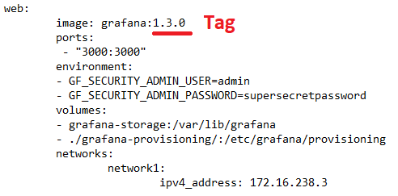

<!-- multilingual suffix: en, es -->

<!-- [en] -->

# Installing containerized software

<!-- [es] -->

# Instalación de software en contenedores

<!-- [en] -->

The resources that you will run in the virtual machine are:

- **Node-RED**, a communications manager with the plant and other applications in the cloud, which also allows programs to be executed (in the first part of the project, to check its operation, NodeRed will contain a generator of sinusoidal signals at a certain frequency and amplitude that will emulate the captured signal).
- **Grafana**, a low-complexity graphical interface that allows you to present data on a web in the form of graphs, maps, etc. It is easily configurable to work with InfluxDB.
- **InfluxDB**, a database server in which we will store data.

In the technological solution that you are going to implement, you will install each software in an isolated container, as you can see in the following screenshot:

{: .center}

## Docker installation
Once connected to your virtual machine via SSH, you will need to run the commands presented in this section to download and install Docker. The commands found below are the same as those provided in the official Docker documentation, which you can find at the following link:

<https://docs.docker.com/engine/install/ubuntu/>

**NOTE:** if you have an AMR processor, consult the official documentation, <https://docs.docker.com/engine/install/ubuntu/>, since the last command will be different in your case)

```bash
sudo apt-get udpate

sudo apt-get install \

  apt-transport-https \

  ca-certificates \

  curl \

  gnupg \

  lsb-release

sudo curl -fsSL https://download.docker.com/linux/ubuntu/gpg | sudo gpg --dearmor -o /usr/share/keyrings/docker-archive-keyring.gpg

echo \

  "deb [arch=amd64 signed-by=/usr/share/keyrings/docker-archive-keyring.gpg] https://download.docker.com/linux/ubuntu \

  (lsb\_release -cs) stable" | sudo tee 
  /etc/apt/sources.list.d/docker.list > /dev/null

sudo apt-get update

sudo apt-get install docker-ce docker-ce-cli containerd.io
```

You can verify that Docker has been installed correctly by running the following command to download and run an image in a container, printing an informative message on the screen when doing so.

```bash
sudo docker run hello-world
```

## Install Docker Compose

Next, you will need to download and install Docker-compose with the following commands:

```bash
sudo curl -L 
"https://github.com/docker/compose/releases/download/1.28.5/docker-compose-$(uname -s)-$(uname -m)" -o /usr/local/bin/docker-compose

sudo chmod +x /usr/local/bin/docker-compose
```
You can verify that it has been installed correctly by running the following command:

```bash
sudo docker-compose –version
```

## Transfer files to the virtual machine

Now you must download the IIACPS\_base\_folder directory from Athena and send it to the virtual machine that you have created. This file transfer will be carried out using the SCP protocol (Security Copy Protocol) which is based on SSH.

Once cmd or Windows Terminal is open on your computer, enter the following command:

```bash
scp -r -i <privatekeyrute> <originrute> userVM@ipVM:<destinationrute>
```

NOTE: The -r in the command indicates that a complete directory is being sent, if you need to send only one file you can use the same command, removing the -r.

In the terminal you should see the progress of the file transfer being indicated, reaching 100% when complete. It is recommended that you verify, being SSH connected to the VM, that you can easily locate the IIACPS\_base\_folder directory.

{: .center}

## Node-RED *custom* image creation

Because we are going to need to use some specific Node-RED packages that are not included in the base version, it will be necessary for you to mount an image that includes those packages. **The docker architecture that you have sent by SCP to the virtual machine is already prepared for it**. To mount the image, you will need to go inside the IIA\_CPS\_base\_folder folder and run the following command (NOTE: The dot after <tag> is included in the command):

```bash
sudo docker build -t nodered:<tag> .
```

You will notice when you press “Enter” that a sequence of 4 steps begins.

{: .center}

When the sequence is finished, you can verify that it was created correctly with the following command:

```bash
sudo docker image ls
```

{: .center}

Once finished, **you will have to edit the file “docker-compose.yml” the tag of the image that you have just mounted**. You can leave the Node-Red directory with the following command:

```bash
cd ..
```

Once in the folder where “docker-compose.yml” is located, you can edit the file with the following command:

```bash
sudo nano docker-compose.yml
```
Be careful not to add spaces or tabs. You only have to edit the line that is shown in the following screenshot, modifying the tag that you have chosen for your image. You can navigate through the file with the directional arrows on the keyboard.

{: .center}

When you have made the modification, remember that you can save the changes by means of “CTRL+O”, it will ask you to name the file and you must not modify the name, so it will be enough to press “Enter”. Finally, to exit the nano file editor, use "CTRL+X". The process of creating the custom image for Node-RED will only have to be done once.

Now, to verify that the image has been generated correctly, you will run the “docker-compose.yml” file (you will find the command to do so on the next page). **You must perform this operation every time you connect to the virtual machine** since, even if you leave the containers mounted, they will be deleted when the virtual machine automatically shuts down at 00:00.

## Grafana *custom* image creation

In the case of Grafana it will also be necessary to generate an image. To mount the image, you will need to go inside the IIA\_CPS\_base\_folder folder and run the following command (NOTE: The dot after **tag** is included in the command):

```bash
sudo docker build -t grafana:<tag> .
```

Access the “docker-compose.yml” file as indicated in the previous section and in the Grafana service write the tag of the image you have mounted.

{: .center}

## Container lifting
The following command takes the information collected in the docker-compose to generate the containers. In the case at hand, the docker-compose file you're using has been written to pull up a container for each piece of software, three in total.

```bash
sudo docker-compose up
```

**The terminal session you are using will get stuck returning information about the containers in the form of logs, this can be useful in determining what happens if something doesn't work as expected. You will have to open a new one to continue working.**

Alternatively, it is possible to launch the containers without the session being blocked and therefore the logs not being received. To do this, you must add -d to the previous command, being as follows:

```bash
sudo docker-compose up -d
```

In either case, to verify that the containers are active, use the following command, which returns the list of containers:

```bash
sudo docker ps
```

In the console you should see a list like the following. Keep in mind that it is possible that the first time you execute the command, the three containers have not been generated. Re-enter the command until you verify that all three containers are working.


{: .center}

> At this point, if you wish, you can already modify the features of the virtual machine because all the necessary software has already been installed. The cheapest option is B1ls, see the following screenshot. 

{: .center}

## Configuring the ports of the virtual machine

In technological solutions such as the one you are implementing, it is necessary to access the configuration of the software elements to guarantee that their operation will comply with the required performance. To program and configure these programs it will be necessary to enable the communication ports in the virtual machine.

Because InfluxDB is a database that we are not going to access from the outside, but other applications will access it when they perform data read or write operations, you will only have to enable the Node-RED and Grafana ports. **By default, Node-RED occupies port 1880 and Grafana 3000.**

In Azure, you will need to access your virtual machine. You can do it through the “Virtual machines” icon, highlighted in the following screenshot.

{: .center}

You will access the list of virtual machines created, and clicking on yours will open the general information of the virtual machine. Now, in the "Networks" section of the configuration menu, a list will be displayed. You will need to define new input port rules, one rule for each port, in order to access and configure each software. As an example, below, you can see what data to fill in to configure the port corresponding to Node-RED.

{: .center}

NOTE: When you click “Add” it may take a few seconds for the new rule to be reflected in the list of port of entry rules.

Once you have both rules defined, you should see a list of input port rules like the one in the screenshot below:

{: .center}

Although it is not necessary to do so, you can also generate a rule with the InfluxDB port, which is 8086. In this way, you will be able to communicate from the browser with the database that you will create in InfluxDB of the virtual machine.

The following HTTP address example makes a GET request to the “endpoint” query, with the “q” and “pretty” parameters. According to the InfluxDB API, the “q” parameter must contain the command that we want to execute, in this case “SHOW DATABASES”, and the “pretty” parameter contains a boolean to indicate that the response is with easy-to-view line breaks.

This is the request:

*http://”IPpublicaDeVuestraVM”:8086/query?q=show databases&pretty=true*

And this is a response message similar to the one you will receive:

{: .center}

To access Node-RED or Grafana you will use the port of each one, the one you have configured in the input port rules of your virtual machine.

**To access NodeRed through the browser you must use:**

[*http://”IPpublicaDeVuestraVM”:1880*]()

**And to access Grafana you must use:**

[*http://”IPpublicaDeVuestraVM”:3000*]()


Now we recommend that, through your browser, you access the Node-RED installation created in a specific container for this software and verify that the following packages have been installed correctly:

- Modbus.
- InfluxDB
- Dashboard.

You can do it by consulting the list of available blocks in the vertical bar to the left of your screen, highlighted in the following screenshot.

{: .center}

If you type the names of the packages in the node browser, at the top of the nodes palette, you can verify that you have available the blocks of the Modbus package (in red), the blocks of the Influxdb package (in brown) and the blocks of the dashboard package (in blue).

<!-- [es] -->

Los recursos que haréis correr en la máquina virtual son:

- **Node-RED**, un gestor de comunicaciones con la planta y otras aplicaciones en nube, que permite además ejecutar programas (en la primera parte del proyecto, para comprobar su funcionamiento, NodeRed contendrá un generador de señales sinusoidales a cierta frecuencia y amplitud que emulará la señal capturada).
- **Grafana**, un interfaz gráfico de baja complejidad que permite presentar datos en una web en forma de gráficos, mapas, etc. Es fácilmente configurable para trabajar con InfluxDB.
- **InfluxDB**, un servidor de base de datos en el que almacenaremos data.

En la solución tecnológica que vais a implementar instalaréis cada software en un contenedor aislado (*container*), como podéis ver en la siguiente captura:

{: .center}

## Instalación de Docker
Una vez conectados a vuestra máquina virtual mediante SSH, deberéis ejecutar los comandos que se presentan en esta sección para descargar e instalar Docker. Los comandos que se encuentran a continuación son los mismos que se aportan en la documentación oficial de Docker, que podéis encontrar en el siguiente enlace:

<https://docs.docker.com/engine/install/ubuntu/>

**NOTA**: si disponéis de un procesador AMR consultad la documentación oficial, <https://docs.docker.com/engine/install/ubuntu/>, ya que el último comando será diferente en vuestro caso)

```bash
sudo apt-get udpate

sudo apt-get install \

  apt-transport-https \

  ca-certificates \

  curl \

  gnupg \

  lsb-release

sudo curl -fsSL https://download.docker.com/linux/ubuntu/gpg | sudo gpg --dearmor -o /usr/share/keyrings/docker-archive-keyring.gpg

echo \

  "deb [arch=amd64 signed-by=/usr/share/keyrings/docker-archive-keyring.gpg] https://download.docker.com/linux/ubuntu \

  (lsb\_release -cs) stable" | sudo tee 
  /etc/apt/sources.list.d/docker.list > /dev/null

sudo apt-get update

sudo apt-get install docker-ce docker-ce-cli containerd.io
```
Podéis verificar que Docker se ha instalado correctamente ejecutando el siguiente comando, para descargar y ejecutar una imagen en un contenedor, imprimiendo al hacerlo un mensaje informativo por pantalla.

```bash
sudo docker run hello-world
```

## Instalación de Docker Compose
A continuación, deberéis descargar e instalar Docker-compose con los siguientes comandos:

```bash
sudo curl -L 
"https://github.com/docker/compose/releases/download/1.28.5/docker-compose-$(uname -s)-$(uname -m)" -o /usr/local/bin/docker-compose

sudo chmod +x /usr/local/bin/docker-compose
```

Podéis verificar que se ha instalado correctamente ejecutando el siguiente comando:

```bash
sudo docker-compose –version
```

## Transferencia de archivos a la máquina virtual
Ahora deberéis descargar el directorio IIACPS\_base\_folder de Atenea y enviarlo a la máquina virtual que habéis creado. Esta transferencia de archivos se llevará a cabo mediante el protocolo SCP (Security Copy Protocol) que está basado en SSH.

Una vez abierto *cmd* o *Windows Terminal* en vuestro ordenador, introducir el siguiente comando:

```bash
scp -r -i <rutaclaveprivada> <rutadeorigen> usuarioVM@ipVM:
<ruta dedestino>
```

NOTA: La **-r** en el comando indica que se está enviando un directorio completo, si necesitáis enviar solo un archivo podéis utilizar el mismo comando, eliminando la **-r**.

En el terminal deberíais observar que se indica el progreso de la transferencia de archivos, alcanzando el 100% cuando se haya completado. Se recomienda que verifiquéis, estando conectados por SSH a la VM, que podéis localizar fácilmente el directorio IIACPS\_base\_folder.

{: .center}

## Creación de imagen *custom* de Node-RED
Debido a que vamos a necesitar usar algunos paquetes concretos de Node-RED que no vienen incluidos en la versión base, será necesario que montéis una imagen que incluya dichos paquetes. **La arquitectura docker que habéis enviado por SCP a la máquina virtual ya está preparada para ello**. Para montar la imagen, deberéis situaros dentro de la carpeta IIA\_CPS\_base\_folder y ejecutar el siguiente comando (NOTA: El punto después de **tag** está incluido en el comando):

```bash
sudo docker build -t nodered:<tag> .
```

Observaréis al pulsar “Enter” que se inicia una secuencia de 4 pasos. 

{: .center}

Cuando finalice la secuencia, podéis verificar que se ha creado correctamente con el siguiente comando:

```bash
sudo docker image ls
```

{: .center}

Una vez terminada, **deberéis editar el archivo “docker-compose.yml” el tag de la imagen que acabáis de montar**.  Podéis salir del directorio de Nodered con el siguiente comando:

```bash
cd ..
```

Una vez en la carpeta donde se encuentra “docker-compose.yml”, podéis editar el archivo con el siguiente comando:

```bash
sudo nano docker-compose.yml
```

Tened cuidado de no añadir espacios o tabulaciones. Solo debéis editar la línea que se muestra en la siguiente captura modificando el tag que habéis elegido para vuestra imagen. Podréis navegar por el archivo con las flechas direccionales del teclado.

{: .center}

Cuando hayáis realizado la modificación, recordar que podéis guardar los cambios mediante “CTRL+O”, os pedirá que nombréis el archivo y no debéis modificar el nombre, así que será suficiente con pulsar “Enter”. Finalmente, para salir del editor de archivos *nano*, usad “CTRL+X”. El proceso de crear la imagen *custom* para Node-RED solo deberéis realizarlo una vez.

Ahora, para verificar que la imagen se ha generado correctamente ejecutaréis el archivo “docker-compose.yml” (encontraréis el comando con el que hacerlo en la página siguiente). **Esta operación la deberéis realizar cada vez que os conectéis a la máquina virtual** ya que, aunque dejéis los contenedores montados, se eliminarán cuando la máquina virtual se apague automáticamente a las 00:00.

## Creación de imagen *custom* de Grafana
Para el caso de Grafana también será necesario generar una imagen. Para montar la imagen, deberéis situaros dentro de la carpeta IIA\_CPS\_base\_folder y ejecutar el siguiente comando (NOTA: El punto después de **tag** está incluido en el comando):

```bash
sudo docker build -t grafana:<tag> .
```

Acceded al archive “docker-compose.yml” como se indica en la sección anterior y en el servicio de Grafana escribid el tag de la imagen que habéis montado.

{: .center}

## Levantado de contenedores
El siguiente comando toma la información recogida en el docker-compose para generar los contenedores. En el caso que nos ocupa, el archivo docker-compose que estáis utilizando ha sido escrito para que levante un contenedor para cada software, tres en total.  

```bash
sudo docker-compose up
```

**La sesión de terminal que estáis utilizando se quedará bloqueada devolviendo información acerca de los contenedores en forma de logs, esto puede ser útil a la hora de determinar que sucede si algo no funciona como esperabais. Deberéis abrir una nueva para continuar trabajando.** 

Alternativamente es posible levantar los contenedores sin que la sesión se quede bloqueada y por tanto no se reciban los logs. Para ello, debéis añadir *-d* al comando anterior, quedando como sigue:

```bash
sudo docker-compose up -d
```

En cualquiera de los dos casos, para verificar que los contenedores están activos utilizad el siguiente comando, que devuelve la lista de contenedores:

```bash
sudo docker ps
```

En la consola deberíais visualizar una lista como la siguiente. Tened en cuenta que es posible que la primera vez que ejecutáis el comando no se hayan generado los tres contenedores. Volved a introducir el comando hasta verificar que los tres contenedores están funcionando.

{: .center}

> En este punto, si lo deseáis, ya podéis modificar las prestaciones de la máquina virtual debido a que **ya se ha instalado todo el software necesario**. La opción más económica es **B1ls**, ver la siguiente captura. 

{: .center}

## Configuración de los puertos de la máquina virtual
En soluciones tecnológicas como la que estáis implementando, se requiere acceder a la configuración de los elementos de software para garantizar que su operación cumplirá con el funcionamiento requerido. Para programar y configurar dichos programas será necesario habilitar los puertos de comunicaciones en la máquina virtual.

Debido a que InfluxDB se trata de una base de datos a la que no vamos a acceder des del exterior, sino que accederán las otras aplicaciones cuando realicen operaciones de lectura o escritura de datos, solo deberéis habilitar los puertos de Node-RED y Grafana. **Por defecto, Node-RED ocupa el puerto 1880 y Grafana el 3000.**

En Azure, deberéis acceder a vuestra máquina virtual. Lo podéis hacer mediante el icono de “Máquinas virtuales”, remarcado en la siguiente captura.

{: .center}

Accederéis a la lista de máquinas virtuales creadas, y haciendo clic en la vuestra se os abrirá la información general de la máquina virtual. Ahora, en el apartado “Redes” del menú de configuración, se desplegará una lista.  Deberéis definir nuevas reglas de puertos de entrada, una regla para cada puerto, para poder acceder a cada software y configurarlo. Como ejemplo, a continuación, podéis ver que datos rellenar para configurar el puerto correspondiente a Node-RED.

{: .center}

NOTA: Cuando hagáis clic en “Agregar” es posible que tarde unos segundos en verse reflejada la nueva regla en la lista de reglas de puerto de entrada.

Una vez tengáis ambas reglas definidas, deberíais ver una lista de reglas de puerto de entrada como la de la captura siguiente:

{: .center}

Pese a que no es necesario hacerlo, también se puede generar una regla con el puerto de InfluxDB, que es el 8086. De esta forma, os podréis comunicar des del navegador con la base de datos que crearéis en InfluxDB de la máquina virtual.

El siguiente ejemplo de dirección HTTP realiza una petición GET al “endpoint” query, con los parámetros “q” y “pretty”. Según la API de InfluxDB, el parámetro “q” debe contener el comando que queremos ejecutar, en este caso “SHOW DATABASES”, y el parámetro “pretty” contiene un booleano para indicar que la respuesta sea con saltos de línea fáciles de visualizar. 

Esta es la petición:

*http://”IPpublicaDeVuestraVM”:8086/query?q=show databases&pretty=true*

Y este un mensaje de respuesta semejante al que vosotros recibiréis:

{: .center}

Para acceder a Node-RED o Grafana utilizaréis el puerto de cada uno, el que habéis configurado en las reglas de puertos de entrada de vuestra máquina virtual. 

**Así, para acceder a NodeRed mediante el navegador debéis usar:**

[*http://”IPpublicaDeVuestraVM”:1880*]()

**Y para acceder a Grafana debéis usar:**

[*http://”IPpublicaDeVuestraVM”:3000*]()


Ahora recomendamos que, mediante vuestro navegador, accedáis a la instalación de Node-RED creada en un contenedor específico para este software y verifiquéis que se han instalado correctamente los siguientes paquetes:

- Modbus.
- InfluxDB
- Dashboard.

Lo podéis hacer consultando la lista de bloques disponibles en la barra vertical a la izquierda de vuestra pantalla, remarcada en la siguiente captura.

{: .center}

Si tecleáis los nombres de los paquetes en el buscador de nodos, en la parte superior de la paleta de nodos, podréis verificar que tenéis disponibles los bloques del paquete Modbus (de color rojo), los bloques del paquete Influxdb (de color marrón) y los bloques del paquete dashboard (de color azul).