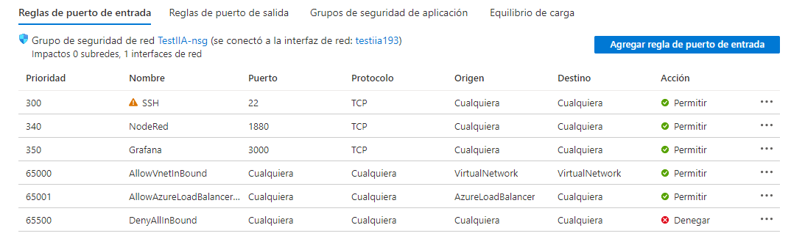
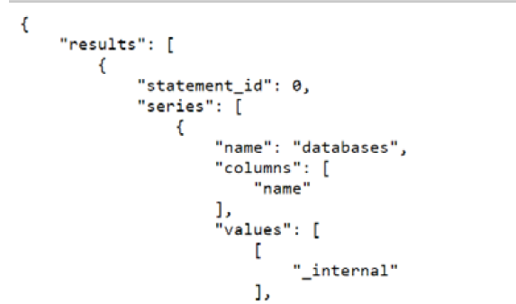
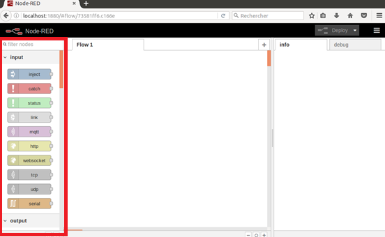

<!-- multilingual suffix: en, es -->

<!-- [en] -->

# Configuring the ports of the virtual machine

<!-- [es] -->

# Configuración de los puertos de la máquina virtual

<!-- [en] -->

In technological solutions such as the one you are implementing, it is necessary to access the configuration of the software elements to guarantee that their operation will comply with the required performance. To program and configure these programs it will be necessary to enable the communication ports in the virtual machine.

Because InfluxDB is a database that we are not going to access from the outside, but other applications will access it when they perform data read or write operations, you will only have to enable the Node-RED and Grafana ports. **By default, Node-RED occupies port 1880 and Grafana 3000.**

In Azure, you will need to access your virtual machine. You can do it through the “Virtual machines” icon, highlighted in the following screenshot.

{: .center}

You will access the list of virtual machines created, and clicking on yours will open the general information of the virtual machine. Now, in the "Networks" section of the configuration menu, a list will be displayed. You will need to define new input port rules, one rule for each port, in order to access and configure each software. As an example, below, you can see what data to fill in to configure the port corresponding to Node-RED.

{: .center}

NOTE: When you click “Add” it may take a few seconds for the new rule to be reflected in the list of port of entry rules.

Once you have both rules defined, you should see a list of input port rules like the one in the screenshot below:

{: .center}

Although it is not necessary to do so, you can also generate a rule with the InfluxDB port, which is 8086. In this way, you will be able to communicate from the browser with the database that you will create in InfluxDB of the virtual machine.

The following HTTP address example makes a GET request to the “endpoint” query, with the “q” and “pretty” parameters. According to the InfluxDB API, the “q” parameter must contain the command that we want to execute, in this case “SHOW DATABASES”, and the “pretty” parameter contains a boolean to indicate that the response is with easy-to-view line breaks.

This is the request:

*http://”IPpublicaDeVuestraVM”:8086/query?q=show databases&pretty=true*

And this is a response message similar to the one you will receive:

{: .center}

To access Node-RED or Grafana you will use the port of each one, the one you have configured in the input port rules of your virtual machine.

**To access NodeRed through the browser you must use:**

[*http://”IPpublicaDeVuestraVM”:1880*]()

**And to access Grafana you must use:**

[*http://”IPpublicaDeVuestraVM”:3000*]()

Now we recommend that, through your browser, you access the Node-RED installation created in a specific container for this software and verify that the following packages have been installed correctly:

- Modbus.
- InfluxDB
- Dashboard.

You can do it by consulting the list of available blocks in the vertical bar to the left of your screen, highlighted in the following screenshot.

{: .center}

If you type the names of the packages in the node browser, at the top of the nodes palette, you can verify that you have available the blocks of the Modbus package (in red), the blocks of the Influxdb package (in brown) and the blocks of the dashboard package (in blue).

<!-- [es] -->

En soluciones tecnológicas como la que estáis implementando, se requiere acceder a la configuración de los elementos de software para garantizar que su operación cumplirá con el funcionamiento requerido. Para programar y configurar dichos programas será necesario habilitar los puertos de comunicaciones en la máquina virtual.

Debido a que InfluxDB se trata de una base de datos a la que no vamos a acceder des del exterior, sino que accederán las otras aplicaciones cuando realicen operaciones de lectura o escritura de datos, solo deberéis habilitar los puertos de Node-RED y Grafana. **Por defecto, Node-RED ocupa el puerto 1880 y Grafana el 3000.**

En Azure, deberéis acceder a vuestra máquina virtual. Lo podéis hacer mediante el icono de “Máquinas virtuales”, remarcado en la siguiente captura.

{: .center}

Accederéis a la lista de máquinas virtuales creadas, y haciendo clic en la vuestra se os abrirá la información general de la máquina virtual. Ahora, en el apartado “Redes” del menú de configuración, se desplegará una lista.  Deberéis definir nuevas reglas de puertos de entrada, una regla para cada puerto, para poder acceder a cada software y configurarlo. Como ejemplo, a continuación, podéis ver que datos rellenar para configurar el puerto correspondiente a Node-RED.

{: .center}

NOTA: Cuando hagáis clic en “Agregar” es posible que tarde unos segundos en verse reflejada la nueva regla en la lista de reglas de puerto de entrada.

Una vez tengáis ambas reglas definidas, deberíais ver una lista de reglas de puerto de entrada como la de la captura siguiente:

{: .center}

Pese a que no es necesario hacerlo, también se puede generar una regla con el puerto de InfluxDB, que es el 8086. De esta forma, os podréis comunicar des del navegador con la base de datos que crearéis en InfluxDB de la máquina virtual.

El siguiente ejemplo de dirección HTTP realiza una petición GET al “endpoint” query, con los parámetros “q” y “pretty”. Según la API de InfluxDB, el parámetro “q” debe contener el comando que queremos ejecutar, en este caso “SHOW DATABASES”, y el parámetro “pretty” contiene un booleano para indicar que la respuesta sea con saltos de línea fáciles de visualizar. 

Esta es la petición:

*http://”IPpublicaDeVuestraVM”:8086/query?q=show databases&pretty=true*

Y este un mensaje de respuesta semejante al que vosotros recibiréis:

{: .center}

Para acceder a Node-RED o Grafana utilizaréis el puerto de cada uno, el que habéis configurado en las reglas de puertos de entrada de vuestra máquina virtual. 

**Así, para acceder a NodeRed mediante el navegador debéis usar:**

[*http://”IPpublicaDeVuestraVM”:1880*]()

**Y para acceder a Grafana debéis usar:**

[*http://”IPpublicaDeVuestraVM”:3000*]()

Ahora recomendamos que, mediante vuestro navegador, accedáis a la instalación de Node-RED creada en un contenedor específico para este software y verifiquéis que se han instalado correctamente los siguientes paquetes:

- Modbus.
- InfluxDB
- Dashboard.

Lo podéis hacer consultando la lista de bloques disponibles en la barra vertical a la izquierda de vuestra pantalla, remarcada en la siguiente captura.

{: .center}

Si tecleáis los nombres de los paquetes en el buscador de nodos, en la parte superior de la paleta de nodos, podréis verificar que tenéis disponibles los bloques del paquete Modbus (de color rojo), los bloques del paquete Influxdb (de color marrón) y los bloques del paquete dashboard (de color azul).