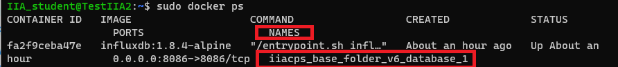
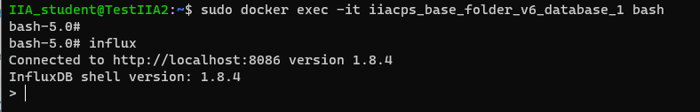

<!-- multilingual suffix: en, es -->

<!-- [en] -->

# InfluxDB database

<!-- [es] -->

# Acceso a la base de datos InfluxDB

<!-- [en] -->

Once the containers are up, it will be necessary to generate a database inside the container that runs the InfluxDB software. To do so, you will enter the container's dedicated terminal and access the InfluxDB command line interface.

First of all, you must identify the name of the Influxdb container, as indicated in the following screenshot:

{: .center}

Now you must enter the following command to access the container terminal:
```bash
 sudo docker exec -it <name_of_the_container> bash
```
Next, you must enter the word "influx" to access the InfluxDB command line interface, receiving a response like the one in the following screenshot.

{: .center}

Finally, using the following command you can generate a database:

```bash
> create database <name_of_the_database>
```
To verify that you have done it correctly, you can access the list of databases created by entering the following command:

```bash
> show databases
```

The terminal should return a list in which you will find two databases: one with the name “\_internal”, which stores internal InfluxDB data, and the one you have created.

You can find all the documentation regarding the commands used to manage databases from the Influxdb command line interface at the following link:

<https://docs.influxdata.com/influxdb/v1.8/query_language/manage-database/>

<!-- [es] -->

Una vez levantados los contenedores, será necesario generar una base de datos dentro del contenedor que ejecuta el software InfluxDB. Para hacerlo, entraréis al terminal dedicado del contenedor y accederéis a la interfaz de línea de comandos de InfluxDB.

En primer lugar, deberéis identificar el nombre del contenedor de Influxdb, como se indica en la siguiente captura:

{: .center}

Ahora deberéis introducir el siguiente comando para acceder al terminal del contenedor:

```bash
sudo docker exec -it <nombre_del_contenedor> bash
```

A continuación, deberéis introducir la palabra “influx” para acceder a la interfaz de línea de comandos de InfluxDB, recibiendo una respuesta como la de la siguiente captura.

{: .center}

Finalmente, mediante el siguiente comando podréis generar una base de datos:

```bash
> create database <nombre_de_la_base_de_datos>
```

Para verificar que lo habéis hecho correctamente, podéis acceder a la lista de bases de datos creadas introduciendo el siguiente comando:

```bash
> show databases
```

El terminal os debería devolver una lista en la que encontraréis dos bases de datos: una con el nombre “\_internal”, que almacena datos internos de InfluxDB, y la que habéis creado vosotros.

Podéis encontrar toda la documentación referente a los comandos que sirven para gestionar bases de datos a partir de la interfaz de línea de comandos de Influxdb en el siguiente enlace:

<https://docs.influxdata.com/influxdb/v1.8/query_language/manage-database/>