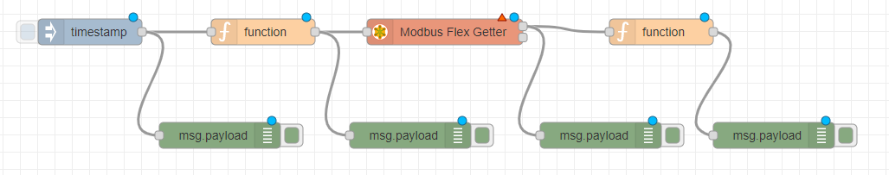
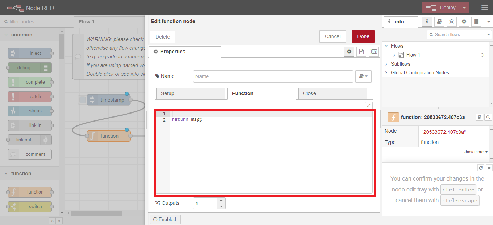
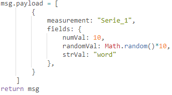
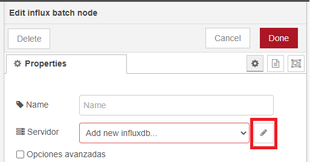
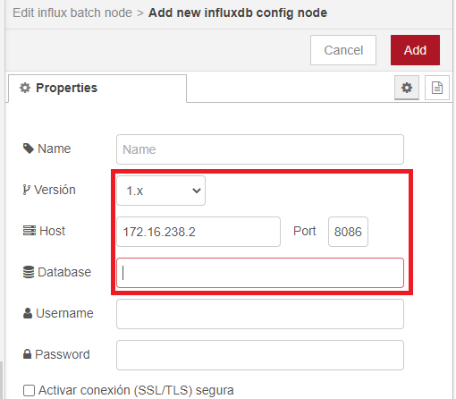

<!-- multilingual suffix: en, es -->

<!-- [en] -->

# Node-RED programming

<!-- [es] -->

# Generación y volcado de datos en Node-RED

<!-- [en] -->

The next step will be to **program a communication flow on Node-RED capable of generating artificial data and dump it into the InfluxDB database that you have created.**

Remember that to access the Node-RED container through the browser you can use the following address:  
[*http://”IPpublicVM”:1880*]()

Progressively and fulfilling the objectives that we are setting for you, we propose to generate a flow with the following structure:

{: .center}

## Debug Block

Although debug blocks are not included in the structure of the flow that you have to program, it is recommended that you use the debug blocks to verify that the modifications you make to the Flow produce the expected effect.

The debug blocks can be connected to the output of any block and will show the information they have received on the right side of the screen, specifically in the debug tab.

Therefore, it is not unreasonable to use a debug block at the output of each block that generates or modifies data. Doing so can allow you to quickly spot which block is not performing the desired operation. Once it has been validated that the operation is as expected, deleting the debug blocks will not have any effect.

{: .center}

Below are several sections dedicated to the different types of blocks you will need. It is intended that the objectives that we set for you at the end of each section serve to verify that you have understood how to work with each type of block. To complete these objectives you will need to combine the blocks that have already been presented, cumulatively, with which you will end up generating the complete flow.

## Inject Block

The *inject* blocks allow the generation of messages in the *flow* manually, by means of a button (blue square, on the left side of the block) that can be clicked, or periodically. These messages are objects that contain information and store it in a predefined structure. Normally the messages will have an element called *payload* (which can be accessed through *msg.payload*) where the data contained in the message is usually stored.

In the configuration of your inject block you can decide what you want to be included in the payload of the emitted object. By default, a *timestamp* is sent, that is, the time stamp (in Unix Time format) of the moment in which that inject block has been executed.

In this first part of the project, this block replaces the set of blocks in charge of taking data from a sensor, database, weather station or PLC.

**Goal**

1. **You must verify that you are able to program a Flow in which an *inject* block generates messages manually and also periodically.**

## Function Block

*Function* blocks allow messages to be manipulated and are programmed in the *JavaScript* language. You can consult the following tutorial to know what the *JavaScript* syntax is for each case.

<https://www.w3schools.com/js/default.asp>

The code that you write in the *function* block, inside the blank space that you can see in the following screenshot, will be executed every time this block receives a message.

{: .center}

You will find information on the operational capabilities offered by this type of block in the following link:

<https://nodered.org/docs/user-guide/writing-functions>

**Goals**

1. **Program a constant numeric value to be assigned to the message *payload*. Verify that this is the case using a *debug* block.**
1. **Program variable data to be generated over time (Some examples may be periodic mathematical functions, counters, or simply random values; the “JS Math” section of the tutorial indicated above may be useful). Verify that it works correctly using a *debug* block.**

The next goal, specified on the next page, is to program the *function* block to output data in the format accepted by InfluxDB databases.

The following screenshot is an example of a function to prepare the message to be dumped to the database through an “Influx Batch” block. As you can see, for each *measurement* that you want to write in the data series, which is indicated as measurement, from the database we can include values that correspond to the data that you want to store, and tags, which are indicators that allow you to filter the data afterwards.

{: .center}

For example, in a *measurement* where data from several temperature sensors is stored, there would be a single temperature column and a column indicating which sensor it is. The data would be organized as in the following table, where the temperature column, which would be the data to be stored, would be a *field* type column, and the name of the sensor to which that measurement corresponds would be a *tag* type column.

|**Temperature**|**Sensor**|
| :-: | :-: |
|23|sensor1|
|21|sensor1|
|29|sensor2|


3. **Program the signal you want to write to the database and see in Grafana (this means that you should no longer modify the *function* block). Adapt the structure and data of the message so that the Influx block can dump them into the database.**

> **You must provide a screenshot or screenshot of the code** that you have programmed in the function block to generate the signal that you will later write to the database. Later on, you will be asked for a screenshot of the data written to the database where you can see that the data written by the Node-RED flow is the same as what you see in the InfluxDB database. That is why it is referred to that the function block is not modified during the rest of this first part of the project.	


## InfluxDB Batch Block

The InfluxDB block allows you to connect the Node-RED flow to an InfluxDB database. The steps to configure the block are as follows:

1) Click on the pencil to edit the information regarding the database to which the block is going to connect.

{: .center}

2) In the node editing options, you must fill in the host and port fields with the capture information. Note that this IP has been manually assigned to the InfluxDB container in the docker-compose file. Although it would be totally equivalent to use the IP of the virtual machine indicating port 8086, remember that the IP of the virtual machine changes every time you start it (which would imply modifying this parameter in the Flow of Node-RED each time), while the IP of the container will always be the same.

3) Finally, you must fill in the database field with the name that you have given to your database, the one that you have previously created in the InfluxDB container.

{: .center}

Click Update or Add when you're done to save your changes.

**Objetive**

1. **Generate multiple messages manually using the Inject block. Confirm that the data has been correctly written to the database by following the procedure below:**

Repeat the process that was carried out to create the database in the Influx container ([click here to return to the instructions for that process](#_heading=h.z337ya)). Once inside the Influx container, enter the following commands:

```bash
> use <name_of_the_database>
```

This command is used to indicate that from now on the commands entered will refer to a specific database.

```bash
> select * from <name_of_series_of_measures>
```

This is how we tell influx that we want to display all the columns (*) of (from) a particular series of measurements. As an example we show you a response similar to the one you should receive in the terminal.

{: .center}

Keep in mind that if you have kept the Node-RED flow writing periodically, the list of measures that you will see can be very long.


2. **Generate a signal for a while (2 minutes is enough if you are writing a measure every second, since 120 measures would come out). This signal will be the one you should visualize in Grafana; how to do it is explained in the next section.**

> **You must provide a screenshot of the data written to the InfluxDB database.** Remember that at this point you are demonstrating that the synthetic data generated by how you have programmed in the function block (which has been reflected in the last capture that we have asked you for) arrive correctly at the database. As an example, think that if you have generated a sinusoidal signal with an amplitude between -1 and 1, it is very easy to see that it is the same signal in the database. 

<!-- [es] -->

El siguiente paso será **programar sobre Node-RED un flujo de comunicaciones capaz de generar datos artificiales y volcarlos en la base de datos de InfluxDB que habéis creado.**

Recordad que para acceder al contenedor de Node-RED mediante el navegador podéis utilizar la siguiente dirección: [*http://”IPpublicaDeVuestraVM”:1880*]()

De forma progresiva y cumpliendo los objetivos que os vamos marcando, se os propone generar un *flow* con la siguiente estructura:

{: .center}

## Bloque Debug
Pese a que no se incluyan bloques *debug* en la estructura del *flow* que tenéis que programar, se recomienda que utilicéis los bloques *debug* para verificar que las modificaciones que hacéis en el Flow producen el efecto esperado.

Los bloques *debug* pueden conectarse a la salida de cualquier bloque y mostrarán en la parte derecha de la pantalla, concretamente en la pestaña *debug*, la información que han recibido.

Por tanto, no es descabellado utilizar un bloque *debug* a la salida de cada bloque que genere o modifique datos. Hacerlo puede permitir localizar rápidamente que bloque no ejecuta la operación que se desea. Una vez validado que el funcionamiento es el esperado, eliminar los bloques *debug* no tendrá ningún efecto.

{: .center}

A continuación, se presentan varias secciones dedicadas a los distintos tipos de bloques que vais a necesitar. Se pretende que los objetivos que os fijamos al final de cada sección sirvan para verificar que habéis entendido como trabajar con cada tipo de bloque. Para completar dichos objetivos vais a necesitar combinar los bloques que ya se hayan presentado, de forma acumulativa, con lo que terminaréis generando el *flow* completo.
## Bloque inject
Los bloques *inject* permiten la generación de mensajes en el *flow* de manera manual, mediante un botón (cuadrado de color azul, en la parte izquierda del bloque) en el que es posible hacer clic, o de manera periódica.  Estos mensajes son objetos que contienen información y la almacenan en una estructura predefinida. Normalmente los mensajes tendrán un elemento llamado *payload* (al que se puede acceder mediante *msg.payload*) donde se acostumbra a almacenar los datos que contiene el mensaje.

En la configuración de vuestro bloque *inject* podréis decidir qué queréis que se incluya en el *payload* del objeto emitido. Por defecto se envía un *timestamp*, es decir, la maca de tiempo (en formato *Tiempo Unix*) del momento en el que se ha ejecutado ese bloque *inject*.

En esta primera parte del proyecto, este bloque sustituye al conjunto de bloques encargado de tomar datos de algún sensor, base de datos, estación meteorológica o PLC. 

**Objetivo**

1. **Deberéis verificar que sois capaces de programar un Flow en el que un bloque *inject* genera mensajes manualmente y también de forma periódica.**

## Bloque function
Los bloques *function* permiten manipular los mensajes y se programan en lenguaje *JavaScript*. Podéis consultar el siguiente tutorial para conocer cual es la sintaxis de *JavaScript* para cada caso.

<https://www.w3schools.com/js/default.asp>

El código que escribáis en el bloque *function*, dentro del espacio en blanco que podéis ver en la siguiente captura, se ejecutará cada vez que este bloque reciba un mensaje.

{: .center}

Encontrareis información sobre las capacidades operativas que ofrece este tipo de bloques en el siguiente link: 

<https://nodered.org/docs/user-guide/writing-functions>

**Objetivos**

1. **Programad que se asigne un valor numérico constante al *payload* del mensaje. Verificad que es así mediante un bloque *debug*.**
1. **Programad que se generen datos variables a lo largo del tiempo (Algunos ejemplos pueden ser funciones matemáticas periódicas, contadores, o simplemente valores aleatorios; el apartado “JS Math” del tutorial indicado anteriormente puede ser de utilidad). Verificad que funciona correctamente mediante un bloque *debug*.**

El siguiente objetivo, que se especifica en la próxima página, consiste en programar el bloque *function* para que genere datos en el formato que aceptan las bases de datos InfluxDB. 

La siguiente captura es un ejemplo de *function* para preparar el mensaje para ser volcado a la base de datos mediante un bloque “Influx Batch”. Como veis, por cada medida que se quiera escribir en la serie de datos, que se indica como *measurement*, de la base de datos podemos incluir valores, que correspondan a los datos que se quieran almacenar, y tags, que son indicadores que permiten filtrar los datos a posteriori. 

{: .center}

Por ejemplo, en un *measurement* donde se almacenen datos de varios sensores de temperatura, existiría una sola columna de temperatura y una columna donde indicase de que sensor se trata. Los datos se organizarían como en la siguiente tabla, donde la columna de temperatura, que sería el dato a almacenar, sería una columna de tipo *field*, y el nombre del sensor al que corresponde esa medición sería una columna de tipo *tag*.

|**Temperatura**|**Sensor**|
| :-: | :-: |
|23|sensor1|
|21|sensor1|
|29|sensor2|

3. **Programad la señal que deseéis escribir en la base de datos y ver en Grafana (ello implica que ya no deberíais volver a modificar el bloque *function)*. Adaptar la estructura y los datos del mensaje para que el bloque Influx los pueda volcar en la base de datos.**

> **Debéis aportar una captura o recorte de pantalla** del código que habéis programado en el bloque *function* para generar la señal que posteriormente escribiréis en la base de datos. Más adelante, se os pedirá una captura de los datos escritos en la base de datos donde se pueda apreciar que los datos escritos por el *flow* de Node-RED son los mismos que visualizáis en la base de datos de InfluxDB. Por eso se hace referencia a que no se modifique el bloque *function* durante el resto de esta primera parte del proyecto.	


## Bloque InfluxDB Batch
El bloque InfluxDB permite conectar el *flow* de Node-RED con una base de datos de InfluxDB. Los pasos para configurar el bloque son los siguientes:

1) Hacer clic sobre el lápiz para editar la información referente a la base de datos a la que se va a conectar el bloque.

{: .center}

2) En las opciones de edición del nodo, deberéis rellenar los campos *host* y *port* con la información de la captura. Tened en cuenta que esta IP ha sido asignada manualmente al container de InfluxDB en el archivo *docker-compose*. Pese a que sería totalmente equivalente utilizar la IP de la máquina virtual indicando el puerto 8086, recordad que la IP de la máquina virtual cambia cada vez que la arrancáis (lo que implicaría modificar este parámetro en el Flow de Node-RED cada vez), mientras que la IP del container será siempre la misma.

3) Finalmente, deberéis rellenar el campo *database* con el nombre que le habéis dado a vuestra base de datos, la que anteriormente habéis creado en el contenedor de InfluxDB.

{: .center}

Haced clic en *Update* o *Add* cuando terminéis para guardar los cambios.

**Objetivo**

1. **Generad varios mensajes de forma manual mediante el bloque *Inject*. Confirmad que los datos se han escrito correctamente en la base de datos siguiendo el siguiente procedimiento:**

Repetid el proceso que se ha llevado a cabo para crear la base de datos en el contenedor de Influx ([haced clic aquí para volver a las instrucciones para dicho proceso](#_Acceso_a_la)). Una vez dentro del contenedor de Influx, introducid los siguientes comandos:

```bash
> use <nombre_de_la_base_de_datos>
```

Este comando sirve para indicar que a partir de ahora los comandos introducidos se referirán a una base de datos concreta.

```bash
> select * from <nombre_de_la_serie_de_medidas>
```

Así le indicamos a influx que queremos visualiar todas las columnas (*) de (*from*) una serie de medidas en particular. Como ejemplo os mostramos una respuesta semejante a la que deberíais recibir en el terminal. 

{: .center}

Tened en cuenta que si habéis mantenido el *flow* de Node-RED escribiendo periódicamente, la lista de medidas que visualizaréis puede ser muy larga.

2. **Generad una señal durante un tiempo (2 minutos es suficiente si estáis escribiendo una medida cada segundo, ya que saldrían 120 medidas). Esta señal será la que deberéis visualizar en Grafana; se explica cómo hacerlo en el siguiente apartado.**

> **Debéis aportar una captura de pantalla de los datos escritos en la base de datos de InfluxDB.** Recordad que en este punto estáis demostrando que los datos sintéticos generados por como habéis programado en el bloque *function* (que ha quedado reflejado en la última captura que os hemos pedido) llegan correctamente a la base de datos. Como ejemplo, pensad que si habéis generado una señal senoidal de amplitud entre -1 y 1, es muy fácil apreciar que se trata de la misma señal en la base de datos. 