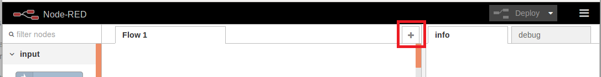
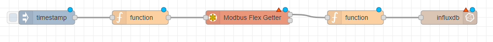
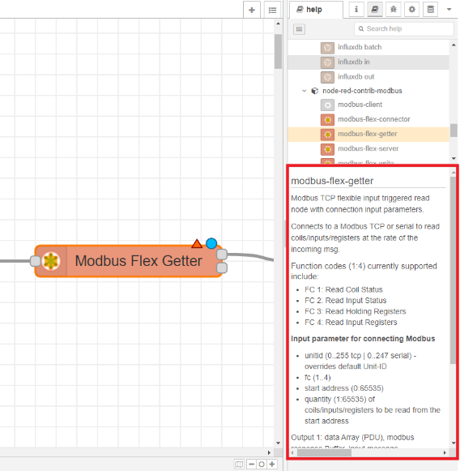
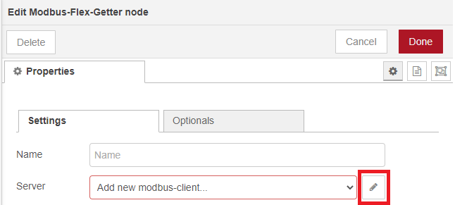
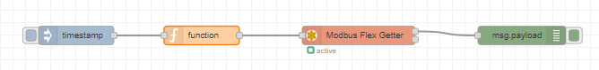
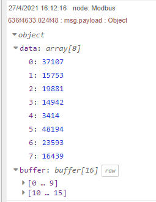
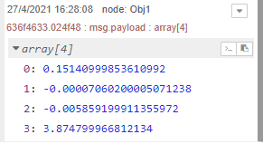
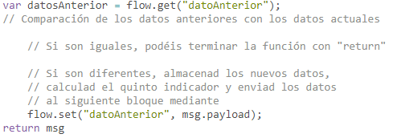
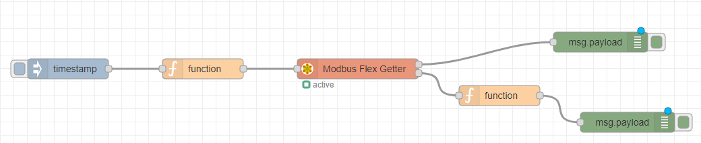
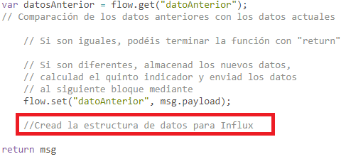

<!-- multilingual suffix: en, es -->

<!-- [en] -->

# Communications in Node-RED

<!-- [es] -->

# Comunicación con entorno industrial en Node-RED 

<!-- [en] -->

First of all, you will need to access Node-RED. It is not necessary to delete the *flow* generated for the first part of the project, you can create a new one that will appear as a new tab by clicking on the “+” sign indicated in the following screenshot:

{: .center}

Again, as in the first part of the project, the design of the Node-RED *flow* will be carried out progressively, fulfilling the objectives that we are setting below. The *flow* you will generate will have a structure like the following:

{: .center}

The use of *debug* blocks is recommended to validate each step of the process.
## Inject block
Este tipo de bloque ya se introdujo en la primera parte del proyecto**, por ello solo indicamos que inicialmente lo configuréis con accionamiento manual,** es decir, que no genere pulsos de forma periódica.

## Function block before Modbus Flex Getter block
This *function* block is used to configure the *payload* of the message received by the *Modbus Flex Getter* block with specific parameters so that the latter can read the data stored by the PLC with which we want to communicate.

Information regarding the parameters that can be configured and two payload examples can be found in the *Modbus Flex Getter* block documentation. The second example, which receives the name of Function node code example for multiple inputs, is used for cases in which different values ​​must be read at the same time, such as the case at hand. Remember that we intend to read four statistical parameters calculated on the vibration signal of a machine: *RMS, Skewness, Kurtosis and Mean*.

To access the documentation of the block and the example just mentioned, click on the *Modbus Flex Getter* block and on the right side of the Node-RED screen, look for the *Help* tab, the one with the symbol of a book .

Since you already have the *Modbus Flex Getter* block selected (the border of a block you have selected will turn orange/red to make it easy to identify), the information that will appear at the bottom right of the Node -RED will already be the one that refers to this block. You should see something similar to what is shown in the screenshot below.


{: .center}

Once you copy the example that has been mentioned, you should have a *function* block with the following code:

{: .center}

Parameter names will be colored green and parameter values will be colored orange.

It is important to note that each parameter is passed as an unsigned integer. For that to be possible, two integer values are needed for each parameter. **Thus, you will receive 8 values that the code below will convert to signed decimal (floating point) numbers.**

**Objective**

1. **Modify the values of the parameters of the example so that the reading operation of data stored in the PLC is carried out according to the following table. Keep in mind that the initial address will be that of the first data, 0 in this case, and you want to read four parameters.**

|**FC o *function code***|**Dirección o *Adress***|**Dato**|
| :-: | :-: | :-: |
|3|0,1|*RMS*|
|3|2,3|*Skewness*|
|3|4,5|*Kurtosis*|
|3|6,7|*Mean*|

Once the function block has been configured, it will also be necessary to configure the *Modbus Flex Getter* block to validate that both blocks work correctly.

## Modbus Flex Getter block
The *Modbus Flex Getter* block, of the Modbus package, allows receiving data from devices that communicate using the Modbus TCP/IP protocol, such as the PLC that stores the parameters measured by the vibration sensor.

To configure it, double click on the block and click on the pencil icon, indicated in the following screenshot, to add a new *Server*.

{: .center}

Now, you must enter the information regarding the *Type*, *Host* and *Port*, with the data available regarding the PLC with which we are going to communicate, which are the following:

|**Dirección IP**|**Puerto TCP**|
| :-: | :-: |
|147.83.83.29|20000|

To exit, click the red *Update* or *Done* button.

At this point, the *flow* you should have generated consists of 3 blocks: *Inject, function and Modbus Flex Getter*. If you connect a debug block to the output of the *Modbus Flex Getter* block, as you can see in the following screenshot, you will be able to validate if you have reached the proposed objective.

{: .center}

**Objective**

1. **Run the *flow* and verify that you are able to receive an object with the format shown in the following screenshot:**

{: .center}

## Function block after the Modbus Flex Getter block
For the design of the code of this *function* block, three premises must be taken into account:

1) The received data correspond to the decimal values ​​of the 4 parameters, but they have been encoded as unsigned integers to transmit them in binary. You will be provided with a code that allows you to transform the received data to the original decimal values.
1) When the flow is complete, you must configure (when you reach point 4 of this document) a reading period of the PLC data registers of 1 second. However, the PLC data refresh period is 5 seconds. Therefore, it is expected that sometimes the same data is read several times consecutively. Since this information does not add anything new, it will neither be processed as follows or written to the database.
1) In the event that new data has been read, you will generate a fifth parameter by way of data preprocessing, creating a fifth indicator, which you can name as you wish, which responds to the following formula:

>                           Indicator = RMS^2

Therefore, five parameters will be written to the database at a time.

**Objectives**

1. **Copy the following code in the *function* block and verify in its output that the data received is similar to that of the capture.**

```bash
let data1 = [msg.payload[0], msg.payload[1]];
let data2 = [msg.payload[2], msg.payload[3]];
let data3 = [msg.payload[4], msg.payload[5]];
let data4 = [msg.payload[6], msg.payload[7]];

var bytes1 = new Uint16Array(data1);
var bytes2 = new Uint16Array(data2);
var bytes3 = new Uint16Array(data3);
var bytes4 = new Uint16Array(data4);

let view1 = new DataView(bytes1.buffer);
let view2 = new DataView(bytes2.buffer);
let view3 = new DataView(bytes3.buffer);
let view4 = new DataView(bytes4.buffer);

let param1 = view1.getFloat32(0, true);
let param2 = view2.getFloat32(0, true);
let param3 = view3.getFloat32(0, true);
let param4 = view4.getFloat32(0, true);

msg.payload = [param1, param2, param3, param4];

return msg;
```

{: .center}

**NOTE: The code requested in the following sections must be written after the code provided for Objective 1.**

2. **Complete the following template with a conditional structure that allows repeated data to be discarded without actually calculating the fifth parameter.**

{: .center}

You can verify that you have done it correctly by comparing the messages displayed by the debug blocks as in the following screenshot:

{: .center}

3. **Add the calculation of the fifth parameter only if the data is not repeated**

4. **Include the data structure so that it can be written to an InfluxDB database. Create a new data series so as not to mix the data read from the PLC with the synthetic data (you can use as a base the code that you have generated in the first part of the project to write the synthetic data in the InfluxDB database).**

As indicated in the following screenshot, you must include the data structure before the line where the *return* msg is executed:

{: .center}


## Influx Batch block
The configuration of the *Influx Batch* block is the same as that indicated in the guide document of the first part of the project (page XX). At this point you should already have a complete flow like the following:

{: .center}

**Objective**

1. **Generate multiple messages manually using the Inject block. Confirm that the data has been written correctly in the database following the procedure indicated in the guide document of the first part of the project (page 23).**

In the InfluxDB database, you should see data like the one shown in the following screenshot:

{: .center}


<!-- [es] -->

En primer lugar, deberéis acceder a Node-RED. No es necesario que eliminéis el *flow* generado  para la primera parte del proyecto, podéis crear uno nuevo que aparecerá como una nueva  pestaña haciendo clic sobre el signo “+” que se indica en la siguiente captura: 

{: .center}

De nuevo, como en la primera parte del proyecto, el diseño del *flow* de Node-RED se llevará a  cabo de forma progresiva cumpliendo los objetivos que os vamos marcando a continuación. El  *flow* que generaréis tendrá una estructura como la siguiente: 

{: .center}

Se recomienda el uso de bloques *debug* para validar cada paso del proceso. 

## Bloque Inject 

Este tipo de bloque ya se introdujo en la primera parte del proyecto**, por ello solo indicamos  que inicialmente lo configuréis con accionamiento manual,** es decir, que no genere pulsos de  forma periódica. 

## Bloque function anterior al bloque Modbus Flex Getter 

Este bloque *function* se utiliza para configurar el *payload* del mensaje que recibe el bloque  *Modbus Flex Getter* con unos parámetros concretos para que este último pueda leer los datos  que almacena el PLC con el que nos queremos comunicar. 

En la documentación del bloque *Modbus Flex Getter* se puede encontrar la información  referente a los parámetros que se pueden configurar y dos ejemplos de *payload*. El segundo  ejemplo, que recibe el nombre de *Function node code example for multiple inputs*, se utiliza para  casos en los que se deba leer distintos valores a la vez, como el caso que nos ocupa. Recordad  que pretendemos leer cuatro parámetros estadísticos calculados sobre la señal de vibración de  una máquina: *RMS, Skewness, Kurtosis* y *Mean*.  

Para acceder a la documentación del bloque y al ejemplo que se acaba de mencionar, hacer clic  en el bloque *Modbus Flex Getter* y en la parte derecha de la pantalla de Node-RED, buscad la  pestaña *Help,* la que tiene el símbolo de un libro. 

Debido a que ya tenéis seleccionado el bloque *Modbus Flex Getter* (el borde de un bloque que  tengáis seleccionado se volverá de color naranja/rojo para que sea fácil de identificar), la  información que os aparecerá en la parte inferior derecha de la pantalla de Node-RED ya será la  que hace referencia a este bloque. Deberíais ver algo similar a lo que se muestra en la siguiente  captura.

{: .center}

Una vez copiéis el ejemplo que se ha mencionado, deberíais tener un bloque *function* con el  siguiente código: 

{: .center}

Los nombres de los parámetros quedarán coloreados en verde y los valores de los parámetros  quedarán coloreados en naranja. 

**Objetivo** 

**1. Modificad los valores de los parámetros del ejemplo para que se realice la operación  de lectura de datos almacenados en el PLC acorde con la siguiente tabla. Tened en  cuenta que la dirección inicial será la del primer dato, 0 en este caso, y queréis leer  cuatro parámetros.** 

|**FC o *function***  ***code***|**Dirección o**  ***Adress*** |**Dato**|
| :-: | :-: | :-: |
|3 |0 |*RMS*|
|3 |1 |*Skewness*|
|3 |2 |*Kurtosis*|
|3 |3 |*Mean*|


Una vez configurado el bloque *function* será necesario configurar también el bloque *Modbus  Flex Getter* para validar que ambos bloques funcionan correctamente.

## Bloque Modbus Flex Getter 

El bloque *Modbus Flex Getter,* del paquete de Modbus, permite recibir datos de dispositivos que  se comuniquen mediante el protocolo Modbus TCP/IP, como el PLC que almacena los  parámetros medidos por el sensor de vibración. 

Para configurarlo, haced doble clic sobre el bloque y hacer clic en el icono del lápiz, que se indica  en la siguiente captura, para añadir un nuevo *Server*. 

{: .center}

Ahora, deberéis introducir la información referente al *Type, Host* y *Port,* con los datos de los que  se dispone referentes al PLC con el que nos vamos a comunicar, que son los siguientes: 

|**Dirección IP** |**Puerto TCP**|
| :-: | :-: |
|147.83.83.29 |20000|


Para salir, hacer clic en el botón rojo de *Update* o *Done*. 

En este punto, el *flow* que deberíais haber generado consiste de 3 bloques: *Inject, function* y  *Modbus Flex Getter.* Si conectáis un bloque *debug* a la salida del bloque *Modbus Flex Getter,*  como se puede ver en la siguiente captura, podréis validar si habéis alcanzado el objetivo  propuesto. 

{: .center}

**Objetivo** 

**1. Ejecutad el *flow* y verificad que sois capaces de recibir un objeto con el formato que  se muestra en la captura siguiente:**

{: .center}

## Bloque function posterior al bloque Modbus Flex Getter 
Para el diseño del código de este bloque *function* se deben tener en cuenta tres premisas: 

1) Los datos recibidos corresponden a los valores decimales de los 4 parámetros, pero han  sido codificados como enteros sin signo (*unsigned*) para transmitirlos en binario. Se os  proporcionará un código que permite transformar los datos recibidos a los valores  decimales originales. 

2) Cuando el *flow* esté completado, se deberá configurar (cuando lleguéis al punto 4 de  este documento) un período de lectura de los registros de datos del PLC de 1 segundo.  No obstante, el período de refresco de datos del PLC es de 5 segundos. Por tanto, se  espera que en ocasiones se lea el mismo dato varias veces consecutivas. Debido a que  esta información no aporta nada nuevo, ni se procesará como se indica a continuación  ni se escribirá en la base de datos. 

3) En el caso que se hayan leído nuevos datos, generaréis un quinto parámetro a modo de  preprocesado de datos, creando un quinto indicador, que podéis nombrar como  queráis, que responda a la siguiente fórmula: 

>                             Indicador = RMS^2 

Por tanto, en la base de datos se escribirán cinco parámetros cada vez. 

**Objetivos** 

**1. Copiad el siguiente código en el bloque *function* y verificad en su salida que los datos  recibidos se asemejan a los de la captura.** 

```bash
let data1 = [msg.payload.data[0], msg.payload.data[1]]; 
let data2 = [msg.payload.data[2], msg.payload.data[3]]; 
let data3 = [msg.payload.data[4], msg.payload.data[5]]; 
let data4 = [msg.payload.data[6], msg.payload.data[7]]; 

var bytes1 = new Uint16Array(data1); 
var bytes2 = new Uint16Array(data2); 
var bytes3 = new Uint16Array(data3); 
var bytes4 = new Uint16Array(data4); 

let view1 = new DataView(bytes1.buffer); 
let view2 = new DataView(bytes2.buffer); 
let view3 = new DataView(bytes3.buffer); 
let view4 = new DataView(bytes4.buffer); 

let param1 = view1.getFloat32(0, true); 
let param2 = view2.getFloat32(0, true); 
let param3 = view3.getFloat32(0, true); 
let param4 = view4.getFloat32(0, true); 

msg.payload = [param1, param2, param3, param4]; 

return msg;
```

{: .center}

**NOTA: El código que se pide en los siguientes apartados se tiene que ir escribiendo a  continuación del código proporcionado para el Objetivo 1.** 

**2. Completad la siguiente plantilla con una estructura condicional que permita descartar  los datos repetidos sin llegar a calcular el quinto parámetro.** 

{: .center}

Podéis verificar que lo habéis hecho correctamente comparando los mensajes mostrados por  los bloques *debug* como en la captura siguiente: 

{: .center}

**3. Añadid el cálculo del quinto parámetro solo si los datos no son repetidos** 

**4. Incluid la estructura de datos para que se puedan escribir en una base de datos de  InfluxDB. Cread una nueva serie de datos para no mezclar los datos leídos del PLC con  los datos sintéticos (Podéis utilizar como base el código que habéis generado en la  primera parte del proyecto para escribir los datos sintéticos en la base de datos de  InfluxDB).** 

Como se indica en la siguiente captura, debéis incluir la estructura de datos antes de la línea  donde se ejecuta el *return msg*:

{: .center}

## Bloque Influx Batch 

La configuración del bloque Influx Batch es la misma que la que se indica en el documento guía  de la primera parte del proyecto (página XX). En este punto ya deberíais tener un *flow* completo  como el siguiente: 

{: .center}

**Objetivo** 

**1. Generad varios mensajes de forma manual mediante el bloque *Inject*. Confirmad que  los datos se han escrito correctamente en la base de datos siguiendo el procedimiento  que se indica en el documento guía de la primera parte del proyecto (página 23).** 

En la base de datos de InfluxDB, deberíais visualizar datos como los que se muestran en la  siguiente captura:

{: .center} 