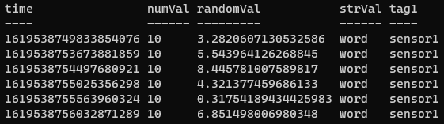

<!-- multilingual suffix: en, es -->

<!-- [en] -->
# Acces to influx
asdfasdf

<!-- [es] -->

# Generación y volcado de datos en Node-RED
El siguiente paso será **programar sobre Node-RED un flujo de comunicaciones capaz de generar datos artificiales y volcarlos en la base de datos de InfluxDB que habéis creado.**

Recordad que para acceder al contenedor de Node-RED mediante el navegador podéis utilizar la siguiente dirección: [*http://”IPpublicaDeVuestraVM”:1880*]()

De forma progresiva y cumpliendo los objetivos que os vamos marcando, se os propone generar un *flow* con la siguiente estructura:
<!-- [common] -->

<!-- [es] -->
## Bloque Debug
Pese a que no se incluyan bloques *debug* en la estructura del *flow* que tenéis que programar, se recomienda que utilicéis los bloques *debug* para verificar que las modificaciones que hacéis en el Flow producen el efecto esperado.

Los bloques *debug* pueden conectarse a la salida de cualquier bloque y mostrarán en la parte derecha de la pantalla, concretamente en la pestaña *debug*, la información que han recibido.

Por tanto, no es descabellado utilizar un bloque *debug* a la salida de cada bloque que genere o modifique datos. Hacerlo puede permitir localizar rápidamente que bloque no ejecuta la operación que se desea. Una vez validado que el funcionamiento es el esperado, eliminar los bloques *debug* no tendrá ningún efecto.
<!-- [common] -->

<!-- [es] -->
A continuación, se presentan varias secciones dedicadas a los distintos tipos de bloques que vais a necesitar. Se pretende que los objetivos que os fijamos al final de cada sección sirvan para verificar que habéis entendido como trabajar con cada tipo de bloque. Para completar dichos objetivos vais a necesitar combinar los bloques que ya se hayan presentado, de forma acumulativa, con lo que terminaréis generando el *flow* completo.
   ## Bloque inject
Los bloques *inject* permiten la generación de mensajes en el *flow* de manera manual, mediante un botón (cuadrado de color azul, en la parte izquierda del bloque) en el que es posible hacer clic, o de manera periódica.  Estos mensajes son objetos que contienen información y la almacenan en una estructura predefinida. Normalmente los mensajes tendrán un elemento llamado *payload* (al que se puede acceder mediante *msg.payload*) donde se acostumbra a almacenar los datos que contiene el mensaje.

En la configuración de vuestro bloque *inject* podréis decidir qué queréis que se incluya en el *payload* del objeto emitido. Por defecto se envía un *timestamp*, es decir, la maca de tiempo (en formato *Tiempo Unix*) del momento en el que se ha ejecutado ese bloque *inject*.

En esta primera parte del proyecto, este bloque sustituye al conjunto de bloques encargado de tomar datos de algún sensor, base de datos, estación meteorológica o PLC. 

**Objetivo**

1. **Deberéis verificar que sois capaces de programar un Flow en el que un bloque *inject* genera mensajes manualmente y también de forma periódica.**
## Bloque function
Los bloques *function* permiten manipular los mensajes y se programan en lenguaje *JavaScript*. Podéis consultar el siguiente tutorial para conocer cual es la sintaxis de *JavaScript* para cada caso.

<https://www.w3schools.com/js/default.asp>

El código que escribáis en el bloque *function*, dentro del espacio en blanco que podéis ver en la siguiente captura, se ejecutará cada vez que este bloque reciba un mensaje.
<!-- [common] -->

<!-- [es] -->
Encontrareis información sobre las capacidades operativas que ofrece este tipo de bloques en el siguiente link: 

<https://nodered.org/docs/user-guide/writing-functions>

**Objetivos**

1. **Programad que se asigne un valor numérico constante al *payload* del mensaje. Verificad que es así mediante un bloque *debug*.**
1. **Programad que se generen datos variables a lo largo del tiempo (Algunos ejemplos pueden ser funciones matemáticas periódicas, contadores, o simplemente valores aleatorios; el apartado “JS Math” del tutorial indicado anteriormente puede ser de utilidad). Verificad que funciona correctamente mediante un bloque *debug*.**

El siguiente objetivo, que se especifica en la próxima página, consiste en programar el bloque *function* para que genere datos en el formato que aceptan las bases de datos InfluxDB. 

La siguiente captura es un ejemplo de *function* para preparar el mensaje para ser volcado a la base de datos mediante un bloque “Influx Batch”. Como veis, por cada medida que se quiera escribir en la serie de datos, que se indica como *measurement*, de la base de datos podemos incluir valores, que correspondan a los datos que se quieran almacenar, y tags, que son indicadores que permiten filtrar los datos a posteriori. 
<!-- [common] -->

<!-- [es] -->
Por ejemplo, en un *measurement* donde se almacenen datos de varios sensores de temperatura, existiría una sola columna de temperatura y una columna donde indicase de que sensor se trata. Los datos se organizarían como en la siguiente tabla, donde la columna de temperatura, que sería el dato a almacenar, sería una columna de tipo *field*, y el nombre del sensor al que corresponde esa medición sería una columna de tipo *tag*.

|**Temperatura**|**Sensor**|
| :-: | :-: |
|23|sensor1|
|21|sensor1|
|29|sensor2|

3. **Programad la señal que deseéis escribir en la base de datos y ver en Grafana (ello implica que ya no deberíais volver a modificar el bloque *function)*. Adaptar la estructura y los datos del mensaje para que el bloque Influx los pueda volcar en la base de datos.**

**Debéis aportar una captura o recorte de pantalla** del código que habéis programado en el bloque *function* para generar la señal que posteriormente escribiréis en la base de datos. Más adelante, se os pedirá una captura de los datos escritos en la base de datos donde se pueda apreciar que los datos escritos por el *flow* de Node-RED son los mismos que visualizáis en la base de datos de InfluxDB. Por eso se hace referencia a que no se modifique el bloque *function* durante el resto de esta primera parte del proyecto.	

## Bloque InfluxDB Batch
El bloque InfluxDB permite conectar el *flow* de Node-RED con una base de datos de InfluxDB. Los pasos para configurar el bloque son los siguientes:

1) Hacer clic sobre el lápiz para editar la información referente a la base de datos a la que se va a conectar el bloque.
<!-- [common] -->

<!-- [es] -->
2) En las opciones de edición del nodo, deberéis rellenar los campos *host* y *port* con la información de la captura. Tened en cuenta que esta IP ha sido asignada manualmente al container de InfluxDB en el archivo *docker-compose*. Pese a que sería totalmente equivalente utilizar la IP de la máquina virtual indicando el puerto 8086, recordad que la IP de la máquina virtual cambia cada vez que la arrancáis (lo que implicaría modificar este parámetro en el Flow de Node-RED cada vez), mientras que la IP del container será siempre la misma.

3) Finalmente, deberéis rellenar el campo *database* con el nombre que le habéis dado a vuestra base de datos, la que anteriormente habéis creado en el contenedor de InfluxDB.
<!-- [common] -->

<!-- [es] -->
Haced clic en *Update* o *Add* cuando terminéis para guardar los cambios.

**Objetivo**

1. **Generad varios mensajes de forma manual mediante el bloque *Inject*. Confirmad que los datos se han escrito correctamente en la base de datos siguiendo el siguiente procedimiento:**

Repetid el proceso que se ha llevado a cabo para crear la base de datos en el contenedor de Influx ([haced clic aquí para volver a las instrucciones para dicho proceso](#_Acceso_a_la)). Una vez dentro del contenedor de Influx, introducid los siguientes comandos:

      > use <nombre\_de\_la\_base\_de\_datos>

Este comando sirve para indicar que a partir de ahora los comandos introducidos se referirán a una base de datos concreta.

      > select \* from <nombre\_de\_la\_serie\_de\_medidas>

Así le indicamos a influx que queremos visualiar todas las columnas (\*) de (*from*) una serie de medidas en particular. Como ejemplo os mostramos una respuesta semejante a la que deberíais recibir en el terminal. 
<!-- [common] -->

<!-- [es] -->
Tened en cuenta que si habéis mantenido el *flow* de Node-RED escribiendo periódicamente, la lista de medidas que visualizaréis puede ser muy larga.

2. **Generad una señal durante un tiempo (2 minutos es suficiente si estáis escribiendo una medida cada segundo, ya que saldrían 120 medidas). Esta señal será la que deberéis visualizar en Grafana; se explica cómo hacerlo en el siguiente apartado.**

**Debéis aportar una captura de pantalla de los datos escritos en la base de datos de InfluxDB.** Recordad que en este punto estáis demostrando que los datos sintéticos generados por como habéis programado en el bloque *function* (que ha quedado reflejado en la última captura que os hemos pedido) llegan correctamente a la base de datos. Como ejemplo, pensad que si habéis generado una señal senoidal de amplitud entre -1 y 1, es muy fácil apreciar que se trata de la misma señal en la base de datos. 