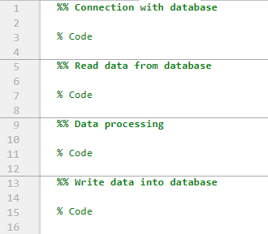
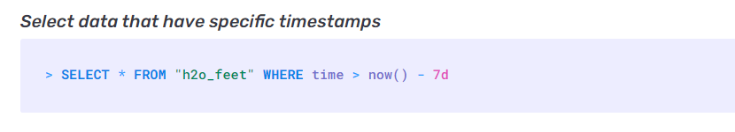
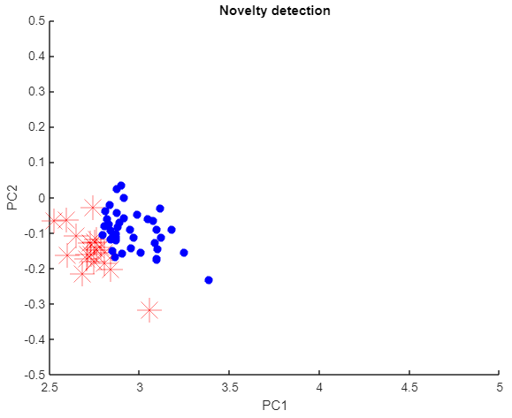
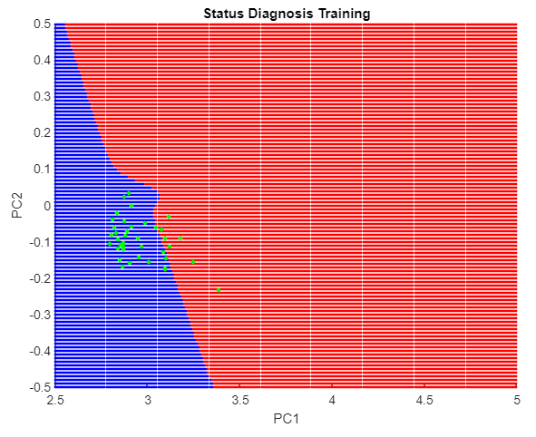

<!-- multilingual suffix: en, es -->

<!-- [en] -->

# Data Processing in MATLAB

<!-- [es] -->

# Procesado de datos en MATLAB Online 

<!-- [en] -->

The MATLAB Online tool allows you to work in the cloud with the latest version of MATLAB available. Thanks to a specific library, which you can find in the link shown at the end of this paragraph, it is possible to work with InfluxDB databases from MATLAB Online.

<https://github.com/EnricSala/influxdb-matlab>

Below, you will find the code templates that you will need to use to:

- Read the data from your InfluxDB database and staging it in the MATLAB *workspace*.
- Carry out data processing that must calculate the average of each of the five parameters received in the last minute of information registered and available in the database.
- Write the data, once you have done the processing, back to your InfluxDB database.

**It is recommended that you generate a script with four sections, separating them using the characters "%%", as you can see in the following screenshot:**

{: .center} 

**This will allow you to progressively execute each new section that you program, always being able to execute the entire code if you wish, using the *Run* or *Run Section* buttons:**

{: .center} 

You can access MATLAB Online by clicking on the following link your Mathworks account credentials.

<http://matlab.mathworks.com>

**You will find all the information regarding how to access and/or create a Mathworks account in the additional documentation that has been provided to you.**

<!-- [es] -->

La herramienta MATLAB Online permite trabajar en la nube con la última versión de MATLAB  disponible. Gracias a una librería específica, que podéis encontrar en enlace que se muestra al  final de este parágrafo, es posible trabajar con bases de datos InfluxDB desde MATLAB Online. 

https://github.com/EnricSala/influxdb-matlab 

A continuación, encontraréis las plantillas del código que necesitaréis utilizar para: 

- Leer los datos de vuestra base de datos de InfluxDB y almacenarlos provisionalmente en  el *workspace* o espacio de trabajo de MATLAB. 

- Realizar un procesado de datos que debe calcular la media de cada uno de los cinco  parámetros recibidos en el último minuto de información registrada y disponible en la  base de datos. 

- Escribir los datos, una vez hayáis llevado a cabo el procesado, de nuevo en vuestra base  de datos de InfluxDB. 

**Se recomienda que generéis un script con cuatro secciones, separándolas utilizando los  caracteres “%%”, como podéis ver en la siguiente captura:** 

{: .center} 

**Ello va a permitir ir ejecutando progresivamente cada nueva sección que programéis, siempre  pudiendo ejecutar el código entero si lo deseáis, utilizando los botones *Run* o *Run Section*:** 

{: .center} 

Podéis acceder a MATLAB Online haciendo clic en el siguiente enlace las credenciales de vuestra  cuenta de Mathworks. 

http://matlab.mathworks.com 

**Encontraréis toda la información referente a como acceder y/o crear una cuenta Mathworks  en la documentación adicional que se os ha proporcionado.**

<!-- [en] -->

## Simple data analitycs

<!-- [es] -->

## Análisis de datos simple

<!-- [en] -->

### First Section: Connection with the database
In order to access the database we want to work with, it is necessary to define the credentials using the following code in a MATLAB script:

{: .center} 

Then, still in the same script, use the following code to check that you were able to successfully connect to the database:

{: .center} 

**Objectives**

**Fill in the code containing the virtual machine and database parameters, and confirm that you receive the message 'InfluxDB is OK' in the MATLAB Online command window.**
### Second section: Reading measured data
Now you must perform the data reading, requesting the InfluxDB database to return the last minute of recorded information. The following code will serve as a template:

{: .center} 

**Objectives**

1. **Complete the names of the columns so that it is possible to receive the five statistical indicators.**

The InfluxDB documentation specifies what type of request must be made to receive the data for a specific period of time, as indicated in the following example:

{: .center} 

In the following link you can find the complete information:

<https://docs.influxdata.com/influxdb/v1.8/query_language/explore-data/#the-basic-select-statement>

2. **Complete the configuration of the request (after the *WHERE*) so that it requests the data of the last minute of recorded information each time the script is executed. Check that it works correctly.**

### Third section: Data processing

In a new section you will have to generate a code to calculate the average of each of the five parameters received in the last minute of information registered and available in the database.

**Objective**

1. **Verify that the code performs the data processing.**

### Fourth section: Write processed data

Finally, you will prepare the obtained values to be able to send them to the database. These will be stored at the same date as the last value obtained from InfluxDB to perform the calculation.

**Note that to write data, you must first be connected to the database. To do so, you can use the first two codes provided in point 3.1.**

The following code allows you to prepare the results. You must complete it with as many lines as results you are going to write in the database.

{: .center} 

It is possible to preview the content that will be written to the InfluxDB database using the following code:

{: .center} 

If the result is successful, it is possible to write it to the database using the following code:

{: .center} 

**Objective**

1. **Write the processed data to the database. Optionally, you can verify if they have been written correctly in a series called 'Results' by accessing the container that runs the InfluxDB database, as explained in the guide document of the first part of the project. In any case, you will know it in the next point when you want to show the processed data in Grafana.**

<!-- [es] -->

### Primera sección - Conexión con la base de datos 

Para poder acceder a la base de datos con la que queremos trabajar, es necesario definir las  credenciales empleando el siguiente código en un script de MATLAB: 

{: .center} 

A continuación, todavía en el mismo script, utilizad el siguiente código para comprobar que os  habéis podido conectar satisfactoriamente con la base de datos: 

{: .center} 

**Objetivos** 

**1. Completad el código que contiene los parámetros de la máquina virtual y la base de  datos y confirmad que recibís el mensaje ‘InfluxDB is OK’ en la ventana de comandos  de MATLAB Online.** 

### Segunda sección - Lectura de datos medidos 

Ahora debéis realizar la lectura de datos, solicitando a la base de datos de InfluxDB que os  devuelva el último minuto de información registrada. El siguiente código os servirá de plantilla: 

{: .center} 

**Objetivos** 

**1. Completad los nombres de las columnas para que sea posible recibir los cinco  indicadores estadísticos.** 

En la documentación de InfluxDB se específica que tipo de petición se debe realizar para recibir  los datos de un período concreto de tiempo, como se indica en el siguiente ejemplo: 

{: .center} 

En el siguiente enlace podéis encontrar la información completa: 

https://docs.influxdata.com/influxdb/v1.8/query\_language/explore-data/#the-basic-select-statement 

**2. Completad la configuración de la petición (después del *WHERE*) para que solicite los  datos del último minuto de información registrada cada vez que se ejecuta el script.  Verificad que funciona correctamente.** 

### Tercera sección - Procesado de datos 

En una nueva sección deberéis generar un código de realice la media de cada uno de los cinco  parámetros recibidos en el último minuto de información registrada y disponible en la base de  datos.  

**Objetivo** 

**1. Verificad que el código lleva a cabo el procesado de datos.** 

### Cuarta sección - Escritura de datos procesado 

Finalmente, prepararéis los valores obtenidos para poder enviarlos a la base de datos. Estos  serán almacenados a la misma fecha que el último valor obtenido de InfuxDB para realizar el  cálculo. 

**Tened en cuenta que, para escribir datos, primero deberéis estar conectados a la base de  datos. Para hacerlo podéis emplear los dos primeros códigos aportados en el punto 3.1.** 

El siguiente código os permite preparar los resultados. Debéis completarlo con tantas líneas  como resultados vayáis a escribir en la base de datos. 

{: .center} 

Es posible obtener una vista previa del contenido que se escribirá en la base de datos de InfluxDB  usando el siguiente código: 

{: .center} 

Si el resultado es satisfactorio, es posible escribirlo en la base de datos mediante el siguiente  código: 

{: .center} 

**Objetivo** 

**1. Escribid los datos procesados en la base de datos. Opcionalmente podéis verificar si  se han escrito correctamente en una serie llamada ‘Resutados’ accediendo al  contenedor que ejecuta la base de datos de InfluxDB, como se ha explicado en el  documento guía de la primera parte del proyecto. En cualquier caso, lo sabréis en el  próximo punto cuando queráis mostrar los datos procesados en Grafana.** 

<!-- [en] -->

## Data analytics in MATLAB Online

<!-- [es] -->

## Analisis de datos en MATLAB Online 

<!-- [en] -->

First of all, you must download two files from Atenea:

- The MATLAB script template that you will use in this part of the project.
- The base *workspace* file that contains the mathematical models you need. Once you have accessed MATLAB Online, in another tab use the following link to upload the *workspace* to MATLAB Drive. Once you have done it, this *workspace* should appear in your MATLAB Online tab. You may have to refresh the MATLAB Online tab in order to see the *workspace* you have uploaded.

<https://drive.matlab.com/login>

**As in the second part of the project, it is recommended that you respect the sections of the template provided, being separated using the characters “%%”. This will allow the code to be progressively executed to verify that it works as expected.**

### First section: Connect to the database
The first section of the script is used to connect to the database. Fill in the details of your InfluxDB database so that the MATLAB script is able to connect to it.

**Objective**

1. **Confirm that you get the message 'InfluxDB is OK' in the MATLAB Online command window.**

### Second section: Reading data
In this section, a data request is made to the database with which you have connected.

**Objective**

1. **Fill in the parameters of the query to read the data of the four statistical parameters (request the data recorded in the last 5 minutes).**

### Third section: Detection of new (without processing) data
In order to lighten the data analysis as much as possible at the computational cost level, a repeated data control has been included in this section. In this case, the script is capable of remembering which was the last data entry that it read the last time it was executed, and with that information it verifies if that data entry is within the new data read. In this case, all previous data will be considered as already processed and will be automatically discarded.

This data management implies that if you make two consecutive requests (executing the second section), the second time you run the detection of new data it is possible that all the data is considered repeated and is completely ignored. A possible solution would be not to run the third section if you need to repeat the data request for some reason, keep that in mind.

### Fourth section: Data Transformation
The matrix "PCA\_matrix" has been generated using principal component analysis techniques. The purpose of this matrix is to reduce the dimensionality of the vibration data, which initially has a dimension of 4 parameters, to 2 parameters (named *PC1/Feature 1* and *PC2/Feature 2*).

**Objective**

1. **Use the matrix “PCA matrix” and program the necessary matrix operation.**

### Fifth section: Novelty Detection
In this section a model is used, which you can find in the *workspace* as "model", which after being trained offline has established ranges for the two parameters that come out of the transformation of the previous section, being able to decide if these parameters represent a known situation or not.

This step prior to the diagnosis is fundamental since, if the model is not capable of associating new data to a situation that is already known to it, the conclusion that can be drawn from the diagnosis process will be totally irrelevant. In the script, MATLAB's *predict* function returns a numeric and a boolean value, the latter being the one that indicates whether the data is known or not.

At this point you will see how a figure is created in MATLAB similar to the following, which shows the distribution of the data and colors the data classified as known in blue, and the unknown in red.

{: .center} 

In the code you will see that the two classes of data are separated in order to use only the known data in the diagnosis, despite the fact that at the end of the script both vectors will be written to the database again to be able to view them in Grafana and not lose information.

### Sixth section: Diagnosis
In this section, a diagnosis is made with the data classified as known. At this point you will see how a mesh of points in red and blue is generated. Here, these colors define the domain in which the neural network considers a data to belong to the condition of “Healthy” (in the case of the color blue) or “Bearing Failure” (in the case of the color red). The data entries are shown as green dots in the figure that will appear, which should be similar to the following.

{: .center} 

Additionally, the processed data is sent to the neural network to obtain its membership value, which indicates with what probability the neural network affirms that a data belongs to the "Healthy" or "Bearing failure" condition.

### Seventh section: Write Diagnostic Data
In this section, a new *measurement* is generated where the data processed and used for the diagnosis is written.

**Obective**

1. **Complete the missing data to be able to write the data resulting from the diagnosis.**

### Eighth section: Write Data Classified as Novelty
In this section, a new *measurement* is generated where the processed data is written and classified as unknown.

**Obective**

1. **Complete the missing data to be able to write the unknown data.**

<!-- [es] -->

En esta tercera parte del proyecto, deberéis descargar de Atenea dos archivos: 

- La plantilla del script de MATLAB que utilizaréis en esta parte del proyecto. 
- El archivo *workspace* de base que contiene los modelos matemáticos que necesitáis. Una  vez hayáis accedido a MATLAB Online, en otra pestaña utilizad el siguiente enlace para subir  el *workspace* a MATLAB Drive. Una vez lo hayáis hecho os debería aparecer dicho *workspace* en vuestra pestaña de MATLAB Online. Es posible que tengáis que refrescar la pestaña de  MATLAB Online para poder ver el *workspace* que habéis subido. 
https://drive.matlab.com/login 

**Como en la segunda parte del proyecto, se recomienda que respetéis las secciones de la plantilla  que se os proporciona, quedando separadas utilizando los caracteres “%%”. Ello va a permitir ir  ejecutando progresivamente el código para verificar que funciona como se espera.** 

### Primera sección: Conexión con la base de datos 

La primera sección del script sirve para conectarse a la base de datos. Completad los datos de  vuestra base de datos de InfluxDB para que el script de MATLAB sea capaz de conectarse con ella. 

**Objetivo** 

**1. Confirmad que recibís el mensaje ‘InfluxDB is OK’ en la ventana de comandos de MATLAB  Online.** 

### Segunda sección: Lectura de datos 

En esta sección, se lleva a cabo una petición de datos a la base de datos con la que se ha conectado.  

**Objetivo** 

**1. Completad los parámetros de la *query* para leer los datos de los cuatro parámetros  estadísticos (e.g. solicitar los datos registrados en los últimos 5 minutos).** 

### Tercera sección: Detección de datos nuevos (sin procesar) 
Con la finalidad de aligerar lo máximo posible el análisis de datos a nivel de coste computacional, se  ha incluido en esta sección un control de datos repetidos. En este caso el script es capaz de recordar  cual fue el último input de datos que leyó la última vez que se ejecutó, y con esa información verifica  si ese input de datos se encuentra dentro de los nuevos datos leídos. En caso de que así sea, todos  los datos previos se considerarán como ya procesados y se descartarán automáticamente. 

Esta gestión de los datos implica que si hacéis dos peticiones consecutivas (ejecutando la segunda  sección), a la segunda vez que ejecutéis la detección de datos nuevos es posible que todos los datos  se consideren repetidos y se desprecien en su totalidad. Una posible solución sería no ejecutar la  tercera sección si debéis repetir la petición de datos por alguna razón, tenedlo en cuenta.

### Cuarta sección: Transformación de datos 

La matriz “PCA\_matrix” se ha generado utilizando técnicas de análisis de componentes principales.  El objetivo de esta matriz es reducir la dimensionalidad de los datos de vibración, que inicialmente  tienen una dimensión de 4 parámetros, a 2 parámetros (que reciben el nombre de *PC1/Feature 1* y  *PC2/Feature 2*). 

**Objetivo** 

**1. Utilizad la matrix “PCA\_matrix” y programad la operación matricial necesaria.** 

### Quinta sección: Detección de novedad 

En esta sección se emplea un modelo, que podéis encontrar en el *workspace* como “model”, que  después de ser entrenado fuera de línea ha establecido rangos para los dos parámetros que salen  de la transformación del apartado anterior, pudiendo decidir si estos parámetros representan una  situación conocida o no. 

Este paso previo al diagnóstico es fundamental ya que, si el modelo no es capaz de asociar un nuevo  dato a una situación que ya le es conocida, la conclusión que se pueda extraer del proceso de  diagnóstico será totalmente irrelevante. En el script, función *predict* de MATLAB devuelve un valor  numérico y uno booleano, y este último es el que indica si los datos son conocidos o no. 

En este punto veréis como se crea una figura en MATLAB similar a las siguiente, que muestra la  distribución de los datos y colorea en azul los datos clasificados como conocidos, y en rojo como los  desconocidos. 

{: .center} 

En el código veréis que se separan las dos clases de datos con el objetivo de utilizar solo los datos  conocidos en el diagnóstico, pese que al final del script ambos vectores se escribirán en la base de  datos de nuevo para poder visualizarlos en Grafana y no perder la información.

### Sexta sección: Diagnóstico 

En esta sección, se realiza un diagnóstico con los datos clasificados como conocidos. En este punto  veréis como se genera una malla de puntos en rojo y azul. Aquí, estos colores definen el dominio en  el que la red neuronal considera que un dato pertenece a la condición de “Sano” (en el caso del  color azul) o “Fallo cojinete” (en el caso del color rojo). Las entradas de datos se muestran como  puntos verdes en la figura que os aparecerá, que debería ser similar a la siguiente. 

{: .center} 

Adicionalmente, se envía a la red neuronal los datos procesados para obtener su valor de  pertenencia, que indica con que probabilidad afirma la red neuronal que un dato pertenece a la  condición de “Sano” o “Fallo cojinete”. 

### Séptima sección: Escritura de datos de diagnóstico 

En esta sección se genera un nuevo *measurement* donde se escriben los datos procesados y  utilizados para el diagnóstico. 

**Obetivo** 

**1. Completad los datos que faltan para poder escribir los datos resultantes del diagnóstico.** 

### Octava sección: Escritura de datos clasificados como novedad 
En esta sección se genera un nuevo *measurement* donde se escriben los datos procesados y  clasificados como desconocidos. 

**Obetivo** 

**1. Completad los datos que faltan para poder escribir los datos desconocidos.**